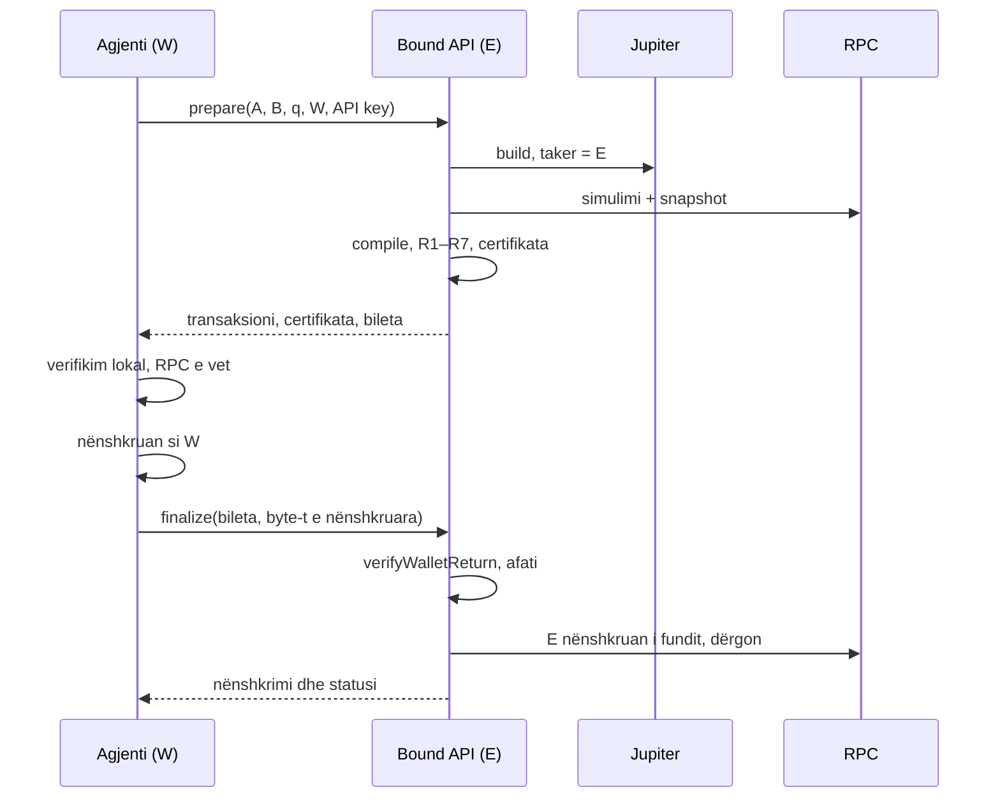

# Bound API për agjentët dhe botët

23 shtator 2026 · kopje e dokumentit të gjallë:
https://claude.ai/code/artifact/865587e9-3295-474a-b185-bdfae0153a53 (mbajini të dyja njësoj)

**Gjendja (23 shtator 2026):** i ndërtuar sipas këtij dizajni, me opsionin (a) për E-në
(`apps/web/lib/server/agent/`, `/api/v1/prepare` dhe `/api/v1/finalize`; përshkrimi për agjentët:
`AGENT-API.md`; `AUDIT.md` seksioni 0q). Dy ndryshime nga seksioni 7: në vend të SDK-së do të ketë
një skill (dokumentim për agjentët), dhe finalize dërgon një herë dhe i kthen agjentit transaksionin
e nënshkruar plotësisht, që ta konfirmojë vetë, sepse një funksion serverless nuk mbahet hapur një
minutë. Pyetjet e seksionit 9 mbeten të hapura për audituesin; API-ja është e fikur derisa të
vendosen `BOUND_API_SECRET` dhe `BOUND_API_KEYS`.

**Propozimi:** për agjentët dhe botët, Bound bëhet nënshkruesi i dytë. Çelësi njëpërdorimësh E mbahet
në serverin e Bound-it, dhe tarifa detyrohet nga nënshkrimi i E-së, pa asnjë program në zinxhir.
Kërkojmë mendimin tuaj para se të ndërtohet; ndërtimi vjen pas testit me Phantom.

## 1. Problemi

Tarifa e Bound-it (0.2%, e marrë në tokenin që jepet) futet nga kodi që ndërton transaksionin. Kush e
kontrollon atë kod, mund ta heqë tarifën.

- **Te faqja** kodi punon në shfletuesin e klientit. Teknikisht tarifa mund të hiqet duke ndryshuar
  JavaScript-in, por për 0.2% praktikisht askush nuk e bën.
- **Te një bot ose agjent** kodi do të punonte në makinën e tij. Me mijëra swap-e në muaj, heqja e
  tarifës ia vlen.
- **Verifikuesi** e kufizon tarifën vetëm nga lart (`MAX_FEE_BPS` = 1%). Nuk kërkon një minimum, sepse
  mbron klientin, jo Bound-in.
- **Teknika e mbrojtjes** (çelësi E, kutia E_in, mbyllja pas swap-it) ndërtohet me instruksione
  standarde të System dhe Token Program. Kushdo mund ta riprodhojë pa Bound.

Pra pyetja nuk është si ta bëjmë të pamundur anashkalimin, sepse nuk bëhet. Është si të detyrohet
tarifa për çdo swap që kalon nëpër shërbimin tonë.

## 2. Alternativat e shqyrtuara

Zgjodhëm të tretën: ajo që jep mbrojtjen, nënshkrimi i fundit i E-së, jep edhe kontrollin e tarifës.

| Alternativa | A e detyron tarifën? | Kosto dhe rreziqe |
| --- | --- | --- |
| SDK i hapur, tarifa vetëm me licencë | Jo, vetëm ligjërisht | Asnjë kosto teknike; varet nga ndershmëria e bot-it |
| Program në zinxhir ("Bound Guard") që kontrollon q, tarifën, treasury-n dhe hash-in e policy-së | Vetëm për kë e thërret; teknika ndërtohet edhe pa të | Program i ri për auditim dhe mirëmbajtje; kush mban autoritetin e përditësimit; llogari shtesë në çdo transaksion, ndërsa madhësia është kufiri ynë kryesor (T9); një nivel CPI më shumë nëse programi thërret Jupiter-in; kthen vendimin A (pa program në zinxhir) |
| **Bound si nënshkrues i dytë (E në server)**, propozimi | Po, për çdo swap që kalon nëpër shërbim | Një udhëtim më shumë drejt serverit (~0.1–0.3 s); varet nga disponueshmëria e serverit; asnjë program i ri, asnjë llogari shtesë |

Asnjë nga të tri nuk e ndalon një bot që ndërton vetë kutinë pa Bound. Ajo që shesim është
shërbimi: rrugët, trajtimi i Token-2022 dhe Pump.fun, riparimi i rrugëve, auditimi dhe mirëmbajtja.

## 3. Dizajni

I njëjti transaksion që ndërton faqja sot, me një ndryshim: E krijohet dhe nënshkruan në serverin e
Bound-it, jo te klienti. Renditja mbetet W i pari, E i fundit.

Bileta lidh çdo finalize me një prepare: mban një nonce, `messageSha256`, identitetin e çelësit API
dhe afatin (`lastValidBlockHeight`), e vërtetuar me MAC të serverit.

**Pse detyrohet tarifa.**

1. R6 kërkon që nënshkruesit të jenë saktësisht {W, E}. Pa nënshkrimin e E-së, transaksioni nuk hyn
   në zinxhir.
2. Bound nënshkruan me E vetëm mesazhin që ndërtoi dhe verifikoi vetë, me tarifën brenda.
3. `verifyWalletReturn` kërkon mesazh identik byte për byte, nënshkrim të vlefshëm të W-së dhe asnjë
   nënshkrim të E-së. Çdo ndryshim, përfshirë heqjen e tarifës, ndalet para se E të nënshkruajë.

**Kodi ekziston.** `prepareProtectedSwap` dhe `finalizeProtectedSwap` e bëjnë saktësisht këtë sot në
shfletues. Për API-në ata vendosen në server, me E të krijuar për çdo biletë. Tarifa për çdo çelës
API vendoset në server; standardi 0.2%, me zbritje sipas vëllimit më vonë.

## 4. Çelësi E në server

Rekomandojmë opsionin (a): E derivohet nga një sekret i serverit dhe bileta, pa ruajtur asgjë.
Problemi që zgjidh: në hostim serverless (Vercel), prepare dhe finalize mund të bien në instanca të
ndryshme, dhe memoria nuk ndahet.

| Opsioni | Si | Pa gjendje? | Nëse rrjedh sekreti ose depoja |
| --- | --- | --- | --- |
| (a) E e derivuar | seed = HMAC-SHA256(K, nonce i biletës); E = Ed25519 nga seed | Po | Sulmuesi mund të nënshkruajë si E për bileta, pra të heqë tarifën nga transaksionet që ndërton Bound. Paratë e përdoruesve nuk preken. |
| (b) E e enkriptuar në biletë | Çelësi privat i E-së në biletë, AES-GCM me çelës të serverit | Po | E njëjta si (a) |
| (c) Depo e përbashkët me TTL | Redis ose KV, E fshihet pas ~90 s | Jo | E njëjta, plus sekretet e E-ve në një shërbim të tretë; bie ndesh me parimin "pa databazë" |

**Pse rrjedhja nuk rrezikon paratë.** E nuk është e regjistruar kund në zinxhir dhe nuk zotëron
asgjë jashtë transaksionit të vet. Nënshkrimi si E ka vlerë vetëm për një mesazh që W e ka nënshkruar
tashmë. Pra sekreti mbron vetëm tarifën, jo fondet.

**Detaje.**

- Sekreti K rrotullohet rregullisht; bileta mban versionin e çelësit.
- E mbahet në memorie vetëm gjatë një thirrjeje prepare ose finalize.
- WebCrypto jo i eksportueshëm (D7 në shfletues) nuk ruhet dot mes instancave. Në server E derivohet
  sërish sa herë që duhet.
- Dy finalize për të njëjtën biletë japin të njëjtin E dhe të njëjtin transaksion. Ai hyn në zinxhir
  një herë.

## 5. Pse agjenti nuk ka nevojë të na besojë për paratë

Bound kontrollon nëse swap-i ndodh, jo çfarë ndodh me paratë. Kjo nuk është kujdestari.

1. **E nuk ka fuqi jashtë transaksionit.** Para tij E nuk zotëron asnjë llogari dhe asnjë SOL. E_in,
   E_out dhe llogaritë ndërmjetëse krijohen dhe mbyllen brenda tij (R3: mungojnë ose janë bosh në
   snapshot; R5: mbyllen).
2. **W nënshkruan byte-t e sakta.** Pasi W nënshkruan, Bound nuk mund të ndryshojë asgjë pa e prishë
   atë nënshkrim.
3. **Agjenti verifikon vetë.** Skill-i (jo SDK) ekzekuton `@bound/verifier` mbi të njëjtat byte, me
   policy-n e kontrolluar kundrejt qëllimit të agjentit dhe me gjendjen e lexuar nga RPC-ja e agjentit,
   jo nga e jona (`skills/bound-protected-swap/lib/bound-verify.mjs`, AUDIT.md 0r, FA-01). Pa këtë
   kontroll, agjenti i beson serverit tonë gjithë portofolin.
   Në rrugët e Pump.fun, llogarinë që Pump hap për çdo blerës Bound e mbyll në fund të të njëjtit
   transaksion dhe qiraja i kthehet W-së (FA-05); vetëm kur kjo nuk bëhet dot, llogaria mbetet nën E.
4. **Besimi i vetëm ndaj nesh është disponueshmëria.** Mund të refuzojmë ose të vonojmë. Një
   transaksion i nënshkruar i vonuar hyn vetëm brenda vlefshmërisë së blockhash-it (~60–90 s) dhe vetëm
   ashtu siç u nënshkrua.

Një agjent që nuk verifikon lokalisht na beson po aq sa klienti i faqes sot: njësoj si faqja, jo më
shumë.

## 6. Kërcënimet

Asnjë nga këto nuk arrin paratë e përdoruesit përtej asaj që W nënshkruan. Më e dobëta është rreshti
"shabllon falas": nuk ndalohet, vetëm bëhet i kushtëzuar.

| Kush | Çfarë mund të bëjë | Çfarë e ndalon |
| --- | --- | --- |
| Server Bound i komprometuar | Ndërton një transaksion të dëmshëm | Verifikimi lokal i agjentit me RPC-në e vet |
| Server Bound i komprometuar | Ngre tarifën mbi 1% | Verifikuesi (`MAX_FEE_BPS`), lokalisht |
| Server Bound i komprometuar | Sheh adresat dhe shumat e agjentit | Nuk ndalohet; e njëjta si proxy-t e faqes sot |
| Server Bound i komprometuar | Refuzon ose vonon | Vetëm disponueshmëri; vlefshmëria e blockhash-it e kufizon vonesën |
| Agjent keqdashës | Heq tarifën ose ndryshon një byte | `verifyWalletReturn`; E nuk nënshkruan |
| Agjent keqdashës | Falsifikon ose ndryshon biletën | MAC-u i biletës dhe `messageSha256` brenda saj |
| Agjent keqdashës | Përdor prepare si shabllon falas dhe e rindërton me çelësin e vet pa tarifë | Nuk ndalohet dot. Kufizim: çelës API, limite, monitorim i raportit prepare/finalize, pezullim i çelësit |
| Agjent keqdashës | Përmbyt prepare (çdo thirrje kushton Jupiter, RPC, simulime) | Çelës API i detyrueshëm, limite për çelës |
| Kushdo | Finalize dy herë me të njëjtën biletë | I njëjti mesazh dhe të njëjtat nënshkrime; hyn një herë |
| Kush vjedh sekretin K | Nënshkruan si E dhe heq tarifën nga transaksionet e Bound-it | Rrotullimi i K; asnjë fond përdoruesi në rrezik |

## 7. Çfarë ndërtohet dhe si testohet

Asgjë në zinxhir dhe asgjë në verifikues nuk ndryshon. Shtohen dy endpoint-e, çelësat API dhe një SDK
e hollë.

**Ndërtimi.**

1. `POST /v1/prepare`: çelësi API → `prepareProtectedSwap` me E të derivuar për biletën → kthen
   transaksionin, certifikatën, policy-n, biletën dhe `lastValidBlockHeight`.
2. `POST /v1/finalize`: bileta + byte-t e nënshkruara nga W → `finalizeProtectedSwap` (identitet byte
   për byte, afati, E nënshkruan, dërgim) → nënshkrimi dhe statusi.
3. Çelësat API: limite për çelës dhe tarifa për çelës (0.2% standard).
4. SDK në TypeScript: prepare → verifikim lokal me RPC-në e agjentit → nënshkrim si W → finalize.
   Verifikimi lokal është i ndezur si parazgjedhje.

**Testet.**

- [x] Agjenti heq tarifën → finalize refuzon, E nuk nënshkruan.
- [x] Një byte i ndryshuar kudo në mesazh → refuzohet.
- [x] Biletë e skaduar, e falsifikuar ose e një çelësi tjetër API → refuzohet.
- [x] Dy finalize të së njëjtës biletë → i njëjti transaksion.
- [x] Verifikimi lokal i skill-it kap një server që ndërton transaksion të dëmshëm (sulmi i auditimit
      dhe shtatë variante).
- [x] E derivuar: e njëjta biletë jep të njëjtin E; bileta të ndryshme japin E të ndryshme.
- [ ] Mainnet: T4, T13 dhe T14 të përsëritura përmes API-së (u bënë vetëm dry-run-e me skill-in).

## 8. Kufijtë e njohur

- **Anashkalimi mbetet i mundur.** Teknika është publike. Një bot që ndërton vetë kutinë nuk na
  paguan, dhe këtë nuk e ndalon asnjë dizajn.
- **Vonesë.** Një udhëtim më shumë drejt serverit, rreth 0.1–0.3 s. Botët ultra të shpejtë nuk do ta
  përdorin.
- **Disponueshmëria.** Nëse serveri bie, agjentët nuk bëjnë swap të mbrojtur përmes Bound-it.
- **Matja e vëllimit.** Tarifa sipas vëllimit kërkon numërim për çdo çelës API, pra një depo e vogël
  numërash (jo fondesh). Kjo bie ndesh me parimin "pa databazë". Faza e parë mund të jetë një çmim për
  të gjithë, pa matje.
- **Faqja nuk ndryshon.** Atje tarifa mbetet e detyruar vetëm nga kodi i faqes; praktikisht e
  mjaftueshme për 0.2%.
- **Tarifa te shitjet.** Tarifa merret në tokenin që jepet. Kur treasury nuk ka llogari për atë token
  (shumica e memecoin-ave), shitja kalon pa tarifë, edhe përmes API-së.

## 9. Pyetjet për audituesin

1. **Kujdestaria.** A e ruan ky dizajn deklaratën "Bound nuk mban kurrë fondet" kur E mbahet nga
   serveri? Argumenti ynë: E nuk ka fuqi jashtë mesazhit që W nënshkruan (seksioni 5).
2. **Ruajtja e E-së.** Opsioni (a), (b) apo (c) i seksionit 4? Si duhet rrotulluar sekreti K, dhe a
   mjafton HMAC-SHA256 për seed-in e Ed25519?
3. **Verifikimi lokal.** A duhet që SDK ta bëjë të detyrueshëm, me RPC-në e agjentit? Çfarë mund të
   anashkalojë një server i komprometuar nëse agjenti përdor RPC-në tonë?
4. **Verifikuesi.** A duhet një rregull i ri, p.sh. një tarifë minimale në policy për API-në? Apo
   mjafton që serveri nënshkruan si E vetëm atë që ndërtoi vetë?
5. **Rruga e anashkalimit.** A shihni ndonjë mënyrë që një agjent të marrë nënshkrimin e E-së për një
   mesazh pa tarifë, pa vjedhur K?
6. **Shablloni falas.** A mjaftojnë çelësi API, limitet dhe monitorimi i raportit prepare/finalize?
7. **Rregullatori.** A e ndryshon statusin ligjor të Bound-it bërja bashkënënshkrues i transaksioneve
   të të tjerëve?

## 10. Çfarë ndryshoi që nga auditimi i fundit

Ju lutemi rishikoni edhe këto, bashkë me dizajnin më lart. Testi me Phantom me para të vërteta ende
nuk është bërë; ai mund ta ndryshojë rrjedhën e nënshkrimit.

| Ndryshimi | Ku përshkruhet | Prova |
| --- | --- | --- |
| Token-2022 me listë të lejuar extension-esh | `AUDIT.md` 0f | teste njësie + çifte reale në mainnet |
| Tokenët nëpër të cilët kalon rruga kontrollohen si dy të swap-it | `AUDIT.md` 0i | 4/4 |
| Stablecoin-ët me delegat të lëshuesit (PYUSD, USDG, AUSD, CASH) | `AUDIT.md` 0j | T12 33/33 |
| Pump.fun: qiraja e matur për E (`takerRent`), bonding curve, toleranca 3% në kurbë, rikuotimi kur lëviz çmimi | `AUDIT.md` 0k | T13 45/45, T14 42/42, T6 32/32 |
| Hiqet RPC-ja e dytë; certifikata nuk shfaqet më në faqe | `AUDIT.md` 0l | 252 teste, browser 17/18 |
| Tarifa 0.2% (ishte 0.3%) | `README.md`, `SECURITY.md` | vetëm konfigurim |
| SRI: 7 nga 8 skripte me hash | `SECURITY.md` | testi në browser |
