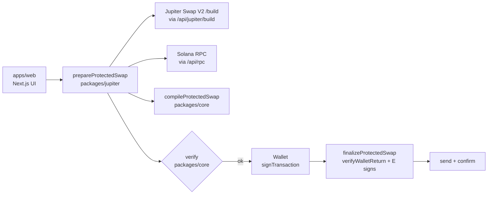
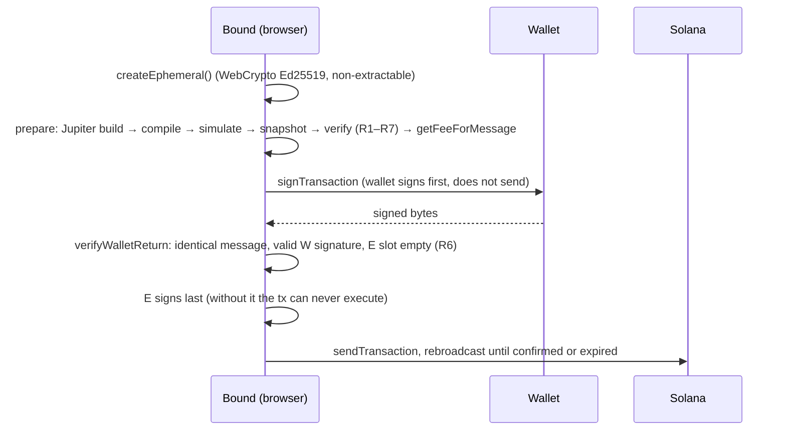

# Bound v0.1 — Audit brief (revision 3, after the second review)

This document gives an auditor everything needed to review Bound v0.1: what it guarantees, how it
works, where each piece lives, what has been tested, and where we are least sure. We ask for a full
security review and, just as much, for design feedback: where the approach is wrong, fragile, or
could be simpler.

- Code: this repository (`bound/`). Start with sections 0b, 0c, 0 and 1–4, then `packages/verifier/src/`.
- Status: feature-complete for v0.1, not yet used with real user funds. No on-chain program.
- Revision 1: 19 September 2026, reviewed in `bound-v0.1-audit.md` (findings B-01 to B-12).
- Revision 2: 19 September 2026. Section 0 lists what changed after the first review.
- Second review: 19 September 2026, engineering audit of the whole repository (findings C-01 to C-10).
- Revision 3: 19 September 2026, this document. Section 0b lists what changed after the second review.

---

## 0. Changes after the first review

Every finding has a regression test that replaces the reviewer's proof of concept
(`packages/verifier/test/audit.test.ts`, `apps/web/test/server.test.ts`).

| ID | Severity | Status | What changed | Tests |
| --- | --- | --- | --- | --- |
| B-01 | Medium | Fixed | The verifier refuses a fee above `MAX_FEE_BPS` (1%, `constants.ts`). Fee and treasury are compiled into the page at build time (`NEXT_PUBLIC_BOUND_*`) and are no longer served by `/api/status`. | 5000, 9999 and 101 bps → R2; the architecture test asserts the verifier uses the ceilings from `constants.ts` |
| B-02 | Medium | Fixed | R4 compares against `min(policy F_max, ABSOLUTE_MAX_NETWORK_FEE_LAMPORTS)` (0.001 SOL); a policy F_max above the ceiling is itself a violation. The server clamps its setting too. | 710,000 lamports with a 1 SOL policy → R4 |
| B-03 | Low | Fixed | A trusted `Revoke(W_out)` signed by W runs before the swap (variants B, C). `W_out` is always fetched into the snapshot; one with a close authority is refused by the pipeline (`output-account-restricted`) and by R1. | delegate neutralised; missing Revoke → R2; close authority → R1; `W_out` missing from the snapshot → R1 |
| B-04 | Medium | Fixed | Minimum-output assertion without an on-chain program (section 3). The floor is the chosen route's `otherAmountThreshold`; the verifier refuses a floor of 0 and a check with any other amount, account, authority or position. The UI now shows "Minimum received … checked by Bound". | honest A/B/C accepted, including a non-empty `W_out`; missing, weaker, `b0`-ignoring and misplaced checks rejected; mainnet T5 3/3 |
| B-05 | Low | Fixed | The kill switch is enforced by `/api/jupiter/build` and by `sendTransaction` on `/api/rpc`. The USD cap fails closed when a token has no USD price. | server tests |
| B-06 | Low | Fixed | Client key: the platform header (`x-vercel-forwarded-for`, `cf-connecting-ip`), else the rightmost `X-Forwarded-For` entry. `sendTransaction` has its own limit (20/min). Expired windows are swept once a minute; memory is bounded. | server tests |
| B-07 | Low | Fixed | The v1 message config is an allowlist: CU limit, priority fee and loaded-accounts data size (≤ 64 MiB). Any other field → R4. | heap size in the config → R4 |
| B-08 | Low | Fixed | Nonce-based CSP from Next.js 16 `proxy.ts` with `'strict-dynamic'`; the page renders per request. `img-src 'self' data:`; token icons come from `/api/token-icon` (section 9, question 6). | e2e: a different nonce per request, no `'unsafe-inline'` for scripts, no third-party image request; icon proxy tests |
| B-09 | Info | Fixed | The reviewer's cleanest option: Bound no longer creates the treasury's account at the user's expense. If `ATA(treasury, input)` does not exist, the swap is fee-free (the policy's treasury is null). `createFeeAccount` is gone from policy, compiler and verifier. The remaining rent (opening `W_out`) is returned as `oneTimeCosts` and shown before and while the wallet is open; the guarantee now carries that term. | fee-free without the account; creating the treasury account → R2; SOL input still pays the fee |
| B-10 | Info | Fixed | A Token-2022 hop mint must be in the snapshot and carry no transfer hook (non-null program) and no permanent delegate (R7). At most 4 intermediate accounts (R5). The pipeline treats a refused hop as a route to repair. | base mint, harmless extension and null hook accepted; hook, permanent delegate and missing mint → R7; 5 hops → R5 |
| B-11 | Info | Fixed | R1 refuses the fee account and the treasury inside the external instruction. | fee ATA in the swap → R1 |
| B-12 | Info | Mitigated | The constant is documented as a cluster parameter, and after verification the pipeline prices the final message with `getFeeForMessage` and refuses a fee above the limit. | mainnet runs |

Adopted from the answers and design feedback:

- The security model now leads with R6 (`SECURITY.md`, and a note above the rules in `verify.ts`).
- The five overstated claims are corrected: the SOL line carries a rent term; the fee is bounded
  and fixed at build time; the backend's role is stated in full; `W_out` is handled by `Revoke`; the
  minimum output is now something Bound itself enforces.
- R5's size measure is pinned by a test (`getTransactionSize` equals the encoded length, v0 and v1).
- D7 now says what non-extractable does not mean: script in the page could still use E to sign.
- Jupiter's `/build` answers are validated: a malformed amount or instruction is a `JupiterError`,
  not a crash further down (answer 7).
- The second RPC relays only the two reads that lookup tables need; an oversized body is refused
  before parsing.

Found by our own mainnet runs after the fixes (not in the review):

- A Jupiter route whose accounts, together with Bound's, exceed Solana's 64-account limit made the
  compiler throw (USDC → HNT). It now counts as "does not fit" and a smaller route is requested
  (`compileIfFits` in `swap.ts`, `packages/jupiter/test/swap.test.ts`).
- The mainnet test re-prepares once when the execution check reverts because the price or a pool
  moved in the seconds after prepare, as a user would retry; a pair must pass on its own second
  prepare.
- Jupiter wraps a transient upstream failure ("Pool has not been updated in a while") in HTTP 400;
  the client now retries it like its other transient errors.

Done since: the **CPI-based malicious program test**, the reviewer's top item (T6, section 0d).
The repository is on GitHub now and both workflows run on every push.

Not done yet, in priority order:

1. **Reproducible build and SRI** for the frontend.
2. **Dependency supply-chain review**, to be commissioned separately.
3. Exact (not "at least") role checks in `parse.ts`: the reviewer found the current checks not
   abusable, so this is left as an optional strengthening.
4. `sendTransaction` is still proxied: the public RPC refuses browser origins (HTTP 403), so the
   browser cannot broadcast directly without a third-party RPC. It is rate-limited separately and
   blocked by the kill switch.

---

## 0b. Changes after the second review

The second review found no way to take the user's other assets, and ten findings (C-01 to C-10)
about the link between what the user accepts and what the verifier enforces, the send lifecycle,
the proxies and the tests. Each has a regression test that fails on the old code.

| ID | Severity | Status | What changed | Tests |
| --- | --- | --- | --- | --- |
| C-01 | High | Fixed | The page converts what the user types with the mint's **on-chain** decimals (`readMint` in `apps/web/lib/client/tokens.ts`); Jupiter's metadata is only for names and icons. The request carries the decimals the page used, and `prepareProtectedSwap` refuses to build when they differ from the chain (`token-data-mismatch`). The verifier also compares the policy's decimals with the mints in the snapshot (R2). A USD price is used only if it is a finite positive number. | `packages/jupiter/test/prepare.test.ts` (metadata says 9 for USDC → refused); `audit.test.ts` (decimals ≠ mint → R2) |
| C-02 | High | Fixed | Bound computes the floor itself: `outAmount × (1 − slippage)`, rounded down; Jupiter's `otherAmountThreshold` can only make it stricter (`routeFloor`). A Jupiter answer for another pair or amount is refused. The page shows that floor, and the request carries it as `acceptedMinOut`: the transaction enforces at least what the user saw. If the market can no longer deliver it, nothing is built; the page shows the new minimum and asks (`price-moved`), and it never lowers it silently. A swap needs a visible quote. | `prepare.test.ts`: floor of 1 replaced; stricter floor kept; accepted minimum enforced; `price-moved` with the new minimum; answer for another amount → `bad-quote` |
| C-03 | Medium | Fixed | `sendAndConfirm` reports the signature before the first request; the page records the swap as `pending` with its `lastValidBlockHeight` at that moment. Outcomes: `confirmed`, `failed` (reverted, fee paid), `rejected` (a structured preflight failure or an HTTP 4xx explicitly marked by Bound's proxy as stopped locally), `expired` (the recorded block height has passed and two full-history lookups find nothing), `unknown` (anything else, including upstream HTTP/JSON-RPC errors and `processed` that never confirms). "No funds moved" is said only for proven `rejected` and `expired` outcomes. Old history entries without a block height remain unknown. Re-broadcasts are fire-and-forget every 3 s. | `packages/solana/test/send.test.ts`; `apps/web/test/history.test.ts`; `apps/web/test/server.test.ts` |
| C-04 | Medium (deployment) | Fixed | The client key comes only from the header named by `BOUND_CLIENT_IP_HEADER` (default `x-vercel-forwarded-for`; `cf-connecting-ip` behind Cloudflare). No other header is read; without it every request shares one bucket. Under a key flood the oldest windows are dropped instead of clearing all. A limit across instances is left to the hosting firewall (documented). | `server.test.ts`: behind Cloudflare a sent `x-vercel-forwarded-for` cannot mint identities; XFF ignored |
| C-05 | Low | Fixed | The verifier derives the variant from the mints and checks the policy's label (R2). | `audit.test.ts` |
| C-06 | Low | Fixed | Amounts are never rounded up; a value too small to show reads `<0.000001`. The minimum is shown with every digit (`formatExact`). | e2e shows the exact minimum |
| C-07 | Low | Fixed | Request bodies are counted in bytes while reading (`readBodyLimited`), refused past 64 KiB before being held; upstream RPC and Jupiter calls time out after 15 s (504). | `server.test.ts`: 80,000-byte body of 40,000 characters → 413; timeout → 504 |
| C-08 | Low | Fixed | The icon tests' stub now answers for the mint asked, and each test asserts which URLs were fetched (the redirect endpoint is visited, the private target is not). A test for a redirect that stays on listed hosts was added. T4 checks intermediate ATAs among the temporary accounts (`PreparedSwap.intermediates`). | `server.test.ts`; `tests/integration/mainnet.ts` |
| C-09 | Low | Fixed | Rent for a new token account comes from `getMinimumBalanceForRentExemption(165)` (1,488,440 lamports on 19 September 2026, down from 2,039,280); the old value remains only as an upper bound if the RPC cannot answer. The exact network fee of the final message (from `getFeeForMessage`) is shown while the wallet is open. | `prepare.test.ts` |
| C-10 | Low | Fixed | Token search drops answers for an older query; balance refreshes apply only the latest request. | code review; e2e search and paste checks |

Also from the second review:

- **B-12 now fails closed.** Without a price from the cluster for the final message (two tries),
  nothing goes to the wallet.
- **Lookup tables (question 5).** With a second RPC, both must return every entry of every table;
  a shorter answer is unconfirmed (`sameLookupTable`).
- **Concurrent swaps (question 2), decision A.** The page allows one Bound swap at a time into the
  same output token, across tabs (`apps/web/lib/client/swapLock.ts`), and keeps the lock for 150 s
  when an outcome is unknown. The guarantee now states the check exactly: the output account ends
  with at least its balance when the swap was prepared plus the minimum; a transfer into it from
  someone else before execution counts toward that. A small on-chain guard program would close this
  fully; it was not chosen (D2).
- **Revoke disclosure.** When the output account has a delegate, the page says before signing that
  Bound will remove it.
- **Wallet versions.** A wallet that supports neither `0` nor `1` is refused with a clear message.
- **Neutral taker.** Live quotes are asked for a neutral address; Jupiter never receives the user's
  address before a swap (e2e checks every build request).
- **Pasted addresses.** A token Jupiter's list does not know is read from the chain and marked as
  not listed.
- **Fuzz time limit.** The property tests' limit grows with the number of cases, so
  `npm run test:fuzz` (100,000 cases, about 75 minutes) is no longer cut off at 600 s.
- **Copy.** "Temporary key — Deleted after swap" is now "Used once, never stored".
- **Found by our mainnet runs after these fixes:** Jupiter intermittently answers "No matching
  liquidity" for a pair it quotes a second later (SOL → RAY). The baseline quote now retries once
  after a pause, then accepts a smaller route before giving up with `no-route`.

Claims corrected in this revision: "v1 does not depend on the RPC for R1" (it does not depend on RPC
lookup tables; account state still comes from the RPC); "`img-src` and `connect-src` leave no
channel out" (same-origin endpoints that relay queries, `/api/jupiter/tokens` and
`/api/token-icon`, remain); "a compromised server that serves the genuine page can only stop swaps"
(it also relays RPC answers and token metadata; decimals are now checked against the chain, RPC
account state is still trusted); "B-10 covers every Token-2022 hop" (it covers the mints of the
intermediate accounts Bound creates); "no Linux CI" (the workflow exists but has not run); the rent
figure; and the fuzz duration.

---

## 0c. Ideas adopted from the product brief

After the second review, a product brief ("Bound — Solana Protected Transaction Layer") was checked
against the code. Most of it already held; these parts were adopted.

- **Separate verifier package** (`packages/verifier`, `@bound/verifier` 0.2.0): candidate for open
  source and for wallets that want to check Bound's transactions themselves.
- **Certificate** (`certify` in `packages/verifier/src/certificate.ts`). After every rule holds on
  the exact bytes, the verifier issues: approved total debit, swap amount, Bound fee and its
  destination, minimum output, network fee limit, signers, programs invoked, "other assets debited:
  none", "persistent permissions: none", the verifier version and the SHA-256 of the message. The
  pipeline returns it with the prepared swap and the page shows it while the wallet is open. It is
  as trustworthy as the verifier that issued it: a wallet should run the verifier itself.
- **Parallel reads** (idea 21). Mints, the treasury account, `W_out` and the rent are one round
  trip; the unrestricted baseline, the first protected route, the blockhash and the DEX labels are
  asked for together; the verifier's snapshot and the final blockhash too. `PreparedSwap.timings`
  records the total and the local part (compile and verify). Over the 60 mainnet cases the local
  part had a median of 130 ms and a maximum of 270 ms; in the browser test, click to wallet took
  under one second (974 ms) with the public RPC and keyless Jupiter.
- **Quote freshness** (idea 23). The live quote refreshes every 20 s while the page is visible and
  an amount is entered, three times, and then waits: the page offers "Refresh price" instead of
  asking the aggregator forever on behalf of a tab nobody is looking at. A quote older than 45 s
  cannot be accepted either way. Measured in a browser: one request on typing, three refreshes over
  the next minute, none after that, and one more when the button is used.
- **Wording** (ideas 11, 18, 36, 37): "Minimum output … enforced on successful execution",
  "Persistent permissions: none created", a visible swap amount, "any token pair Jupiter can route and
  Bound can safely isolate", and "What you approve is all the swap can touch" (not "the transaction":
  the network fee and a new account's rent are also debited).

Not adopted as written: a temporary output account for every token (SPL Token has no "transfer all",
so the delivered amount is unknown when the transaction is built; token outputs go to `W_out` with
`Revoke` and the minimum check), and a total latency target of 300 ms (the local part is well under
it; the network steps are the cost).

---

## 0d. T6 — the external program as malicious code

T1 puts attacker *instructions* where Jupiter's would be. It cannot answer the reviewer's first
question, because a swap program is code: it makes cross-program invocations of its own, with
account metas of its own choosing. T6 closes that gap.

`tests/cpi/attacker` is a deliberately malicious swap program (Rust, `cargo build-sbf`). Its
instruction data is a list of inner instructions to attempt — program, account metas, data, and
whether to sign with its own program-derived key. A meta may name an account by index into what the
program was given, or by raw address, which lets a case demand an account Bound never handed over.

`tests/cpi/run.ts` deploys it into a real Solana VM (litesvm: the Agave runtime, real SPL Token and
ATA programs), builds the protected transaction with Bound's own policy builder and compiler,
verifies it, signs as W and as E, and executes it. After every case the chain is checked against
Bound's promise: nothing beyond the approved amount moved, no permission survived, both temporary
accounts are gone, and the wallet's other tokens and SOL are untouched.

19 cases, all passing (`tests/cpi/results/cpi.md`):

- The route takes the approved amount and delivers the minimum: the transaction succeeds, exactly
  `q` leaves the wallet, the fee is exact, and E_in (and E_out) no longer exist.
- It delivers nothing, or one unit less than the minimum: the transaction reverts at Bound's
  minimum-output check (instruction 8, the swap being 7), and the theft is undone with it.
- It tries to take more than the approved amount: the temporary account does not hold it.
- It tries to spend the wallet's input account, another of the wallet's tokens, the balance already
  sitting in W_out, or the wallet's SOL, and to close W_out, reassign its ownership or leave a
  delegate on it: every one fails inside the runtime with *"an account required by the instruction
  is missing"*. The accounts were never handed over, so the program cannot name them — and W's
  signature, which those moves need, is not available to it either.
- It tries the same while signing with its own program-derived key: a program cannot sign for a
  wallet.
- It leaves a delegate on the *temporary* account and then delivers honestly: the swap succeeds and
  the permission dies with the account, which cleanup closes.
- It closes the temporary output account to itself (SPL → SOL): allowed by the runtime, since E is
  the owner, but the minimum check then fails and the transaction reverts.
- It empties the temporary *input* account and then destroys it before delivering honestly, so that
  a successful swap would leave it holding the rent W paid to open that account. Cleanup then
  closes an account that no longer exists: the transaction reverts at instruction 9, three
  instructions after the swap, and the rent goes nowhere.
- It sends that rent to the one key it could sign for — its own program-derived authority — which
  is what it would need to pay for re-creating the account and hiding the loss. The runtime refuses
  with *"Cross-program invocation with unauthorized signer or writable account"*: Bound handed that
  account over read-only, and a program's own inner call cannot widen a privilege the transaction
  never granted.
- A route that also demands the wallet's input account never reaches the wallet at all: R1 rejects
  it before signing.

This is also the first time the whole protected transaction has been *executed* rather than
simulated, with real signatures from W and E, including the wrapped-SOL variant.

Limits of the test: litesvm is the Agave runtime with real SPL programs, but it is not a validator,
and the attacker is our own program rather than a real DEX. It also publishes no Windows binding,
so T6 runs only in `.github/workflows/cpi.yml`, and a case counts as verified when that workflow
has passed and not before. Token-2022 transfer hooks are covered a different way, in 0i: a mint
that runs one never reaches the runtime, because the swap is refused before it is signed.

---

## 0e. T7 — large amounts

There is no cap per swap any more (`BOUND_MAX_USD_PER_SWAP` is unset by default). The guarantee
does not depend on the amount: the same instructions, the same rules, the same temporary account.
What does depend on it is the route, so `tests/integration/large.ts` prepares real swaps at growing
sizes, verifies each one and simulates it on mainnet state. Measured on 2026-09-20:

| Pair | Size | Transaction | Price against the smallest trade | Simulation |
| --- | --- | --- | --- | --- |
| USDC → SOL | 1k, 10k, 100k | 1060–1138 bytes | 0.01% worse | passes |
| USDC → SOL | 1,000,000 | 1229 bytes | 0.10% worse | passes |
| SOL → USDC | 5 … 5,000 | 983–1101 bytes | 0.09% worse | passes |
| SOL → USDC | 50,000 (≈ $10M) | 1062 bytes | 0.76% worse | passes |
| USDC → BONK | 1k, 10k, 100k | 1137–1200 bytes | 2.62% worse at 100k | passes |
| USDC → BONK | 1,000,000 | — | — | refused: no route fits |

Two limits are real, and neither is ours:

- **The market.** A large trade in a thin token moves its price. At $100k into BONK the route is
  already 2.6% worse than at $1k. Bound shows the minimum and enforces it; it does not improve the
  price.
- **64 accounts per transaction.** A $1M BONK route needs more pools than fit beside Bound's own
  dozen accounts. The pipeline steps down through `maxAccounts` 64 … 16, and if every route that
  fits is more than 1% below the market price it refuses (`no-route` / `bad-quote`) instead of
  quietly taking a bad one. It never splits a swap across transactions, because a second
  transaction would be a second approval and a second chance to fail halfway.

The failure messages now name the real cause: a route that is priced right but too large says so,
a route far below the market says how far, and when the repair loop has already excluded the DEXes
that failed in simulation, the error is `simulation-failed`, not a complaint about the price.

---

## 0f. Token-2022

Measured before building (`KERKIMI-FAZA3.md`): 55 of the 100 most traded tokens are Token-2022, and
so are all 30 of the newest, because Pump.fun mints them that way. Refusing the standard was
refusing 42% of the volume, and with it most new tokens.

A Token-2022 mint is now accepted when its extensions cannot touch the swap. The rule is an
allowlist, in `unsupportedExtension` (`packages/verifier/src/verify.ts`), shared by the verifier,
the pipeline and the page so they cannot disagree:

- **Allowed:** metadata and metadata pointer, group and member pointers, a mint close authority
  (usable only at zero supply), confidential transfers (our transfers are the ordinary public
  ones), and a transfer hook whose program id is unset — the largest Token-2022 tokens, PUMP among
  them, declare the extension and leave the program empty, so no code runs.
- **Allowed for swap and intermediate mints:** a transfer fee (see below). Every temporary account
  of a taxing mint is harvested before it is closed.
- **Refused:** permanent delegate, accounts frozen by default, pausable, non-transferable,
  interest-bearing, scaled UI amount, memo required on transfer, and **any extension the list does
  not name**.

Why those are refused: a permanent delegate or a default-frozen account would let someone else move
or freeze the temporary account; pausable and non-transferable let a third party stop the swap;
interest-bearing and scaled UI amount would make Bound show a different number than the wallet; a
memo requirement would need another instruction on every incoming transfer (an *output account*
that requires one is refused up front by the pipeline, with its own message).

**Transfer fees** are supported, and they cost the user more here than elsewhere, so three things
had to be true. (The first review of this work found the feature dead on arrival: the pipeline's own
pre-check still refused such a mint before any of it ran. `tests/integration/transfer-fee.ts` (T8)
now exercises the path against mainnet state so that cannot happen again.) The cleanup harvests the withheld amount before closing the temporary account
(`HarvestWithheldTokensToMint`, a permissionless instruction): without it the close fails with
`AccountHasWithheldTransferFees` and the whole swap reverts. R5 requires exactly one harvest of
every temporary account of a taxing mint — E_in and any intermediate hop — before that account is
closed, once each, and nothing else may be harvested; the policy's own flag is checked against the
mint (R2). Hops matter in practice: a route for a taxing token often passes through a temporary
account of that same token, and refusing those was refusing most of its routes. The route is quoted for the amount that
actually lands in the temporary account, not the amount that leaves the wallet — the page asks for
its price on the same amount, so the first number a user sees is the one they can get. Which of a
mint's two fee schedules applies depends on the epoch, so the epoch is read for such a mint and a
swap is refused rather than built on a guess when it cannot be read. And the page says
what the tax costs: the token charges it on every transfer, a protected swap makes one transfer
more than an unprotected one, so it applies twice on the input side, and the money goes to the
token, never to Bound. Bound's minimum-output check is unaffected: a self-transfer on a mint with a
3% fee was simulated on mainnet and moved nothing at all.

What changed elsewhere: the policy carries the token program of each mint, read from the chain and
re-derived by the verifier from the same snapshot (a policy that disagrees with the mint is an R2
violation); every associated account, transfer, revoke and close uses that program; the pipeline
asks for both candidate associated accounts in its first round trip, since the address depends on
the program; and the rent of a new Token-2022 account (170 bytes with the ImmutableOwner extension
the ATA program adds) is priced separately.

One measurement decided the design: a self-transfer on a mint with a 3% transfer fee was simulated
on mainnet and moved nothing at all, so Bound's minimum-output check works unchanged on Token-2022.

Checked on mainnet with real tokens (PUMP, CATE, PAID, TIPPED): 12/12 pairs in v0 and v1 built,
verified and executed in simulation.

---

## 0g. What the protection costs, measured

The thresholds in D15 were set by judgement. `tests/integration/thresholds.ts` (T9) now measures the
thing they judge: for 12 tokens from the day's most traded list, at $100, $1k, $10k and $100k, it
walks the same route selection the pipeline walks — the same account levels, the same exclusions,
the same "does it fit in one transaction" test — and records how far the chosen route sits below the
unrestricted one. Measured on 2026-09-20, 45 of 48 combinations built (the other three got no
baseline quote from Jupiter at $100k):

| | Gap below the unrestricted route |
| --- | --- |
| Median | 0.00% |
| 75th percentile | 0.04% |
| 90th percentile | 0.26% |
| 95th percentile | 1.81% |
| 99th percentile | 3.36% |
| Worst | 18.22% (USDC → CATE at $100k) |

Only four of the 45 sat above 1%, and one above 5%. Measurement noise is about ±0.05%: the baseline
and the protected route are quoted moments apart, and a few rows came out slightly *better* than the
baseline.

So the data supports the numbers rather than overturning them. Asking above 1% fires on the cases
that are genuinely worse and not on noise; the stronger warning at 5% catches the real outliers;
and the refusal at 50% never fired, which is what a "this is not a price" rule should look like. Had
the distribution been wider, the thresholds would have moved — that is the point of measuring.

What the table also shows is where the cost comes from: it is not the size of the trade. A $100k
swap of a liquid pair sits at 0.00%, while a $100 swap of a thin one sat at 3.36%. Size moves the
market for the protected and the unprotected route alike, and cancels out; what does not cancel out
is how many pools a route needs and whether they fit in one transaction.

---

## 0h. T11 — what wallets actually append, read from the chain

Bound refuses a transaction whose bytes changed after it verified them. Phantom's documentation says
it may append Lighthouse assertions to a transaction it signs, which would break that equality and
make every Phantom swap fail. The acceptance rule that follows cannot be written from a document,
and the decisive test — signing a real Bound transaction with the Phantom extension — needs a funded
wallet. `apps/web/app/diagnostic` exists for exactly that and is waiting on one.

What needs no wallet is the chain itself. `tests/integration/lighthouse-usage.ts` (T11) reads a
sample of real mainnet transactions that invoked Lighthouse and reports the shape of what is there.
Measured on 2026-09-21 over 90 successful transactions:

| Selector | Handler | Times | Accounts | Data bytes |
| --- | --- | --- | --- | --- |
| 6 | AssertAccountInfoMulti | 44 | 1 | 16–26 |
| 15 | AssertSysvarClock | 38 | 0 or 1 | 12 |
| 2 | AssertAccountData | 19 | 1 | 13–14 |
| 5 | AssertAccountInfo | 10 | 1 | 12 |
| 10 | AssertTokenAccountMulti | 6 | 1 | 17–64 |

Three things follow, and one does not.

**No memory handler appeared at all.** `MemoryWrite` (0) and `MemoryClose` (1) are the two handlers
that write rather than read, and they are the ones a wallet would need to place *before* the
instructions it guards in order to assert a delta between two states. In 90 transactions neither
occurred once. A rule that accepts only an appended suffix is therefore not obviously wrong, which
was the open question.

**Up to ten assertions occur in one transaction**, with a median of one. Any cap on how many a
wallet may append should come from that, not from a round number.

**AssertSysvarClock takes zero accounts.** An allowlist that demands exactly one account per
assertion would reject it.

What does *not* follow is anything about position. Lighthouse is a public program: 53 of the 90
transactions carry an assertion somewhere other than the end, but grouped by the other programs they
call, those are bots and protocols invoking Lighthouse inside their own recipe — not a wallet
appending a guard to someone else's transaction. This sample cannot separate the two, so it is not
evidence that a wallet ever prepends, and it is not evidence that one never does.

---

## 0i. The mints a route passes through

Closing the gaps left by 0d turned up something T6 could not have shown, because it is decided
before anything is signed.

Bound screens a Token-2022 mint against an extension allowlist and refuses one it cannot isolate: a
transfer hook that runs code on every transfer, a permanent delegate, a frozen default state. That
screen ran on the swap's own two mints only. But a route is not always two mints. Jupiter routes
through intermediate tokens, and for each one Bound creates a temporary account, moves the whole
balance through it and closes it again in the same transaction. Those mints were read — to price a
transfer fee — and never screened.

The effect was a reverted transaction rather than a theft. A hop account exists for the length of
one atomic transaction; a hook program is handed no authority over anything of W's; and anything
that fails takes the whole transaction with it, so no funds move. But it contradicted the rule the
endpoints obey, and it spent a network fee to discover on chain what was knowable before signing.

`prepareProtectedSwap` now applies the same screen, with the same transfer-fee exception, to every
mint a route passes through. A route that fails it is skipped rather than the swap failing — the
next route down is usually fine. Only when every route for the pair passes through such a token is
the swap refused, and then by name: *"Every route for this swap passes through a token that uses a
transfer hook, which a protected swap cannot isolate."*

Four tests in `packages/jupiter/test/prepare.test.ts` cover it: a hop that runs a hook is refused,
the refusal names the extension, a hop through a plain Token-2022 mint still builds, and a hop that
charges a transfer fee is still allowed because the compiler harvests it before closing the
account. The first two fail against the previous code, which is the only reason to believe the
other two.

---

## 1. What Bound is

A Solana dApp for swapping tokens through Jupiter where the swap program **never receives authority
over the user's wallet**. It only receives a temporary account holding exactly the amount being
swapped.

The wallet (W) is never passed to the untrusted swap instruction: that instruction is given a
one-time key (E) and E's temporary accounts. W's signature covers the whole message, which Bound has
verified byte for byte.

### The guarantee

> For every transaction Bound produces, the single external instruction (Jupiter) can move at most
> `q − f` of the input token, where `q` is the amount the user entered and `f` is the Bound fee
> (fixed at build time, 0.3% by default, at most 1% by the verifier). It never receives W or any token
> account of W except the output account, whose delegate is revoked before the swap, and the
> transaction grants no new authority over W's assets. The user receives at least `minOut` — the
> minimum they accepted before signing, never below the quote less the 0.5% slippage — or the
> transaction reverts.

Formally, with `E_in`, `E_out` the temporary accounts of E, `W_out` the user's output account and
`b0` its balance before the transaction:

```
Accounts(external instruction) ∩ ({W} ∪ TokenAccountsOwnedBy(W)) ⊆ {W_out}
Delegate(W_out) = None           when the external instruction runs
Balance(E_in) = q − f            when the external instruction runs
Received ≥ minOut                (A: Balance(E_out) ≥ minOut, E_out is fresh;
                                  B, C: Balance(W_out) ≥ b0 + minOut, b0 read when the swap was prepared)
Debit(W, input token) = q        Debit(W, other tokens) = 0
Debit(W, SOL) ≤ min(F_max, 0.001 SOL) + rent(W_out, if created; read from the cluster) (+ q if the input is SOL)
```

For B and C, a transfer into `W_out` from someone else between prepare and execution counts toward
the minimum. Bound itself never runs two swaps into the same output token at once (decision A).

What is **not** guaranteed: price movement and MEV within the slippage tolerance (0.5%), the value of
the token bought, approvals the user gave elsewhere before, phishing sites that do not use Bound.

**Why it holds.** The load-bearing rule is R6 (signers are exactly W and E), not R1: because W never
appears in the external instruction, W's signature is never available there, so nothing that needs
it can move. R1's address filter only has to cover assets that move without W's signature (delegated
token accounts, permanent delegates). See `SECURITY.md`.

---

## 2. Architecture



| Path | Responsibility | Network |
| --- | --- | --- |
| `packages/core/src/constants.ts` | Program ids, size limits, and the ceilings the verifier enforces (`MAX_FEE_BPS`, `ABSOLUTE_MAX_NETWORK_FEE_LAMPORTS`, `MAX_INTERMEDIATE_ACCOUNTS`) | No |
| `packages/core/src/policy.ts` | Intent → policy: fee, variant, derived accounts, minimum output | No |
| `packages/core/src/compiler.ts` | Builds the instruction list and compiles v0 or v1 transactions | No |
| `packages/verifier/src/parse.ts` | Strict decoder: every trusted instruction must match an exact shape | No |
| `packages/verifier/src/verify.ts` | The 7 rules (section 5) on the compiled bytes | No |
| `packages/verifier/src/wallet.ts` | R6 check on what the wallet returns | No |
| `packages/verifier/src/certificate.ts` | Verifies and, only if every rule holds, issues the certificate | No |
| `packages/solana/src/index.ts` | Chain snapshot, lookup tables, simulation, send/confirm, ephemeral key, retrying RPC | Yes |
| `packages/jupiter/src/client.ts` | Jupiter API client (`payer` is never sent) | Yes |
| `packages/jupiter/src/swap.ts` | Pipeline: quote, route selection, repair, simulate, verify, fee cross-check, finalize | Yes |
| `apps/web/proxy.ts` | Per-request CSP nonce | No |
| `apps/web/lib/server/*` | Stateless proxies: RPC (method allowlist), Jupiter (parameter allowlist), token icons (host list), rate limits, kill switch | Yes |
| `apps/web/lib/client/config.ts` | Fee and treasury, compiled in at build time | No |
| `apps/web/components/SwapApp.tsx` | UI and the signing flow | Yes |

**Independence rule:** the verifier is its own package, `@bound/verifier`. It may import only
`@solana/kit`, `@solana-program/token` and Bound's constants and types (`@bound/core/constants`,
`@bound/core/types`), never the compiler or the policy builder, and `@bound/core` never imports it
(all enforced by `packages/verifier/test/architecture.test.ts`). It re-derives every ATA and amount
itself, and after a transaction passes every rule it issues a certificate (`certify`, section 0c).

---

## 3. Transaction anatomy

Signers are always exactly W (fee payer) and E. Variants by token pair:

**A: SPL → SOL** (example: USDC → SOL)

| # | Instruction | Program | Authority |
| --- | --- | --- | --- |
| 0–1 | `SetComputeUnitLimit`, `SetComputeUnitPrice` (v0 only; v1 uses the message config) | ComputeBudget | — |
| | `CreateIdempotent` ATA(E, input) = E_in, payer W | ATA | W |
| | `CreateIdempotent` ATA(E, WSOL) = E_out, payer W | ATA | W |
| | `CreateIdempotent` ATA(E, m) for each intermediate mint the route needs (≤ 4), payer W | ATA | W |
| | `TransferChecked` W_in → E_in, `q − f` | Token | W |
| | `TransferChecked` W_in → ATA(treasury, input), `f` (only if that account exists) | Token | W |
| | **Swap: E, E_in → E_out (+ pools)** | **Jupiter (untrusted)** | E |
| | `TransferChecked` E_out → E_out, `minOut` (minimum-output check) | Token | E |
| | `CloseAccount` E_in → W | Token | E |
| | `CloseAccount` E_out → W (unwraps all SOL output) | Token | E |
| | `CloseAccount` each intermediate → W | Token / Token-2022 | E |

**B: SOL → SPL.** E_in = ATA(E, WSOL) funded by `System Transfer` W → E_in plus `SyncNative`. The fee is
a `System Transfer` W → treasury. `CreateIdempotent` ATA(W, output) = W_out, then `Revoke(W_out)` by W.
The swap outputs to W_out, followed by the check `TransferChecked` W_out → W_out for `b0 + minOut` by
W. There is no E_out.

**C: SPL → SPL.** Like A for the input side, like B for the output side (`Revoke`, swap into W_out,
check `b0 + minOut`). There is no E_out.

**The minimum-output check.** SPL Token checks the source balance before it short-circuits a
transfer to the same account, so a self-transfer of `X` succeeds exactly when the balance is at least
`X` and otherwise fails with `InsufficientFunds`, reverting the whole transaction. It moves nothing.
`b0` is read from the same snapshot the verifier uses. This was executed against mainnet state
(`tests/integration/self-transfer.ts`) and end to end in T5: a verified swap with the floor raised to
twice the quote fails exactly at the check.

SPL output goes directly to W_out because SPL Token has no "transfer all". W_out is the only W-owned
account the external instruction may see; it only receives, and it has no delegate at that point.

E holds 0 lamports throughout. All rent is paid by W and returned by the closes in the same
transaction, except `W_out` when the swap creates it (the user keeps that account).

---

## 4. Signing flow



Any failure before E signs means nothing can execute. After sending, execution is atomic: it either
completes or reverts; only the network fee can be lost.

---

## 5. Verifier rules (`packages/verifier/src/verify.ts`)

`verify(transaction, policy, snapshot)` is pure: every chain fact comes from `snapshot` (accounts and
v0 lookup tables read from the RPC, never from Jupiter). R6 is listed last for continuity, but it is
the rule the others depend on.

| Rule | Exact checks |
| --- | --- |
| R1 | After resolving lookup tables from the snapshot, the external instruction contains neither W nor W_in, nor the fee account or the treasury. Every other account in it must be in the snapshot, and none may be a token account (Token or Token-2022, ≥ 165 bytes) whose owner field is W, except W_out. W_out must be in the snapshot and have no close authority. Unresolvable lookups fail R1. |
| R2 | Every trusted instruction is decoded by `parse.ts` (exact data length, account count, roles; unknown discriminators are `invalid`) and must fill exactly one expected slot with exact accounts and amounts. Exactly one external instruction, and its program must be Jupiter. Setup runs before the swap; the input account is created before it is funded; SyncNative runs after the SOL transfer; W_out is created before it is revoked; exactly one minimum-output check with the policy's floor (plus `b0` for W_out). The fee is at most `MAX_FEE_BPS`; the floor is above 0. Policy amounts and derived accounts are recomputed and compared. |
| R3 | E, E_in, E_out and every intermediate must be absent or empty in the snapshot. |
| R4 | v0: exactly one `SetComputeUnitLimit` (≤ 1.4M) and one `SetComputeUnitPrice`. v1: no ComputeBudget instructions; the message config may hold only the CU limit, the priority fee and a loaded-accounts data size ≤ 64 MiB. Both: `5000 × signers + priority fee ≤ min(F_max, 0.001 SOL)`, and a policy F_max above 0.001 SOL is itself a violation. |
| R5 | ≤ 1232 bytes (v0) or ≤ 4096 bytes and ≤ 64 static accounts (v1). The minimum-output check and the closes run after the swap; in variant A the check runs before E_out is closed. E_in, E_out and every intermediate (at most 4) are closed exactly once. |
| R6 | Fee payer is W; the signer set is exactly {W, E}. `verifyWalletReturn`: the returned message is byte-identical, W's signature verifies over it, and E has not signed. |
| R7 | Input and output mints exist and belong to the classic Token program or to Token-2022. A Token-2022 mint must carry only allowed extensions: metadata and group pointers, a mint close authority, confidential transfers, a transfer hook whose program id is unset, and — for the swap's own mints, whose temporary account is harvested before it is closed — a transfer fee. Anything else, including an extension the verifier does not know, is a violation. |

---

## 6. Trust assumptions (TCB)

| Component | Assumption |
| --- | --- |
| Solana runtime | A program cannot use accounts or signer privileges it was not passed (CPI cannot escalate). Checked in T6 (section 0d). |
| SPL Token / Token-2022 / ATA / System | Behave as specified, including the balance check on a self-transfer. |
| Bound frontend code | Compiler, verifier and flow are correct and untampered (supply chain is the largest residual risk). |
| Bound server | Serves the genuine page. It also supplies the kill switch, the alpha limit, the excluded DEXes and F_max (capped by the verifier), and relays RPC answers and token metadata. It does not supply the fee or the treasury; decimals are checked against the mint on chain (C-01). |
| RPC | Returns true account state and lookup tables. An optional second RPC must return every lookup-table entry (`RPC_URL_SECONDARY`). v1 has no lookup tables, but account state (owners for R1, `b0`, decimals, delegate and close authority) still comes from the RPC. |
| Wallet | Signs the bytes it is given. |
| Jupiter | **Not trusted.** Its instruction is treated as adversarial; its lookup-table claims are only used to compress, never to verify. Its floor can only make `minOut` stricter: Bound computes the minimum from the quote and the accepted slippage and never goes below what the user accepted (C-02). Answers for another pair or amount are refused. |

---

## 7. Design decisions and why

| ID | Decision | Reason / evidence |
| --- | --- | --- |
| D2 | No Bound on-chain program | Smaller attack surface; phase 1 showed it is not needed, and the minimum-output check (B-04) needs none either. |
| D3 | One atomic transaction, never split | With two transactions, funds could be stranded under E. |
| D4 | Wallet signs first with `signTransaction`; E signs last | Bound gets a final gate after seeing exactly what the wallet signed. |
| D5 | Classic SPL, SOL, and Token-2022 with an extension allowlist (section 0f) | An extension changes what a transfer does; what we have not read, we do not allow. |
| D6 | From Jupiter only the swap instruction and ALT addresses are used | Jupiter's setup and cleanup instructions have E as payer and are rebuilt by Bound. |
| D7 | E is a non-extractable WebCrypto key, one per transaction | `createEphemeral` asserts `extractable === false`. Non-extractable prevents export, not use: script in the page could make E sign, which is harmless because E's accounts are empty outside the transaction. |
| D11 | v1 transactions (live on mainnet since 15 September 2026) when the wallet supports them, else v0 | v1 has no ALTs, so R1 does not depend on RPC lookup-table answers (account state still comes from the RPC). Phantom currently declares only `legacy, 0`. |
| D12 | Jupiter's `payer` parameter is never sent (and the proxy rejects it) | With `payer = W`, W appeared inside the swap instruction on a HumidiFi route. |
| D13 | DEXes charging persistent per-taker rent are excluded (`HumidiFi`, `Pump.fun Amm`) | With a fresh E per swap that rent (~0.013 SOL on HumidiFi) would be lost every time. |
| D14 | Intermediate ATA(E, m) are created by Bound (payer W) and closed back to W | Some routes (e.g. Quay) output to ATA(E, output) first. |
| D15 | A protected route more than 1% below the unrestricted one is put to the user (`costs-more`), with a stronger warning past 5%; Bound refuses on its own only past 50%, where the answer is no longer a price. Both numbers come from the same aggregator, so this is a courtesy check, not a guarantee about the market price. Bound does not block a trade it merely dislikes: the difference is shown, and the person decides. Failed simulations trigger route repair (blame the DEX from logs, exclude, rebuild) | Jupiter once returned `outAmount = 0` and once a route 12% worse, so a wide gap is treated as a broken answer. A narrow one is the price of the protection — fewer accounts fit in one transaction, and pools that leave an account behind are excluded — and that is the user's decision, not ours. A simulation that fails at Bound's own minimum-output check is requoted without blaming any DEX. |
| D16 | No fee when the treasury has no account for the input token | The user never pays rent for Bound's account (B-09). Operations pre-create treasury accounts for the tokens where the fee matters. |
| D17 | Token icons are fetched by Bound's server | Keeps `img-src 'self' data:` and hides users' IP addresses from hosts chosen by token creators (B-08). |
| D18 | Fee and treasury are fixed at build time (`NEXT_PUBLIC_BOUND_*`) | The server has no live channel to change them (B-01). |
| D19 | The minimum the user saw is the minimum enforced; a worse market is a question, never a silent change | Binds the policy to the accepted intent without an extra click in the common case (C-02). |
| D20 | Live quotes use a neutral taker | Jupiter never receives the user's address before a swap. |
| D21 | One Bound swap at a time per output token, across tabs, without an on-chain program | Keeps Bound's own swaps from masking each other's minimum (question 2, decision A). |

---

## 8. Tests and results

| Suite | What it does | Result |
| --- | --- | --- |
| `packages/verifier/test/verifier.test.ts` | Honest v0/v1 swaps for all variants; mutation catalogue M1–M16; further attacks | 39/39 |
| `packages/verifier/test/audit.test.ts` | One regression test (or more) per finding of the first review, C-05, plus the controls the reviewer ran | 35/35 |
| `packages/verifier/test/wallet.test.ts` | R6: identical and signed, changed, unsigned, forged signature, E pre-signed, garbage | 6/6 |
| `packages/verifier/test/property.test.ts` | fast-check: random honest shapes must pass, 15 random attack kinds must fail | 20,000 cases each, run after the second review's fixes (`BOUND_FUZZ_RUNS=20000`, about 10 min); `npm test` runs 150, `npm run test:fuzz` 100,000 |
| `packages/verifier/test/architecture.test.ts` | The verifier imports only kit, the token client and Bound's constants and types; core never imports the verifier; the ceilings come from `constants.ts` | 3/3 |
| `packages/verifier/test/certificate.test.ts` | The certificate states the approved debit, fee, minimum and signers, is bound to the message's SHA-256, and is never issued for a failing transaction | 6/6 |
| `apps/web/test/server.test.ts` | Proxies: client key from the configured header only (C-04), kill switch, allowlists, second-RPC reads only, body size in bytes (C-07), upstream timeout, `sendTransaction` limit, icon host list, redirects with visited URLs asserted (C-08), sniffing, image size | 22/22 |
| `packages/jupiter/test/client.test.ts` | Malformed Jupiter answers become a `JupiterError` | 9/9 |
| `packages/jupiter/test/swap.test.ts` | A route over the 64-account limit counts as "does not fit" | 3/3 |
| `packages/jupiter/test/prepare.test.ts` | The real pipeline against a fake RPC and a hostile fake Jupiter: decimals (C-01), floor and accepted minimum (C-02), answer binding, fee fails closed (B-12), rent (C-09), Revoke disclosure, transient "No matching liquidity", a route too large to fit, certificate and timings | 14/14 |
| `packages/solana/test/send.test.ts` | Send lifecycle (C-03) and full lookup-table agreement | 11/11 |
| `tests/integration/mainnet.ts` (T4) | Full pipeline on mainnet state (simulation, public exchange wallet as fee payer, `sigVerify: false`) for 30 pairs × v0 and v1, with the Bound fee charged; checks that the transaction executes and closes every temporary account | After the second review's fixes: 60/60. Earlier runs surfaced the over-64-account route (USDC → HNT) and Jupiter's transient "No matching liquidity" (SOL → RAY); both are handled now |
| `tests/integration/mainnet.ts` (T1) | 8 attack instructions against the real SPL Token and System programs placed where Jupiter would be | 8/8 behaved as predicted; the verifier rejected all 8 |
| `tests/integration/mainnet.ts` (T5) | USDC→SOL, SOL→USDC, USDC→BONK: the honest transaction executes; with the floor raised to 2× the quote it fails exactly at the check | 3/3 |
| `tests/cpi/run.ts` + `tests/cpi/attacker` (T6) | A malicious swap program, deployed into a real Solana VM, attacking the protected transaction from inside a CPI; the chain is checked against Bound's promise after every case | 19/19 (section 0d) |
| `tests/integration/large.ts` (T7) | Growing sizes up to about $10M on mainnet state: does the pipeline still build, verify and simulate, and what does the size cost? | 12 built and simulated, 1 refused correctly (a $1M BONK route fits in no single transaction), 2 not tried because no public wallet holds that much (section 0e) |
| `tests/integration/transfer-fee.ts` (T8) | A real taxing token (FEELSGOOD, 3%) on both sides: the pipeline must reach it, quote the amount that arrives, harvest and close, and Jupiter's `outAmount` must mean what the wallet receives | 4/4; the quoted amount and the amount received were equal to the unit, so `outAmount` is net of the token's tax |
| `tests/integration/thresholds.ts` (T9) | What the protection costs against the open market, over 12 tokens × 4 sizes, and what each candidate threshold would do | 45/48 built; median 0.00%, p95 1.81%, worst 18.22% (section 0g) |
| `tests/integration/self-transfer.ts` | The SPL Token self-transfer behaviour behind B-04, on mainnet state | 4/4 |
| `tests/e2e/smoke.ts` | Real browser (Edge), test wallet via Wallet Standard that returns the tx unsigned: page must stop at R6 without sending; CSP nonce per request; images only from Bound; Jupiter never receives the wallet's address; pasting a token address finds it | 17/17 |
| `tests/e2e/devnet.ts` | Full sign → verify → E signs → send on devnet with a real signing test wallet | Blocked by the public devnet faucet; ready to rerun |

T1 outcomes: taking `q − f` from E_in succeeds at the attack instruction (that is the bound); taking
more, taking W's other USDC or BONK with E's authority, or taking SOL from E all fail. Reassigning E_in
or closing E_out to an attacker succeeds at the instruction, but our closes then fail and the whole
transaction reverts. Taking SOL from W succeeds *if W is passed to the external program*, which is
exactly what R1 forbids. With the minimum-output check in place, the attacks that succeed at the
instruction (A1, A7) now also revert the transaction. T6 (section 0d) repeats this against a real
malicious program, which reaches the same bound from inside a cross-program invocation.

### Reproduce

```bash
npm install
npm run typecheck && npm test
npm run test:fuzz                       # 100,000 cases per property (~75 min)
npm run integration                     # T4 + T1 + T5 on mainnet (nothing is signed or sent)
(cd tests/cpi/attacker && cargo build-sbf) && node tests/cpi/run.ts   # T6; Linux or macOS, also in CI
node tests/integration/large.ts          # T7: growing sizes up to about $10M
npm run thresholds                      # T9: what the protection costs, measured
node tests/integration/self-transfer.ts # the SPL Token behaviour behind B-04
npm run build && npm run start -w @bound/web
npm run e2e                             # needs Microsoft Edge
```

---

## 9. Where we would like you to look hardest (re-review)

1. **The accepted minimum** (`routeFloor`, `acceptedMinOut`, `price-moved` in `swap.ts`, and
   `prepareAccepted` in `SwapApp.tsx`). Is there a path where the enforced floor ends below what the
   user saw, or where the user signs without having seen it?
2. **Send outcomes** (`sendAndConfirm`). We say "no funds moved" only for a structured preflight
   rejection, a local proxy refusal carrying `x-bound-not-forwarded`, or expiry proven from the
   stored `lastValidBlockHeight` plus an empty full-history lookup. All upstream failures remain
   `unknown`. Are these proof boundaries sound for every RPC provider?
3. **The swap lock** (`swapLock.ts`): best effort over localStorage. Enough for alpha?
4. **CPI attacks**: now tested in T6 (section 0d). Does the case list miss an attack you would
   run, in particular around re-creating a closed account from a PDA or a Token-2022 transfer hook?
5. **Token-2022** (section 0f): is the allowlist right? In particular, is it sound to accept a mint
   that declares a transfer hook whose program id is the zero address, and to refuse a mint with a
   transfer fee rather than harvesting the withheld amount before the close?
6. **Anything in section 0b** that closes a finding only in the case the test covers.

---

## 10. Known limitations and open items

- The treasury needs a token account for each input token where the fee is charged; without it the
  swap is fee-free. Operations must pre-create them for popular tokens.
- If the wallet modifies the message (e.g. Phantom injecting Lighthouse assertions), R6 rejects it.
  This is safe but may break UX; Phantom's behaviour with `signTransaction` and a second unsigned
  signer is untested with real funds.
- Phantom declares no v1 support, so v0 (with lookup tables and RPC trust for them) is what users get
  today. Set `RPC_URL_SECONDARY` to cross-check.
- There is no cap per swap: the guarantee does not depend on the amount. `BOUND_MAX_USD_PER_SWAP`
  remains as an operational valve, unset by default and enforced in the page only (the server
  cannot price a transaction without parsing it); it is a UX limit, not a security boundary.
- Large amounts are limited by the route, not by Bound: Jupiter splits them across more pools, and
  a v0 transaction holds 64 accounts and 1232 bytes. The pipeline retries with fewer accounts and
  otherwise refuses to build the swap (`no-route`); it never splits a swap across transactions.
- The app's own rate limit is per instance. A limit across instances belongs in the hosting
  firewall, together with `BOUND_CLIENT_IP_HEADER` set for the real ingress.
- For B and C, a transfer into `W_out` from someone else before execution counts toward the minimum
  (section 1). Bound's own swaps into the same token do not overlap.
- Tokens that trade only on excluded DEXes (D13, e.g. Pump.fun AMM) may find no protected route.
- T6 runs against litesvm (the Agave runtime with real SPL programs), not a validator, and its
  attacker is our own program rather than a real DEX.
- Not done yet: a reproducible build with SRI, and a dependency supply-chain review (section 0).

---

## 11. What we would like back

- Confirmation that each fix in section 0 closes its finding, and anything it broke.
- Findings with severity, a proof of concept where possible, and a recommended fix.
- Answers to section 9, and anything in the guarantee (section 1) still stated too strongly.
- Design feedback: simpler or safer ways to achieve the same guarantee, and what you would change
  before real users. Explanations are welcome; this is also a learning exercise for the team.
