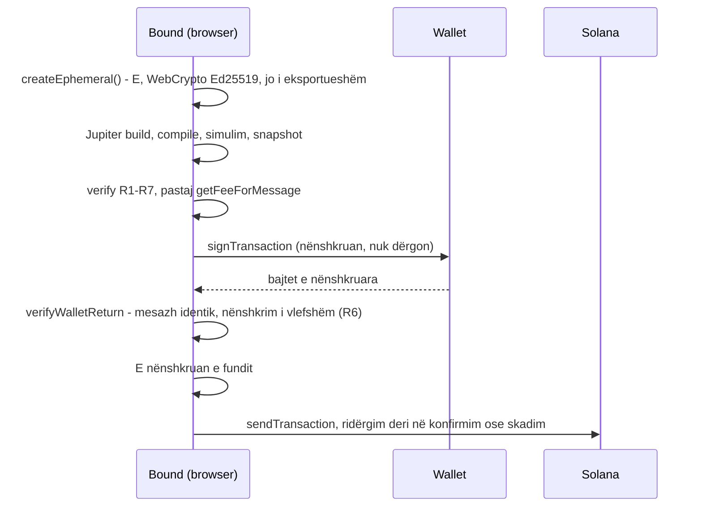

# Bound — Brief për auditimin inxhinierik

19 shtator 2026 (përditësuar pas auditimit të dytë; shih seksionin 14)

Bound është një dApp në Solana për swap të çdo tokeni, ku programi i swap-it nuk merr kurrë autoritet mbi pjesën tjetër të wallet-it. Ju kërkojmë një auditim inxhinierik të plotë të repos: siguria, korrektësia, arkitektura, testet dhe gatishmëria për përdorues realë. Presim gjetje të renditura sipas rëndësisë dhe një vendim të qartë: a mund të nisë alpha me para reale, dhe me çfarë kushtesh.

## 1. Produkti

Bound e ndan wallet-in e përdoruesit nga programi i swap-it: Jupiter merr vetëm një çelës njëpërdorimsh dhe një llogari të përkohshme me sasinë e aprovuar, kurrë wallet-in.

**Problemi.** Në një swap të zakonshëm, wallet-i nënshkruan të gjithë transaksionin dhe programi i swap-it e merr wallet-in si signer. Nëse programi, një DEX brenda route-it ose përgjigjja e API-së është keqdashse, në teori mund të prekë asete të tjera që ai nënshkrim autorizon. Kjo është e njëjta familje rreziku si "drainer"-at që marrin asete përmes një nënshkrimi.

**Zgjidhja.** Bound krijon në browser një çelës të përkohshëm **E**. Brenda një transaksioni të vetëm, wallet-i **W** kalon sasinë e swap-it në një llogari të E-së dhe instruksioni i Jupiter-it merr vetëm E-në dhe atë llogari. W nuk i jepet kurrë instruksionit të jashtëm; nënshkrimi i tij mbulon gjithë mesazhin, që Bound e ka kontrolluar bajt për bajt. Një verifier kontrollon bajtet e sakta të transaksionit para se të hapet wallet-i. Wallet-i nënshkruan i pari, Bound kontrollon çfarë u kthye, dhe E nënshkruan e fundit. Pa nënshkrimin e E-së transaksioni nuk ekzekutohet dot.

**Për kë.** Përdorues që bëjnë swap të çdo tokeni klasik SPL ose SOL, përfshirë memecoin-at, dhe duan që tokenët e tjerë, NFT-të dhe SOL-i të mos ekspozohen.

**Modeli i biznesit.** Fee 0.3% në çdo swap, pa kufi sipër, e paguar në tokenin që jep përdoruesi dhe e përfshirë në sasinë e tij. Nëse treasury nuk ka llogari për atë token, swap-i bëhet pa fee, që përdoruesi të mos paguajë kurrë qira për llogarinë tonë.

**Çfarë sheh përdoruesi.** Paneli "Wallet authority protected" me rreshtat "Other tokens and NFTs — Not exposed", "Wallet authority — Never shared" dhe "Temporary key — Used once, never stored". Nën sasinë që merr shfaqet "Minimum received … · checked by Bound".

**Statusi.** Versioni 0.1 është i plotë dhe kaloi dy auditime; të 22 gjetjet janë rregulluar (seksionet 8 dhe 14). Nuk është përdorur ende me fonde reale të përdoruesve. Bound nuk ka program on-chain.

## 2. Garancia

Për çdo transaksion që ndërton Bound, instruksioni i jashtëm (Jupiter) mund të lëvizë të shumtën `q − f` nga tokeni që jep përdoruesi. Këtu `q` është sasia që shkroi përdoruesi dhe `f` fee e Bound: 0.3% si parazgjedhje, të shumtën 1% sipas verifier-it.

- Instruksioni i jashtëm nuk merr kurrë W-në ose ndonjë llogari tokeni të W-së, përveç llogarisë ku vjen tokeni i blerë (`W_out`). Delegate-i i `W_out` hiqet para swap-it.
- Transaksioni nuk jep asnjë autoritet të ri mbi asetet e W-së: as approve, as ndryshim pronari.
- Përdoruesi merr të paktën `minOut`, minimumin që pranoi para nënshkrimit, kurrë më pak se quote-i minus 0.5%; përndryshe i gjithë transaksioni anulohet.

Formalisht, me `E_in` dhe `E_out` llogaritë e përkohshme të E-së dhe `b0` balancën e `W_out` para transaksionit:

```text
Accounts(external) ∩ ({W} ∪ TokenAccountsOwnedBy(W)) ⊆ {W_out}
Delegate(W_out) = None           kur ekzekutohet instruksioni i jashtëm
Balance(E_in) = q − f            kur ekzekutohet instruksioni i jashtëm
Received ≥ minOut                (B, C: Balance(W_out) ≥ b0 + minOut; A: Balance(E_out) ≥ minOut)
Debit(W, tokeni i dhënë) = q     Debit(W, tokenë të tjerë) = 0
Debit(W, SOL) ≤ min(F_max, 0.001 SOL) + qiraja e W_out nëse krijohet (+ q kur jepet SOL)
```

**Pse mban: R6 para R1.** Rregulli mbajtës është R6: transaksioni ka saktësisht dy signerë, W dhe E, dhe W paguan. R1 e mban W-në jashtë instruksionit të jashtëm, ndaj nënshkrimi i W-së nuk është kurrë i disponueshëm atje. Gjithçka që kërkon nënshkrimin e W-së për të lëvizur mbetet e paarritshme edhe sikur llogaria t'i jepej: transferta SPL, SOL, stake, mbyllje llogarish, ndryshime autoriteti. Filtri i adresave në R1 duhet të mbulojë vetëm atë që lëviz pa nënshkrimin e W-së: llogari tokenësh me delegate të mëparshëm dhe mint-e me permanent delegate.

**Çfarë nuk garantohet:** lëvizja e çmimit dhe MEV brenda tolerancës 0.5%, vlera e tokenit që blihet (rug pull, freeze authority), approve-t që përdoruesi ka dhënë më parë diku tjetër, faqet phishing që nuk përdorin Bound, dhe tokenët Token-2022 me extensions që i refuzojmë (tarifë transferimi, permanent delegate, ngrirje e parazgjedhur, pausable e të tjera — lista te AUDIT.md, seksioni 0f).

## 3. Si funksionon një swap

Një swap është gjithmonë një transaksion i vetëm atomik me dy signerë: W (paguan fee-n e rrjetit) dhe E. Wallet-i nënshkruan i pari pa dërguar; Bound e kontrollon përsëri dhe E nënshkruan e fundit.



Çdo dështim para nënshkrimit të E-së do të thotë që asgjë nuk mund të ekzekutohet. Pas dërgimit, ekzekutimi është atomik: ose përfundon i tëri, ose anulohet; humbet vetëm fee e rrjetit.

**Varianti A: SPL → SOL** (p.sh. USDC → SOL)

| Hapi | Instruksioni | Programi | Autoriteti |
| --- | --- | --- | --- |
| 1 | `SetComputeUnitLimit`, `SetComputeUnitPrice` (vetëm v0; në v1 janë në config të mesazhit) | ComputeBudget | — |
| 2 | `CreateIdempotent` ATA(E, input) = E_in, paguan W | ATA | W |
| 3 | `CreateIdempotent` ATA(E, WSOL) = E_out, paguan W | ATA | W |
| 4 | `CreateIdempotent` ATA(E, m) për çdo mint të ndërmjetëm që kërkon route-i (≤ 4) | ATA | W |
| 5 | `TransferChecked` W_in → E_in, `q − f` | Token | W |
| 6 | `TransferChecked` W_in → ATA(treasury, input), `f` (vetëm nëse ajo llogari ekziston) | Token | W |
| 7 | **Swap: E, E_in → E_out (+ pool-et)** | **Jupiter (i pabesuar)** | E |
| 8 | `TransferChecked` E_out → E_out, `minOut` (kontrolli i minimumit) | Token | E |
| 9 | `CloseAccount` E_in, E_out dhe çdo llogari e ndërmjetme → W | Token / Token-2022 | E |

**Varianti B: SOL → SPL.** E_in = ATA(E, WSOL), mbushet me `System Transfer` W → E_in dhe `SyncNative`. Fee është `System Transfer` W → treasury. Krijohet W_out = ATA(W, output) dhe menjëherë `Revoke(W_out)` nga W. Swap-i dërgon direkt në W_out, pastaj kontrolli `TransferChecked` W_out → W_out për `b0 + minOut`. Nuk ka E_out.

**Varianti C: SPL → SPL.** Ana e input-it si A, ana e output-it si B: `Revoke`, swap direkt në W_out, kontrolli `b0 + minOut`.

**Kontrolli i minimumit, pa program on-chain.** SPL Token e kontrollon balancën e burimit para se të shkurtojë një transferë te e njëjta llogari. Një self-transfer i `X` kalon vetëm kur balanca është të paktën `X`; përndryshe dështon me `InsufficientFunds` dhe anulon të gjithë transaksionin. Nuk lëviz asgjë. `b0` lexohet nga i njëjti snapshot që përdor verifier-i, kur përgatitet swap-i: një transfertë nga dikush tjetër në W_out para ekzekutimit llogaritet te minimumi, prandaj faqja nuk lejon dy swap-e të Bound njëkohësisht drejt të njëjtit token. Sjellja është provuar në gjendjen e mainnet-it (`tests/integration/self-transfer.ts`, T5).

**Qiraja.** E mban 0 lamports gjatë gjithë kohës. W paguan qiranë e llogarive të përkohshme dhe e merr mbrapsht me mbylljet në të njëjtin transaksion. Përjashtim është vetëm W_out kur krijohet për herë të parë (1,488,440 lamports ≈ 0.0015 SOL më 19 shtator 2026, e lexuar nga Solana), që mbetet në llogarinë e përdoruesit dhe i shfaqet para nënshkrimit.

## 4. Verifier-i: rregullat R1–R7

`verify(transaction, policy, snapshot)` është funksion i pastër, pa rrjet. Çdo fakt i zinxhirit vjen nga `snapshot`: llogaritë dhe lookup tables lexohen nga RPC, kurrë nga Jupiter. Verifier-i punon mbi bajtet e kompiluara dhe nuk importon as compiler-in, as policy builder-in (e zbaton `architecture.test.ts`). Kufijtë ekonomikë i merr nga `constants.ts`, jo nga konfigurimi.

| Rregulli | Kontrollet e sakta |
| --- | --- |
| R1 | Pas zgjidhjes së lookup tables nga snapshot-i, instruksioni i jashtëm nuk përmban W, W_in, llogarinë e fee-së ose treasury-n. Çdo llogari tjetër në të duhet të jetë në snapshot, dhe asnjë nuk mund të jetë llogari tokeni (Token ose Token-2022, ≥ 165 bajt) me pronar W, përveç W_out. W_out duhet të jetë në snapshot dhe pa close authority. Lookup-et që nuk zgjidhen dështojnë në R1. |
| R2 | Çdo instruksion i besuar dekodohet nga `parse.ts` (gjatësi e saktë e të dhënave, numri i llogarive, rolet; diskriminatorët e panjohur janë `invalid`) dhe duhet të mbushë saktësisht një slot të pritur me llogari dhe shuma të sakta. Saktësisht një instruksion i jashtëm, me programin Jupiter. Rendi: setup para swap-it, E_in krijohet para se të mbushet, SyncNative pas transfertës së SOL, W_out krijohet para Revoke. Saktësisht një kontroll minimumi me dyshemenë e policy-t (plus `b0` për W_out). Fee ≤ `MAX_FEE_BPS` (1%), minOut > 0. Shumat dhe llogaritë e derivuara rillogariten dhe krahasohen. |
| R3 | E, E_in, E_out dhe çdo llogari e ndërmjetme duhet të mungojnë ose të jenë bosh në snapshot. |
| R4 | v0: saktësisht një `SetComputeUnitLimit` (≤ 1.4M) dhe një `SetComputeUnitPrice`. v1: asnjë instruksion ComputeBudget; config-u i mesazhit lejon vetëm CU limit, priority fee dhe loaded-accounts data size ≤ 64 MiB. Të dy: `5000 × signerë + priority fee ≤ min(F_max, 0.001 SOL)`; një F_max mbi 0.001 SOL është vetë shkelje. |
| R5 | ≤ 1232 bajt (v0) ose ≤ 4096 bajt dhe ≤ 64 llogari statike (v1). Kontrolli i minimumit dhe mbylljet vijnë pas swap-it; në A kontrolli vjen para mbylljes së E_out. E_in, E_out dhe çdo llogari e ndërmjetme (≤ 4) mbyllen saktësisht një herë. |
| R6 | Fee payer është W; bashkësia e signerëve është saktësisht {W, E}. `verifyWalletReturn`: mesazhi i kthyer është identik bajt për bajt, nënshkrimi i W-së verifikohet mbi të dhe E nuk ka nënshkruar ende. |
| R7 | Mint-et e input-it dhe output-it ekzistojnë dhe i përkasin programit klasik Token ose Token-2022. Një mint Token-2022 lejohet vetëm me extensions që nuk e prekin swap-in: metadata dhe pointer-at e grupit, close authority i mint-it, transferta konfidenciale, transfer hook me program bosh, dhe — për mint-et e vetë swap-it, llogaria e përkohshme e të cilëve pastrohet para mbylljes — tarifë transferimi. Çdo gjë tjetër, përfshirë një extension që verifier-i nuk e njeh, është shkelje. |

Skedarët: `packages/verifier/src/verify.ts` (rregullat), `parse.ts` (dekoderi strikt), `wallet.ts` (R6 mbi kthimin nga wallet-i).

## 5. Harta e repos

Repo është një monorepo npm me rreth 3,000 rreshta TypeScript në kodin e produktit dhe rreth 2,000 rreshta teste. Zemra e sigurisë janë rreth 1,000 rreshta në `packages/core` dhe `packages/verifier`.

```text
bound/
├── packages/
│   ├── core/      policy, compiler, konstantet: të pastër, pa rrjet
│   ├── verifier/  7 rregullat dhe certifikata: të pastër, të pavarur nga compiler-i
│   ├── solana/    snapshot i zinxhirit, simulim, dërgim, çelësi E, RPC me riprovim
│   └── jupiter/   klienti i Jupiter Swap API V2 dhe pipeline prepare → finalize
├── apps/web/      dApp-i Next.js, proxy.ts (CSP), API routes pa gjendje
├── tests/
│   ├── integration/  T4, T1, T5 në simulim mbi mainnet
│   └── e2e/          testet në browser (Edge me Playwright)
└── spikes/        prototipi i fazës 1 dhe faqet e testit të wallet-it (jashtë produktit)
```

| Skedari | Rreshta | Përgjegjësia |
| --- | --- | --- |
| `packages/verifier/src/verify.ts` | 369 | Rregullat R1–R7 mbi bajtet e kompiluara |
| `packages/verifier/src/parse.ts` | 99 | Dekoderi strikt i instruksioneve të besuara |
| `packages/verifier/src/wallet.ts` | 49 | R6 mbi atë që kthen wallet-i |
| `packages/verifier/src/certificate.ts` | 95 | Certifikata e transaksionit të verifikuar |
| `packages/core/src/compiler.ts` | 169 | Lista e instruksioneve dhe kompilimi v0 ose v1 |
| `packages/core/src/policy.ts` | 89 | Qëllimi → policy: fee, varianti, llogaritë, minimumi |
| `packages/core/src/constants.ts` | 36 | Program ID-të, kufijtë e madhësisë dhe tavanet e verifier-it |
| `packages/jupiter/src/swap.ts` | 377 | Pipeline: quote, zgjedhja e route-it, riparimi, simulimi, verifikimi, finalizimi |
| `packages/jupiter/src/client.ts` | 156 | Klienti i Jupiter-it; `payer` nuk dërgohet kurrë; validimi i përgjigjes |
| `packages/solana/src/index.ts` | 213 | Snapshot, lookup tables, simulim, dërgim, çelësi E |
| `apps/web/components/SwapApp.tsx` | 581 | UI dhe rrjedha e nënshkrimit |
| `apps/web/proxy.ts` | 45 | CSP me nonce për çdo kërkesë |
| `apps/web/lib/server/*.ts` | 287 | Proxy-të RPC, Jupiter dhe ikona, rate limit, kill switch |
| `apps/web/lib/client/config.ts` | 11 | Fee dhe treasury, të fiksuara në build |

**Teknologjitë:** `@solana/kit` 8.3.0, `@solana-program/token` 0.16.1, `system` 0.14.1, `compute-budget` 0.18.1, Next.js 16.3.5, React 19.3.0, TypeScript 7.0.2, Vitest 4.1.11, fast-check 4.10.1, playwright-core 1.63.0, Wallet Standard 1.1.1. Node ≥ 22.18; skriptet ekzekutojnë TypeScript direkt (type stripping).

**Transaksionet v1** janë live në mainnet që nga 15 shtatori 2026 (4096 bajt, pa lookup tables, ≤ 64 llogari, compute budget në config të mesazhit). Bound i përdor kur wallet-i i deklaron; përndryshe v0. Phantom deklaron sot vetëm `legacy, 0`.

**Nga ku të nisni leximin:** ky dokument, pastaj `SECURITY.md`, `AUDIT.md` (anglisht, me seksionin 0 për rregullimet), pastaj `packages/verifier/src/`.

## 6. Vendimet e dizajnit

Këto vendime përcaktojnë formën e sistemit. Na thoni nëse ndonjë është e gabuar ose ka një rrugë më të thjeshtë.

| ID | Vendimi | Arsyeja |
| --- | --- | --- |
| D2 | Pa program on-chain të Bound | Sipërfaqe më e vogël sulmi; as kontrolli i minimumit nuk kërkon program |
| D3 | Një transaksion atomik, kurrë i ndarë | Me dy transaksione fondet mund të ngeleshin te E |
| D4 | Wallet-i nënshkruan i pari me `signTransaction`; E e fundit | Bound ka një portë të fundit pasi sheh saktësisht çfarë nënshkroi wallet-i |
| D5 | SPL klasik, SOL, dhe Token-2022 me listë të lejuar extensions-ash (AUDIT.md, seksioni 0f) | Një extension ndryshon çfarë bën një transfertë; atë që nuk e kemi lexuar, nuk e lejojmë |
| D6 | Nga Jupiter merret vetëm instruksioni i swap-it dhe adresat e ALT | Setup dhe cleanup i Jupiter-it kanë E si payer; Bound i ndërton vetë |
| D7 | E është çelës WebCrypto jo i eksportueshëm, një për transaksion | Nuk eksportohet, por skript në faqe mund ta përdorë për të nënshkruar; kjo s'ka rëndësi sepse llogaritë e E-së janë bosh jashtë transaksionit |
| D11 | v1 kur wallet-i e deklaron, përndryshe v0 | v1 nuk ka lookup tables, ndaj R1 nuk varet nga përgjigjet e RPC për to; gjendja e llogarive vjen ende nga RPC |
| D12 | Parametri `payer` i Jupiter-it nuk dërgohet kurrë (proxy e refuzon) | Me `payer = W`, W doli brenda instruksionit të swap-it në një route HumidiFi |
| D13 | Përjashtohen DEX-et që marrin qira të përhershme nga taker-i (HumidiFi, Pump.fun Amm) | Me një E të re për çdo swap, ajo qira (~0.013 SOL) do të humbte çdo herë |
| D14 | ATA(E, m) të ndërmjetme i krijon Bound dhe i mbyll te W | Disa route (p.sh. Quay) kalojnë fillimisht përmes ATA(E, output) |
| D15 | Një route i mbrojtur më shumë se 1% nën atë pa kufizime i tregohet klientit dhe vendos ai (`costs-more`), me paralajmërim më të fortë mbi 5%; Bound refuzon vetë vetëm mbi 50%, ku përgjigjja nuk është më çmim. Nuk bllokojmë një tregti thjesht se nuk na pëlqen. Simulimet e dështuara nisin riparimin e route-it | Jupiter një herë ktheu `outAmount = 0` dhe një herë një route 12% më të keq, prandaj një hendek i madh trajtohet si përgjigje e prishur. Një hendek i vogël është çmimi i mbrojtjes, dhe atë e vendos klienti, jo ne |
| D16 | Pa fee kur treasury nuk ka llogari për tokenin e dhënë | Përdoruesi nuk paguan kurrë qira për llogarinë tonë (B-09) |
| D17 | Ikonat e tokenëve i merr serveri i Bound | `img-src 'self' data:` dhe IP-ja e përdoruesit nuk u shkon hosteve të krijuesve të tokenëve (B-08) |
| D18 | Fee dhe treasury fiksohen në build (`NEXT_PUBLIC_BOUND_*`) | Serveri nuk ka kanal të gjallë për t'i ndryshuar (B-01) |

## 7. Supozimet e besimit dhe kërcënimet

Garancia mban nëse komponentët më poshtë janë të saktë dhe të pandryshuar. Rreziku më i madh që mbetet është një frontend i modifikuar (server i komprometuar ose supply chain).

| Komponenti | Supozimi | Mbrojtja sot |
| --- | --- | --- |
| Runtime-i i Solana | Një program nuk përdor dot llogari ose privilegje signer-i që nuk iu dhanë (CPI nuk i rrit ato) | T1 me instruksione direkte dhe T6 me program keqdashës të vërtetë, 17/17 |
| SPL Token, Token-2022, ATA, System | Sillen sipas specifikës, përfshirë kontrollin e balancës në self-transfer | Programe të audituara; self-transfer i provuar në gjendjen e mainnet-it |
| Kodi i Bound në browser | Compiler-i dhe verifier-i janë të saktë dhe të pandryshuar | Verifier i pavarur, teste mutacioni dhe property, CSP me nonce; build i riprodhueshëm mungon ende |
| Serveri i Bound | Shërben faqen e vërtetë dhe përcjell përgjigjet e RPC-së dhe metadata e tokenëve | Nuk mund të ndryshojë fee-n ose treasury-n; F_max e tij kufizohet nga verifier-i; decimals kontrollohen kundrejt mint-it on-chain |
| RPC | Kthen gjendje të vërtetë llogarish dhe lookup tables | v1 nuk ka lookup tables, por gjendja e llogarive vjen ende nga RPC; në v0, një RPC i dytë duhet të kthejë çdo hyrje të çdo tabele |
| Wallet-i | Nënshkruan bajtet që i jepen | Mesazhi i kthyer rikontrollohet bajt për bajt para se të nënshkruajë E |
| Jupiter | **I pabesuar.** Instruksioni i tij trajtohet si armiqësor | Verifier-i; lookup tables e Jupiter-it përdoren vetëm për kompresim, kurrë për verifikim |

**Kërcënimet që mbulohen:**

- DEX ose program keqdashës brenda route-it: kufizohet te sasia e aprovuar; një dalje më e vogël se minimumi anulon transaksionin.
- Përgjigje e komprometuar nga API e Jupiter-it: e refuzon verifier-i.
- Ndryshim pas verifikimit nga wallet-i, extension-i ose rrjeti: e refuzon kontrolli i kthimit (R6).
- Server i komprometuar që ende shërben faqen e vërtetë: sheh mint-e, shuma, çelësin publik të E-së dhe adresën e përdoruesit, kurrë çelës privat. Mund të ndalë swap-et, por nuk mund ta çojë fee-n mbi 1%, fee-n e rrjetit mbi 0.001 SOL, ose ta dërgojë fee-n diku tjetër.

**Nuk mbulohen:** server ose varësi që shërben faqe të **modifikuar**, phishing jashtë Bound, approve të vjetër, vlera e tokenit të blerë, dhe çmimi brenda tolerancës 0.5%.

## 8. Auditimi i parë dhe si u zgjidh

Një rishikim i jashtëm i v0.1 (19 shtator 2026) nuk gjeti mënyrë për të thyer garancinë e autoritetit dhe ngriti 12 gjetje. Të gjitha u rregulluan po atë ditë, secila me test regresioni në `packages/verifier/test/audit.test.ts` ose `apps/web/test/server.test.ts`. Ju lutemi konfirmoni që secili rregullim e mbyll gjetjen dhe nuk prishi diçka tjetër.

| ID | Rëndësia | Gjetja | Si u zgjidh |
| --- | --- | --- | --- |
| B-01 | Mesatare | Verifier-i nuk e kufizonte fee-n e Bound | Tavan `MAX_FEE_BPS` = 1% në `constants.ts`; fee dhe treasury fiksohen në build |
| B-02 | Mesatare | Verifier-i nuk e kufizonte vetë F_max | R4 krahason me `min(F_max, 0.001 SOL)`; një F_max më i lartë është shkelje |
| B-03 | E ulët | W_out me delegate ose close authority | `Revoke(W_out)` i besuar para swap-it; close authority refuzohet; W_out lexohet gjithmonë në snapshot |
| B-04 | Mesatare | "Minimum received" nuk garantohej nga Bound | Kontrolli i minimumit me self-transfer (seksioni 3); T5 në mainnet |
| B-05 | E ulët | Kill switch dhe limiti USD vetëm në React | Kill switch në server (`/api/jupiter/build`, `sendTransaction`); limiti USD bllokon kur mungon çmimi |
| B-06 | E ulët | Rate limit mbi header që e shkruan klienti | Header i platformës ose hyrja më e djathtë e X-Forwarded-For; limit i veçantë për `sendTransaction` |
| B-07 | E ulët | Config-u v1 kontrollohej pjesërisht | Listë e lejuar e plotë e fushave |
| B-08 | E ulët | `script-src 'unsafe-inline'` dhe `img-src https:` | CSP me nonce në `proxy.ts`; ikonat nga `/api/token-icon` |
| B-09 | Info | Qiraja kalonte kufirin e deklaruar për SOL | Pa krijim të llogarisë së treasury-t në kurriz të përdoruesit; qiraja e W_out shfaqet para nënshkrimit |
| B-10 | Info | Hop-et Token-2022 pa kufizim | Pa transfer hook dhe pa permanent delegate; ≤ 4 llogari të ndërmjetme |
| B-11 | Info | Llogaria e fee-së mund t'i jepej swap-it | R1 e refuzon |
| B-12 | Info | `LAMPORTS_PER_SIGNATURE` i fiksuar | Kryqkëzim me `getFeeForMessage` pas verifikimit |

Testet tonë në mainnet pas rregullimeve zbuluan edhe dy gjëra të reja, që u rregulluan: një route me mbi 64 llogari rrëzonte pipeline-in (tani kalon te një route më i vogël), dhe Jupiter e kthen si HTTP 400 gabimin kalimtar "Pool has not been updated" (tani riprovohet). Detajet janë në `AUDIT.md`, seksioni 0.

## 9. Testet dhe si t'i ekzekutosh

Të gjitha testet kalojnë në gjendjen aktuale; i vetmi dështim në mainnet ishte një quote që Jupiter nuk e dha në atë moment. Testet në mainnet janë vetëm simulime: asgjë nuk nënshkruhet dhe asgjë nuk dërgohet.

| Suita | Çfarë bën | Rezultati |
| --- | --- | --- |
| `packages/verifier/test/verifier.test.ts` | Swap-e të ndershme v0/v1 për çdo variant; mutacionet M1–M16; sulme të tjera | 39/39 |
| `packages/verifier/test/audit.test.ts` | Një ose më shumë teste për çdo gjetje B-01–B-12 dhe C-05 | 35/35 |
| `packages/verifier/test/wallet.test.ts` | R6: identik, i ndryshuar, i panënshkruar, nënshkrim i falsifikuar, E e nënshkruar para kohe | 6/6 |
| `packages/verifier/test/property.test.ts` | fast-check: format e ndershme kalojnë, 15 lloje sulmesh të rastësishme refuzohen | 20,000 raste për secilën veti |
| `packages/verifier/test/architecture.test.ts` | Verifier-i importon vetëm kit, klientin e token-it dhe konstantet e tipet e Bound; core nuk e importon verifier-in; tavanet vijnë nga `constants.ts` | 3/3 |
| `packages/verifier/test/certificate.test.ts` | Certifikata: debiti i aprovuar, fee, minimumi, nënshkruesit, SHA-256 i mesazhit; nuk lëshohet kurrë për transaksion që dështon | 6/6 |
| `apps/web/test/server.test.ts` | Proxy-të: çelësi i klientit vetëm nga header-i i konfiguruar, kill switch, listat e lejuara, madhësia në bajte, timeout-et, ikonat me URL-të e vizituara | 22/22 |
| `packages/jupiter/test/*.test.ts` | Përgjigje të keqformuara të Jupiter-it; route mbi 64 llogari; pipeline-i real me Jupiter armiqësor (C-01, C-02, B-12, C-09); refuzimet e përkohshme; route i shtrenjtë sa nuk nxë | 26/26 |
| `packages/solana/test/send.test.ts` | Rezultatet e dërgimit (C-03) dhe përputhja e plotë e lookup tables | 11/11 |
| `tests/integration/mainnet.ts` T4 | Pipeline i plotë mbi gjendjen e mainnet-it, 30 çifte × v0 dhe v1, me fee | 60/60 pas rregullimeve të auditimit të dytë |
| `tests/integration/mainnet.ts` T1 | 8 sulme me SPL Token dhe System realë në vendin e Jupiter-it | 8/8 siç pritej; verifier-i i refuzon të 8-t |
| `tests/integration/mainnet.ts` T5 | Minimumi i ngritur ×2 duhet të bjerë pikërisht te kontrolli | 3/3 |
| `tests/cpi/run.ts` + `tests/cpi/attacker` T6 | Program keqdashës i vërtetë, i ngarkuar në një makinë virtuale Solana, sulmon transaksionin e mbrojtur nga brenda një CPI-je; pas çdo rasti kontrollohet zinxhiri | 17/17 |
| `tests/integration/large.ts` T7 | Shuma në rritje deri në rreth $10M mbi gjendjen e mainnet-it: a ndërtohet, verifikohet dhe simulohet ende, dhe sa kushton madhësia | 12 u ndërtuan dhe u simuluan, 1 u refuzua drejt, 2 nuk u provuan dot |
| `tests/integration/thresholds.ts` T9 | Sa kushton mbrojtja kundrejt tregut të hapur: 12 tokena × 4 madhësi, dhe çfarë do të bënte secili prag | 45/48 u ndërtuan; mediana 0.00%, p95 1.81%, maksimumi 18.22% (AUDIT.md, seksioni 0g) |
| `tests/integration/self-transfer.ts` | Sjellja e self-transfer në SPL Token | 4/4 |
| `tests/e2e/smoke.ts` | Browser real (Edge), wallet testimi që kthen tx pa nënshkruar: faqja duhet të ndalë te R6; CSP; ikonat; Jupiter nuk merr adresën e wallet-it; ngjitja e adresës së coin-it | 17/17 |
| `tests/e2e/devnet.ts` | Nënshkrim → verifikim → E → dërgim në devnet | I bllokuar nga faucet-i publik i devnet |

**Si t'i ekzekutosh** (Node ≥ 22.18; për e2e duhet Microsoft Edge):

```bash
npm install
npm run typecheck && npm test          # ~10 s, 141 teste
BOUND_FUZZ_RUNS=20000 npx vitest run packages/verifier/test/property.test.ts   # ~15 min
npm run test:fuzz                      # 100,000 raste për veti, ~75 min
npm run integration                    # T4 + T1 + T5 në mainnet, ~20 min
(cd tests/cpi/attacker && cargo build-sbf) && node tests/cpi/run.ts   # T6; Linux ose macOS, edhe në CI
node tests/integration/large.ts         # T7: shuma deri në rreth $10M
node tests/integration/self-transfer.ts
npm run build && npm run start -w @bound/web
npm run e2e                            # ~2 min, kundrejt http://localhost:3000
```

Integrimi përdor RPC publik të mainnet-it dhe Jupiter pa key, prandaj mund të shfaqen dështime kalimtare (quote që mungon, 429). Si fee payer në simulim përdoren wallet-e publike exchange-sh me `sigVerify: false`. `RPC_URL` dhe `JUPITER_API_KEY` në mjedis e bëjnë më të qëndrueshëm. Rezultatet ruhen te `tests/integration/results/`.

## 10. Çfarë duhet të kontrollosh

Kërkojmë një auditim të të gjithë repos, jo vetëm të verifier-it. Lista më poshtë është e renditur sipas rëndësisë për ne; shtoni çdo gjë që mungon.

### A. Siguria on-chain dhe garancia

- [x] **Sulmet me CPI (prioriteti 1).** U bë: testi T6 (`tests/cpi/`) ngarkon një program keqdashës të vërtetë në vendin e Jupiter-it dhe e lë të sulmojë nga brenda një CPI-je. 17 raste, të gjitha kaluan. Mbetet për ju: a ka sulm që lista nuk e mbulon — sidomos rikrijimi i një llogarie të mbyllur nga një PDA brenda swap-it, ose ri-hyrja përmes një transfer hook Token-2022?
- [ ] **Plotësia e R1 duke u mbështetur te R6.** A ka ndonjë aset të W-së që lëviz pa nënshkrimin e W-së dhe që filtri i R1 nuk e kap?
- [ ] **Kontrolli i minimumit** (`compiler.ts`, `verify.ts`). A mund ta kalojë një route kontrollin duke dhënë më pak se `minOut`? Një transfertë e jashtme në W_out midis përgatitjes dhe ekzekutimit do ta fshihte mungesën; a është e pranueshme?
- [ ] **`Revoke(W_out)`**: a mjafton, dhe a është në vendin e duhur? W_out është e vetmja llogari e W-së e shkrueshme në swap.
- [ ] **Privilegji i E-së** brenda instruksionit të jashtëm: gjithçka që E mund të bëjë duhet të kufizohet te `q − f` ose të shkaktojë anulim.

### B. Verifier-i (`packages/verifier/src/`)

- [ ] `parse.ts`: a janë format e instruksioneve të besuara mjaft strikte? Rolet kontrollohen si "të paktën"; a duhet të jenë të sakta?
- [ ] `verify.ts`: tabela e slot-eve, rendi, rillogaritja e shumave, `b0` nga snapshot-i, zgjidhja e lookup tables.
- [ ] Leximi i `configMask` të v1 mbështetet te struktura e brendshme e `@solana/kit`. A është i brishtë nga një përditësim i kit?
- [ ] Parsimi ynë i TLV-së për extension-et Token-2022 (`riskyMintExtension`): i saktë për çdo layout? Ka extension-e të tjera që duhen refuzuar?
- [ ] Aritmetika: u64, bigint, rrumbullakimi i fee-s (poshtë), `ceil` në R4.

### C. Pipeline (`packages/jupiter/src/swap.ts`, `packages/solana/src/index.ts`)

- [ ] Zgjedhja e route-it, nivelet `maxAccounts`, riparimi duke fajsuar DEX-in nga log-et. A mund të shkaktojë një DEX keqdashës përjashtimin e të tjerëve?
- [ ] Mbrojtja nga quote-t e këqija krahason Jupiter me Jupiter. Na duhet një oracle i pavarur çmimi?
- [ ] TOCTOU midis snapshot-it dhe ekzekutimit; besimi te RPC për lookup tables në v0; kryqkëzimi me RPC-në e dytë krahason vetëm pjesën e përbashkët.
- [ ] `getFeeForMessage` injorohet kur RPC dështon. A është OK?
- [ ] Dërgimi, ridërgimi dhe konfirmimi deri në skadimin e blockhash-it.

### D. Wallet-i

- [ ] `signTransaction` i pari dhe E e fundit: a ka wallet që e ndryshon mesazhin (p.sh. Phantom me asertime Lighthouse) ose që e dërgon vetë?
- [ ] Zbulimi i versioneve të mbështetura (`legacy`, `0`, `1`) dhe sjellja në browser-at brenda wallet-eve në celular.
- [ ] WebCrypto Ed25519 dhe çelësi jo i eksportueshëm në të gjithë browser-at që na interesojnë.

### E. Frontend dhe serveri (`apps/web`)

- [ ] CSP në `proxy.ts`: nonce, `'strict-dynamic'`, dhe arsyeja pse `style-src` mban `'unsafe-inline'`.
- [ ] Proxy-të: lista e metodave RPC, madhësia e body, RPC-ja e dytë vetëm për lexime, parametrat e Jupiter-it, proxy-ja e ikonave (SSRF, redirect-et, SVG).
- [ ] Rate limit-i është në memorie për çdo instancë; në serverless nuk është global. A mjafton për alpha?
- [ ] Asnjë sekret në bundle; `NEXT_PUBLIC_*` janë publike me qëllim (adresa e treasury-t dhe fee).
- [ ] Supply chain: varësitë, lockfile, skriptet e instalimit. Si ta bëjmë build-in të riprodhueshëm dhe me SRI?
- [ ] Privatësia: çfarë shohin ende serveri dhe RPC-ja (adresa e përdoruesit në leximet e balancës); quote-t shkojnë te Jupiter me adresë neutrale.

### F. Ekonomia dhe UX

- [ ] Modeli i fee-s: në tokenin e dhënë, rrumbullakim poshtë, pa fee kur mungon llogaria e treasury-t. A mund të shmanget fee-ja në mënyrë abuzive?
- [ ] Slippage i fiksuar 0.5%: tokenët e rrallë do të dështojnë shpesh. A duhet slippage dinamik, dhe me çfarë rreziku?
- [ ] A janë të sakta dhe të qarta mesazhet dhe kostot që sheh përdoruesi: fee, qiraja e llogarisë së re, minimumi, limiti $100?

### G. Kodi dhe arkitektura

- [ ] Kufijtë midis paketave, tipet, trajtimi i gabimeve, lexueshmëria, boshllëqet në teste.
- [ ] A mund të shtrihet arkitektura për agregatorë të tjerë përveç Jupiter-it, ose si SDK për wallet-e dhe DEX-e?

### H. Operacionet dhe gatishmëria për prodhim

- [ ] Deploy-i, RPC me pagesë, key i Jupiter-it, monitorimi (sot nuk ka log-e, me qëllim), reagimi ndaj incidenteve me kill switch.
- [ ] Menaxhimi i treasury-t: çelësi mbahet jashtë serverit; llogaritë për tokenët kryesorë krijohen para publikimit.

## 11. Pyetjet ku jemi më pak të sigurt

Këto janë pyetjet për të cilat na intereson më shumë një përgjigje e drejtpërdrejtë.

1. A mund të mbajë një program keqdashës, përmes CPI, fonde ose qira pa i bërë mbylljet tonë të dështojnë? Testi T6 thotë jo për 17 raste; a mungon ndonjë rrugë?
2. A mund të kalojë kontrolli i minimumit ndonëse route-i jep më pak? A duhet të shqetësohemi për një transfertë të jashtme në W_out që e fsheh mungesën?
3. A është `Revoke(W_out)` i mjaftueshëm, apo ka rrugë tjetër për të lëvizur tokena nga W_out pa nënshkrimin e W-së?
4. A është i saktë parsimi ynë i extension-eve Token-2022 për hop-et, dhe a duhen refuzuar extension-e të tjera (p.sh. pausable, default frozen)?
5. RPC që gënjen: nëse thotë se llogaria e treasury-t mungon, swap-i bëhet pa fee; nëse thotë se ekziston kur nuk ekziston, transaksioni dështon në simulim. A ka rrezik për përdoruesin që nuk e shohim?
6. Proxy-ja e ikonave: a ka rrugë për SSRF ose për injektim përmbajtjeje?
7. `style-src 'unsafe-inline'`: a pranohet arsyeja jonë, me `img-src` dhe `connect-src` të mbyllura?
8. Rate limit në memorie për çdo instancë: a është i pranueshëm për alpha, apo duhet një store i përbashkët?
9. Wallet-et që ndryshojnë mesazhin (Lighthouse në Phantom): R6 i refuzon. Si ta trajtojmë pa e dobësuar garancinë?
10. A ka diçka në garanci (seksioni 2) që ende është thjeshtësuar ose e thënë më fort se ç'duhet?

## 12. Çfarë presim mbrapsht

Një raport në Markdown, në shqip ose anglisht, që fillon me vendimin për alpha dhe vazhdon me gjetjet.

1. **Vendimi:** a mund të nisë alpha me para reale (limit $100 për swap)? Po, jo, ose po me kushte, dhe cilat janë kushtet.
2. **Gjetjet**, një për rresht, me këto fusha:

| Fusha | Përmbajtja |
| --- | --- |
| ID | P.sh. C-01 |
| Rëndësia | Kritike, E lartë, Mesatare, E ulët, Info |
| Vendi | `skedari:rreshti` |
| Përshkrimi | Çfarë shkon keq dhe në çfarë kushtesh |
| Ndikimi | Çfarë humbet përdoruesi ose Bound |
| Prova (PoC) | Mundësisht si test në repo (Vitest ose skript në `tests/`) |
| Rregullimi | Çfarë rekomandoni |

3. **Konfirmimi i rregullimeve** B-01 deri B-12: të mbyllura apo jo, dhe çfarë prishën.
4. **Përgjigjet** për pyetjet e seksionit 11.
5. **Feedback për dizajnin:** çfarë do të ndryshonit para përdoruesve realë, dhe rrugë më të thjeshta për të njëjtën garanci.
6. **Vlerësimi i testit T6**: a mbulon lista e rasteve çdo sulm që do të provonit ju?

Shpjegimet janë të mirëpritura: ky është edhe mësim për ekipin. Nëse diçka nuk mund ta kontrolloni (p.sh. nuk ekzekutohet një test), shkruajeni qartë, që të dimë çfarë nuk është konfirmuar.

## 13. Kufizimet e njohura dhe punët e hapura

Këto i dimë tashmë; nuk ka nevojë t'i raportoni si gjetje të reja, por jeni të mirëpritur t'i vlerësoni.

- **Testi T6** ekzekutohet mbi litesvm (runtime-i i Agave me programet reale SPL), jo mbi një validator, dhe sulmuesi është programi ynë, jo një DEX i vërtetë. Transfer hook-et e Token-2022 dhe rikrijimi i një llogarie të mbyllur nga një PDA nuk mbulohen ende.
- **Build i riprodhueshëm dhe SRI** mungojnë për frontend-in.
- **Rishikimi i varësive** (supply chain) nuk është bërë; do ta porosisim veçmas.
- **Phantom** deklaron vetëm `legacy, 0`, ndaj përdoruesit marrin sot v0, me lookup tables dhe besim te RPC për to. Sjellja e Phantom-it me `signTransaction` dhe një signer të dytë nuk është provuar ende me fonde reale.
- **Treasury** duhet të ketë llogari për çdo token ku merret fee; pa të, swap-i bëhet pa fee.
- **Nuk ka limit shume**: garancia nuk varet nga sasia. `BOUND_MAX_USD_PER_SWAP` mbetet si valvul operacionale, i pavendosur si parazgjedhje.
- **Shumat e mëdha** kufizohen nga route-i, jo nga ne: Jupiter i ndan nëpër më shumë pool-e, kurse një transaksion v0 mban 64 llogari dhe 1232 bajt. Pipeline-i provon me më pak llogari dhe, nëse prapë nuk nxë, refuzon ta ndërtojë swap-in. Nuk e ndajmë kurrë një swap në disa transaksione.
- **Testi në devnet** është gati, por i bllokuar nga faucet-i publik.
- **`sendTransaction`** kalon ende përmes proxy-t sepse RPC publik refuzon origjinat e browser-it (HTTP 403).
- **`spikes/`** janë prototipe të fazës 1 dhe faqe testimi; nuk janë pjesë e produktit.

**Materialet:** repo `bound/`; `AUDIT.md` (anglisht, me rregullimet pas auditimit të parë); `SECURITY.md`; `TESTIMI.md` (testet manuale me wallet); raporti i auditimit të parë (`bound-v0.1-audit.md`), nëse e dërgojmë bashkë me repon.

## 14. Ndryshimet pas auditimit të dytë

Auditimi i dytë (19 shtator 2026) nuk gjeti rrugë për të marrë asetet e tjera të përdoruesit dhe ngriti 10 gjetje (C-01 deri C-10). Të gjitha janë rregulluar, secila me një test që dështon me kodin e vjetër. Detajet teknike janë te `AUDIT.md`, seksioni 0b.

| ID | Rëndësia | Çfarë ndryshoi |
| --- | --- | --- |
| C-01 | E lartë | Shuma që shkruan klienti kthehet me decimals nga mint-i on-chain, jo nga metadata e Jupiter-it. Pipeline-i refuzon kur decimals e faqes ndryshojnë nga zinxhiri, dhe verifier-i i krahason me snapshot-in. |
| C-02 | E lartë | Minimumin e llogarit Bound: quote × (1 − 0.5%), i rrumbullakuar poshtë; pragu i Jupiter-it mund ta bëjë vetëm më të rreptë. Minimumi që pa klienti bëhet minimumi që kontrollohet on-chain. Nëse tregu nuk e mban më, klienti sheh minimumin e ri dhe vendos; nuk ulet kurrë në heshtje. Përgjigjet e Jupiter-it për një tregti tjetër refuzohen. |
| C-03 | Mesatare | Signature regjistrohet para dërgimit. Rezultatet: confirmed, failed, rejected, expired, unknown. "No funds moved" thuhet vetëm kur rrjeti e provon; swap-et e pasigurta rikontrollohen në vizitën tjetër. |
| C-04 | Mesatare | Çelësi i klientit merret vetëm nga header-i i konfiguruar (`BOUND_CLIENT_IP_HEADER`). Limiti global vendoset te firewall-i i hosting-ut. |
| C-05 | E ulët | Verifier-i e nxjerr variantin nga mint-et. |
| C-06 | E ulët | Asnjë shumë nuk rrumbullakohet lart; minimumi shfaqet me të gjitha shifrat. |
| C-07 | E ulët | Body numërohet në bajte gjatë leximit; thirrjet te RPC dhe Jupiter kanë timeout 15 s. |
| C-08 | E ulët | Testet e ikonave arrijnë rrugët që emërtojnë; T4 kontrollon edhe llogaritë e ndërmjetme. |
| C-09 | E ulët | Qiraja vjen nga Solana (1,488,440 lamports më 19 shtator 2026); fee e saktë e rrjetit shfaqet para nënshkrimit. |
| C-10 | E ulët | Përgjigjet e vjetra të kërkimit dhe të balancës injorohen. |

Gjithashtu: kontrolli i fee-së së rrjetit tani ndalon kur Solana nuk e jep çmimin (B-12); lookup tables duhet të përputhen plotësisht me RPC-në e dytë; faqja nuk lejon dy swap-e të Bound njëkohësisht drejt të njëjtit token (vendimi A); faqja paralajmëron kur Revoke heq një delegate ekzistues; një wallet pa transaksione me version refuzohet me mesazh të qartë; quote-t kërkohen me adresë neutrale; një adresë e ngjitur që Jupiter nuk e njeh lexohet nga Solana; limiti i kohës së fuzz-it rritet me numrin e rasteve; teksti "Temporary key" tani thotë "Used once, never stored".

**Korrigjime në këtë brief:** qiraja (ishte 0.00203928 SOL), koha e `test:fuzz` (~75 min, jo ~1 orë), CI (workflow-i ekziston, por nuk ka ekzekutuar), formulimi për v1 dhe RPC, shtrirja e rregullit B-10 (vetëm mint-et e llogarive të ndërmjetme që krijon Bound), dhe numrat e testeve.

**Pas auditimit të dytë u morën edhe disa ide nga dokumenti i produktit:** verifier-i është paketë më vete (`packages/verifier`, `@bound/verifier`); pas çdo verifikimi të suksesshëm lëshon një certifikatë (debiti i aprovuar, fee, minimumi, programet, versioni, SHA-256 i mesazhit) që faqja e shfaq ndërsa wallet-i është i hapur; leximet nga RPC dhe Jupiter bëhen paralelisht (në testin në browser, nga klikimi te wallet-i < 1 s); çmimi rifreskohet çdo 20 s tri herë dhe pastaj pret butonin "Refresh price"; tekstet e UI-së janë më të sakta. Detajet: `AUDIT.md`, seksioni 0c.

**Për rishikimin e radhës:**

1. Minimumi i pranuar (`routeFloor`, `acceptedMinOut`, `price-moved`): a ka rrugë ku minimumi i zbatuar del më i ulët se ai që pa klienti, ose ku klienti nënshkruan pa e parë?
2. Rezultatet e dërgimit: "no funds moved" vetëm për `rejected` (gabim JSON-RPC ose HTTP 4xx te dërgimi i parë) dhe `expired` (blockhash i skaduar, dy kërkime në histori pa rezultat). A qëndrojnë të dyja për çdo ofrues RPC?
3. Bllokimi i swap-eve paralele mbi localStorage: a mjafton për alpha?
4. Testi T6: a mungon ndonjë sulm në listën e rasteve?
5. Për mbështetjen e ardhshme të Token-2022 si input/output: cilat extension-e duhen refuzuar?
