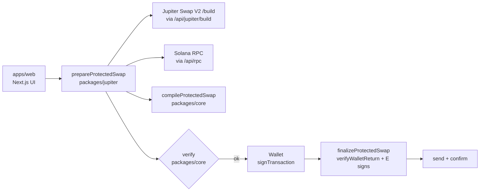
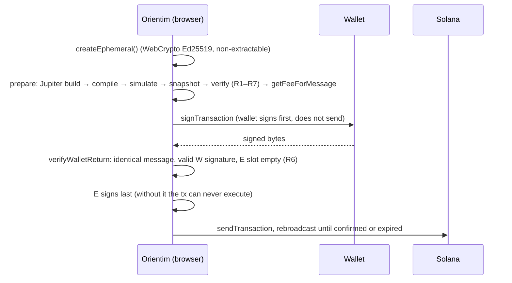

# Orientim v0.1 — Audit brief (revision 3, after the second review)

This document gives an auditor everything needed to review Orientim v0.1: what it guarantees, how it
works, where each piece lives, what has been tested, and where we are least sure. We ask for a full
security review and, just as much, for design feedback: where the approach is wrong, fragile, or
could be simpler.

- Code: this repository (`bound/`). Start with sections 0b, 0c, 0 and 1–4, then `packages/verifier/src/`.
- Status: feature-complete for v0.1, not yet used with real user funds. No on-chain program.
- Revision 1: 19 September 2026, reviewed in `bound-v0.1-audit.md` (findings B-01 to B-12).
- Revision 2: 19 September 2026. Section 0 lists what changed after the first review.
- Second review: 19 September 2026, engineering audit of the whole repository (findings C-01 to C-10).
- Revision 3: 19 September 2026, this document. Section 0b lists what changed after the second review.

---

## 0. Changes after the first review

Every finding has a regression test that replaces the reviewer's proof of concept
(`packages/verifier/test/audit.test.ts`, `apps/web/test/server.test.ts`).

| ID | Severity | Status | What changed | Tests |
| --- | --- | --- | --- | --- |
| B-01 | Medium | Fixed | The verifier refuses a fee above `MAX_FEE_BPS` (1%, `constants.ts`). Fee and treasury are compiled into the page at build time (`NEXT_PUBLIC_ORIENTIM_*`) and are no longer served by `/api/status`. | 5000, 9999 and 101 bps → R2; the architecture test asserts the verifier uses the ceilings from `constants.ts` |
| B-02 | Medium | Fixed | R4 compares against `min(policy F_max, ABSOLUTE_MAX_NETWORK_FEE_LAMPORTS)` (0.001 SOL); a policy F_max above the ceiling is itself a violation. The server clamps its setting too. | 710,000 lamports with a 1 SOL policy → R4 |
| B-03 | Low | Fixed | A trusted `Revoke(W_out)` signed by W runs before the swap (variants B, C). `W_out` is always fetched into the snapshot; one with a close authority is refused by the pipeline (`output-account-restricted`) and by R1. | delegate neutralised; missing Revoke → R2; close authority → R1; `W_out` missing from the snapshot → R1 |
| B-04 | Medium | Fixed | Minimum-output assertion without an on-chain program (section 3). The floor is the chosen route's `otherAmountThreshold`; the verifier refuses a floor of 0 and a check with any other amount, account, authority or position. The UI now shows "Minimum received … checked by Orientim". | honest A/B/C accepted, including a non-empty `W_out`; missing, weaker, `b0`-ignoring and misplaced checks rejected; mainnet T5 3/3 |
| B-05 | Low | Fixed | The kill switch is enforced by `/api/jupiter/build` and by `sendTransaction` on `/api/rpc`. The USD cap fails closed when a token has no USD price. | server tests |
| B-06 | Low | Fixed | Client key: the platform header (`x-vercel-forwarded-for`, `cf-connecting-ip`), else the rightmost `X-Forwarded-For` entry. `sendTransaction` has its own limit (20/min). Expired windows are swept once a minute; memory is bounded. | server tests |
| B-07 | Low | Fixed | The v1 message config is an allowlist: CU limit, priority fee and loaded-accounts data size (≤ 64 MiB). Any other field → R4. | heap size in the config → R4 |
| B-08 | Low | Fixed | Nonce-based CSP from Next.js 16 `proxy.ts` with `'strict-dynamic'`; the page renders per request. `img-src 'self' data:`; token icons come from `/api/token-icon` (section 9, question 6). | e2e: a different nonce per request, no `'unsafe-inline'` for scripts, no third-party image request; icon proxy tests |
| B-09 | Info | Fixed | The reviewer's cleanest option: Orientim no longer creates the treasury's account at the user's expense. If `ATA(treasury, input)` does not exist, the swap is fee-free (the policy's treasury is null). `createFeeAccount` is gone from policy, compiler and verifier. The remaining rent (opening `W_out`) is returned as `oneTimeCosts` and shown before and while the wallet is open; the guarantee now carries that term. | fee-free without the account; creating the treasury account → R2; SOL input still pays the fee |
| B-10 | Info | Fixed | A Token-2022 hop mint must be in the snapshot and carry no transfer hook (non-null program) and no permanent delegate a program can sign for (R7; see 0j). At most 4 intermediate accounts (R5). The pipeline treats a refused hop as a route to repair. | base mint, harmless extension and null hook accepted; hook, permanent delegate and missing mint → R7; 5 hops → R5 |
| B-11 | Info | Fixed | R1 refuses the fee account and the treasury inside the external instruction. | fee ATA in the swap → R1 |
| B-12 | Info | Mitigated | The constant is documented as a cluster parameter, and after verification the pipeline prices the final message with `getFeeForMessage` and refuses a fee above the limit. | mainnet runs |

Adopted from the answers and design feedback:

- The security model now leads with R6 (`SECURITY.md`, and a note above the rules in `verify.ts`).
- The five overstated claims are corrected: the SOL line carries a rent term; the fee is bounded
  and fixed at build time; the backend's role is stated in full; `W_out` is handled by `Revoke`; the
  minimum output is now something Orientim itself enforces.
- R5's size measure is pinned by a test (`getTransactionSize` equals the encoded length, v0 and v1).
- D7 now says what non-extractable does not mean: script in the page could still use E to sign.
- Jupiter's `/build` answers are validated: a malformed amount or instruction is a `JupiterError`,
  not a crash further down (answer 7).
- The second RPC relays only the two reads that lookup tables need; an oversized body is refused
  before parsing. (The second RPC was removed on 23 September 2026, section 0l.)

Found by our own mainnet runs after the fixes (not in the review):

- A Jupiter route whose accounts, together with Orientim's, exceed Solana's 64-account limit made the
  compiler throw (USDC → HNT). It now counts as "does not fit" and a smaller route is requested
  (`compileIfFits` in `swap.ts`, `packages/jupiter/test/swap.test.ts`).
- The mainnet test re-prepares once when the execution check reverts because the price or a pool
  moved in the seconds after prepare, as a user would retry; a pair must pass on its own second
  prepare.
- Jupiter wraps a transient upstream failure ("Pool has not been updated in a while") in HTTP 400;
  the client now retries it like its other transient errors.

Done since: the **CPI-based malicious program test**, the reviewer's top item (T6, section 0d).
The repository is on GitHub now and both workflows run on every push.

Not done yet, in priority order:

1. **Reproducible build and SRI** for the frontend.
2. **Dependency supply-chain review**, to be commissioned separately.
3. Exact (not "at least") role checks in `parse.ts`: the reviewer found the current checks not
   abusable, so this is left as an optional strengthening.
4. `sendTransaction` is still proxied: the public RPC refuses browser origins (HTTP 403), so the
   browser cannot broadcast directly without a third-party RPC. It is rate-limited separately and
   blocked by the kill switch.

---

## 0b. Changes after the second review

The second review found no way to take the user's other assets, and ten findings (C-01 to C-10)
about the link between what the user accepts and what the verifier enforces, the send lifecycle,
the proxies and the tests. Each has a regression test that fails on the old code.

| ID | Severity | Status | What changed | Tests |
| --- | --- | --- | --- | --- |
| C-01 | High | Fixed | The page converts what the user types with the mint's **on-chain** decimals (`readMint` in `apps/web/lib/client/tokens.ts`); Jupiter's metadata is only for names and icons. The request carries the decimals the page used, and `prepareProtectedSwap` refuses to build when they differ from the chain (`token-data-mismatch`). The verifier also compares the policy's decimals with the mints in the snapshot (R2). A USD price is used only if it is a finite positive number. | `packages/jupiter/test/prepare.test.ts` (metadata says 9 for USDC → refused); `audit.test.ts` (decimals ≠ mint → R2) |
| C-02 | High | Fixed | Orientim computes the floor itself: `outAmount × (1 − slippage)`, rounded down; Jupiter's `otherAmountThreshold` can only make it stricter (`routeFloor`). A Jupiter answer for another pair or amount is refused. The page shows that floor, and the request carries it as `acceptedMinOut`: the transaction enforces at least what the user saw. If the market can no longer deliver it, nothing is built; the page shows the new minimum and asks (`price-moved`), and it never lowers it silently. A swap needs a visible quote. | `prepare.test.ts`: floor of 1 replaced; stricter floor kept; accepted minimum enforced; `price-moved` with the new minimum; answer for another amount → `bad-quote` |
| C-03 | Medium | Fixed | `sendAndConfirm` reports the signature before the first request; the page records the swap as `pending` with its `lastValidBlockHeight` at that moment. Outcomes: `confirmed`, `failed` (reverted, fee paid), `rejected` (a structured preflight failure or an HTTP 4xx explicitly marked by Orientim's proxy as stopped locally), `expired` (the recorded block height has passed and two full-history lookups find nothing), `unknown` (anything else, including upstream HTTP/JSON-RPC errors and `processed` that never confirms). "No funds moved" is said only for proven `rejected` and `expired` outcomes. Old history entries without a block height remain unknown. Re-broadcasts are fire-and-forget every 3 s. | `packages/solana/test/send.test.ts`; `apps/web/test/history.test.ts`; `apps/web/test/server.test.ts` |
| C-04 | Medium (deployment) | Fixed | The client key comes only from the header named by `ORIENTIM_CLIENT_IP_HEADER` (default `x-vercel-forwarded-for`; `cf-connecting-ip` behind Cloudflare). No other header is read; without it every request shares one bucket. Under a key flood the oldest windows are dropped instead of clearing all. A limit across instances is left to the hosting firewall (documented). | `server.test.ts`: behind Cloudflare a sent `x-vercel-forwarded-for` cannot mint identities; XFF ignored |
| C-05 | Low | Fixed | The verifier derives the variant from the mints and checks the policy's label (R2). | `audit.test.ts` |
| C-06 | Low | Fixed | Amounts are never rounded up; a value too small to show reads `<0.000001`. The minimum is shown with every digit (`formatExact`). | e2e shows the exact minimum |
| C-07 | Low | Fixed | Request bodies are counted in bytes while reading (`readBodyLimited`), refused past 64 KiB before being held; upstream RPC and Jupiter calls time out after 15 s (504). | `server.test.ts`: 80,000-byte body of 40,000 characters → 413; timeout → 504 |
| C-08 | Low | Fixed | The icon tests' stub now answers for the mint asked, and each test asserts which URLs were fetched (the redirect endpoint is visited, the private target is not). A test for a redirect that stays on listed hosts was added. T4 checks intermediate ATAs among the temporary accounts (`PreparedSwap.intermediates`). | `server.test.ts`; `tests/integration/mainnet.ts` |
| C-09 | Low | Fixed | Rent for a new token account comes from `getMinimumBalanceForRentExemption(165)` (1,488,440 lamports on 19 September 2026, down from 2,039,280); the old value remains only as an upper bound if the RPC cannot answer. The exact network fee of the final message (from `getFeeForMessage`) is shown while the wallet is open. | `prepare.test.ts` |
| C-10 | Low | Fixed | Token search drops answers for an older query; balance refreshes apply only the latest request. | code review; e2e search and paste checks |

Also from the second review:

- **B-12 now fails closed.** Without a price from the cluster for the final message (two tries),
  nothing goes to the wallet.
- **Lookup tables (question 5).** With a second RPC, both must return every entry of every table;
  a shorter answer is unconfirmed (`sameLookupTable`). Removed on 23 September 2026 with the second
  RPC itself (section 0l).
- **Concurrent swaps (question 2), decision A.** The page allows one Orientim swap at a time into the
  same output token, across tabs (`apps/web/lib/client/swapLock.ts`), and keeps the lock for 150 s
  when an outcome is unknown. The guarantee now states the check exactly: the output account ends
  with at least its balance when the swap was prepared plus the minimum; a transfer into it from
  someone else before execution counts toward that. A small on-chain guard program would close this
  fully; it was not chosen (D2).
- **Revoke disclosure.** When the output account has a delegate, the page says before signing that
  Orientim will remove it.
- **Wallet versions.** A wallet that supports neither `0` nor `1` is refused with a clear message.
- **Neutral taker.** Live quotes are asked for a neutral address (e2e checks every quote request).
  The build ahead of the click, added later, does send the user's output account (section 0r, FA-11).
- **Pasted addresses.** A token Jupiter's list does not know is read from the chain and marked as
  not listed.
- **Fuzz time limit.** The property tests' limit grows with the number of cases, so
  `npm run test:fuzz` (100,000 cases, about 75 minutes) is no longer cut off at 600 s.
- **Copy.** "Temporary key — Deleted after swap" is now "Used once, never stored".
- **Found by our mainnet runs after these fixes:** Jupiter intermittently answers "No matching
  liquidity" for a pair it quotes a second later (SOL → RAY). The baseline quote now retries once
  after a pause, then accepts a smaller route before giving up with `no-route`.

Claims corrected in this revision: "v1 does not depend on the RPC for R1" (it does not depend on RPC
lookup tables; account state still comes from the RPC); "`img-src` and `connect-src` leave no
channel out" (same-origin endpoints that relay queries, `/api/jupiter/tokens` and
`/api/token-icon`, remain); "a compromised server that serves the genuine page can only stop swaps"
(it also relays RPC answers and token metadata; decimals are now checked against the chain, RPC
account state is still trusted); "B-10 covers every Token-2022 hop" (it covers the mints of the
intermediate accounts Orientim creates); "no Linux CI" (the workflow exists but has not run); the rent
figure; and the fuzz duration.

---

## 0c. Ideas adopted from the product brief

After the second review, a product brief ("Orientim — Solana Protected Transaction Layer") was checked
against the code. Most of it already held; these parts were adopted.

- **Separate verifier package** (`packages/verifier`, `@orientim/verifier` 0.2.0): candidate for open
  source and for wallets that want to check Orientim's transactions themselves.
- **Certificate** (`certify` in `packages/verifier/src/certificate.ts`). After every rule holds on
  the exact bytes, the verifier issues: approved total debit, swap amount, Orientim fee and its
  destination, minimum output, network fee limit, signers, programs invoked, "other assets debited:
  none", "persistent permissions: none", the verifier version and the SHA-256 of the message. The
  pipeline returns it with the prepared swap and the page shows it while the wallet is open. It is
  as trustworthy as the verifier that issued it: a wallet should run the verifier itself.
- **Parallel reads** (idea 21). Mints, the treasury account, `W_out` and the rent are one round
  trip; the unrestricted baseline, the first protected route, the blockhash and the DEX labels are
  asked for together; the verifier's snapshot and the final blockhash too. `PreparedSwap.timings`
  records the total and the local part (compile and verify). Over the 60 mainnet cases the local
  part had a median of 130 ms and a maximum of 270 ms; in the browser test, click to wallet took
  under one second (974 ms) with the public RPC and keyless Jupiter.
- **Quote freshness** (idea 23). The live quote refreshes every 20 s while the page is visible and
  an amount is entered, three times, and then waits: the page offers "Refresh price" instead of
  asking the aggregator forever on behalf of a tab nobody is looking at. A quote older than 45 s
  cannot be accepted either way. Measured in a browser: one request on typing, three refreshes over
  the next minute, none after that, and one more when the button is used.
- **Wording** (ideas 11, 18, 36, 37): "Minimum output … enforced on successful execution",
  "Persistent permissions: none created", a visible swap amount, "any token pair Jupiter can route and
  Orientim can safely isolate", and "What you approve is all the swap can touch" (not "the transaction":
  the network fee and a new account's rent are also debited).

Not adopted as written: a temporary output account for every token (SPL Token has no "transfer all",
so the delivered amount is unknown when the transaction is built; token outputs go to `W_out` with
`Revoke` and the minimum check), and a total latency target of 300 ms (the local part is well under
it; the network steps are the cost).

---

## 0d. T6 — the external program as malicious code

T1 puts attacker *instructions* where Jupiter's would be. It cannot answer the reviewer's first
question, because a swap program is code: it makes cross-program invocations of its own, with
account metas of its own choosing. T6 closes that gap.

`tests/cpi/attacker` is a deliberately malicious swap program (Rust, `cargo build-sbf`). Its
instruction data is a list of inner instructions to attempt — program, account metas, data, and
whether to sign with its own program-derived key. A meta may name an account by index into what the
program was given, or by raw address, which lets a case demand an account Orientim never handed over.

`tests/cpi/run.ts` deploys it into a real Solana VM (litesvm: the Agave runtime, real SPL Token,
Token-2022 and ATA programs), builds the protected transaction with Orientim's own policy builder and compiler,
verifies it, signs as W and as E, and executes it. After every case the chain is checked against
Orientim's promise: nothing beyond the approved amount moved, no permission survived, both temporary
accounts are gone, and the wallet's other tokens and SOL are untouched.

32 cases, all passing (`tests/cpi/results/cpi.md`):

- The route takes the approved amount and delivers the minimum: the transaction succeeds, exactly
  `q` leaves the wallet, the fee is exact, and E_in (and E_out) no longer exist.
- It delivers nothing, or one unit less than the minimum: the transaction reverts at Orientim's
  minimum-output check (instruction 8, the swap being 7), and the theft is undone with it.
- It tries to take more than the approved amount: the temporary account does not hold it.
- It tries to spend the wallet's input account, another of the wallet's tokens, the balance already
  sitting in W_out, or the wallet's SOL, and to close W_out, reassign its ownership or leave a
  delegate on it: every one fails inside the runtime with *"an account required by the instruction
  is missing"*. The accounts were never handed over, so the program cannot name them — and W's
  signature, which those moves need, is not available to it either.
- It tries the same while signing with its own program-derived key: a program cannot sign for a
  wallet.
- It leaves a delegate on the *temporary* account and then delivers honestly: the swap succeeds and
  the permission dies with the account, which cleanup closes.
- It closes the temporary output account to itself (SPL → SOL): allowed by the runtime, since E is
  the owner, but the minimum check then fails and the transaction reverts.
- It empties the temporary *input* account and then destroys it before delivering honestly, so that
  a successful swap would leave it holding the rent W paid to open that account. Cleanup then
  closes an account that no longer exists: the transaction reverts at instruction 9, three
  instructions after the swap, and the rent goes nowhere.
- It sends that rent to the one key it could sign for — its own program-derived authority — which
  is what it would need to pay for re-creating the account and hiding the loss. The runtime refuses
  with *"Cross-program invocation with unauthorized signer or writable account"*: Orientim handed that
  account over read-only, and a program's own inner call cannot widen a privilege the transaction
  never granted.
- A route that also demands the wallet's input account never reaches the wallet at all: R1 rejects
  it before signing.
- Eight cases repeat the protected path and the key attacks through the real Token-2022 program:
  no output, the wallet's remaining input, an unrelated token, SOL, the existing output balance,
  a delegate and a new owner. The honest path succeeds; every attack reverts without breaking an
  invariant.

This is also the first time the whole protected transaction has been *executed* rather than
simulated, with real signatures from W and E, including the wrapped-SOL variant.

Limits of the test: litesvm is the Agave runtime with real SPL programs, but it is not a validator,
and the attacker is our own program rather than a real DEX. It also publishes no Windows binding,
so T6 runs only in `.github/workflows/cpi.yml`, and a case counts as verified when that workflow
has passed and not before. Token-2022 transfer hooks are covered a different way, in 0i: a mint
that runs one never reaches the runtime, because the swap is refused before it is signed.

---

## 0e. T7 — large amounts

There is no cap per swap any more (`ORIENTIM_MAX_USD_PER_SWAP` is unset by default). The guarantee
does not depend on the amount: the same instructions, the same rules, the same temporary account.
What does depend on it is the route, so `tests/integration/large.ts` prepares real swaps at growing
sizes, verifies each one and simulates it on mainnet state. Measured on 2026-09-20:

| Pair | Size | Transaction | Price against the smallest trade | Simulation |
| --- | --- | --- | --- | --- |
| USDC → SOL | 1k, 10k, 100k | 1060–1138 bytes | 0.01% worse | passes |
| USDC → SOL | 1,000,000 | 1229 bytes | 0.10% worse | passes |
| SOL → USDC | 5 … 5,000 | 983–1101 bytes | 0.09% worse | passes |
| SOL → USDC | 50,000 (≈ $10M) | 1062 bytes | 0.76% worse | passes |
| USDC → BONK | 1k, 10k, 100k | 1137–1200 bytes | 2.62% worse at 100k | passes |
| USDC → BONK | 1,000,000 | — | — | refused: no route fits |

Two limits are real, and neither is ours:

- **The market.** A large trade in a thin token moves its price. At $100k into BONK the route is
  already 2.6% worse than at $1k. Orientim shows the minimum and enforces it; it does not improve the
  price.
- **64 accounts per transaction.** A $1M BONK route needs more pools than fit beside Orientim's own
  dozen accounts. The pipeline steps down through `maxAccounts` 64 … 16, and if every route that
  fits is more than 1% below the market price it refuses (`no-route` / `bad-quote`) instead of
  quietly taking a bad one. It never splits a swap across transactions, because a second
  transaction would be a second approval and a second chance to fail halfway.

The failure messages now name the real cause: a route that is priced right but too large says so,
a route far below the market says how far, and when the repair loop has already excluded the DEXes
that failed in simulation, the error is `simulation-failed`, not a complaint about the price.

---

## 0f. Token-2022

Measured before building (`KERKIMI-FAZA3.md`): 55 of the 100 most traded tokens are Token-2022, and
so are all 30 of the newest, because Pump.fun mints them that way. Refusing the standard was
refusing 42% of the volume, and with it most new tokens.

A Token-2022 mint is now accepted when its extensions cannot touch the swap. The rule is an
allowlist, in `unsupportedExtension` (`packages/verifier/src/verify.ts`), shared by the verifier,
the pipeline and the page so they cannot disagree:

- **Allowed:** metadata and metadata pointer, group and member pointers, a mint close authority
  (usable only at zero supply), confidential transfers (our transfers are the ordinary public
  ones), and a transfer hook whose program id is unset — the largest Token-2022 tokens, PUMP among
  them, declare the extension and leave the program empty, so no code runs.
- **Allowed for swap and intermediate mints:** a transfer fee (see below). Every temporary account
  of a taxing mint is harvested before it is closed.
- **Allowed only in a form that cannot act inside the transaction** (section 0j): a permanent
  delegate that is an ordinary key, accounts that start *initialized* by default, and a fee on
  confidential transfers.
- **Refused:** a permanent delegate a program can sign for, accounts frozen by default, pausable,
  non-transferable, interest-bearing, scaled UI amount, memo required on transfer, and **any
  extension the list does not name**.

Why those are refused: a delegate a program can sign for could be the route acting as the issuer,
and a default-frozen account could never receive the swap; pausable and non-transferable let a
third party stop the swap;
interest-bearing and scaled UI amount would make Orientim show a different number than the wallet; a
memo requirement would need another instruction on every incoming transfer (an *output account*
that requires one is refused up front by the pipeline, with its own message).

**Transfer fees** are supported, and they cost the user more here than elsewhere, so three things
had to be true. (The first review of this work found the feature dead on arrival: the pipeline's own
pre-check still refused such a mint before any of it ran. `tests/integration/transfer-fee.ts` (T8)
now exercises the path against mainnet state so that cannot happen again.) The cleanup harvests the withheld amount before closing the temporary account
(`HarvestWithheldTokensToMint`, a permissionless instruction): without it the close fails with
`AccountHasWithheldTransferFees` and the whole swap reverts. R5 requires exactly one harvest of
every temporary account of a taxing mint — E_in and any intermediate hop — before that account is
closed, once each, and nothing else may be harvested; the policy's own flag is checked against the
mint (R2). Hops matter in practice: a route for a taxing token often passes through a temporary
account of that same token, and refusing those was refusing most of its routes. The route is quoted for the amount that
actually lands in the temporary account, not the amount that leaves the wallet — the page asks for
its price on the same amount, so the first number a user sees is the one they can get. Which of a
mint's two fee schedules applies depends on the epoch, so the epoch is read for such a mint and a
swap is refused rather than built on a guess when it cannot be read. And the page says
what the tax costs: the token charges it on every transfer, a protected swap makes one transfer
more than an unprotected one, so it applies twice on the input side, and the money goes to the
token, never to Orientim. Orientim's minimum-output check is unaffected: a self-transfer on a mint with a
3% fee was simulated on mainnet and moved nothing at all.

What changed elsewhere: the policy carries the token program of each mint, read from the chain and
re-derived by the verifier from the same snapshot (a policy that disagrees with the mint is an R2
violation); every associated account, transfer, revoke and close uses that program; the pipeline
asks for both candidate associated accounts in its first round trip, since the address depends on
the program; and the rent of a new Token-2022 account (170 bytes with the ImmutableOwner extension
the ATA program adds) is priced separately.

One measurement decided the design: a self-transfer on a mint with a 3% transfer fee was simulated
on mainnet and moved nothing at all, so Orientim's minimum-output check works unchanged on Token-2022.

Checked on mainnet with real tokens (PUMP, CATE, PAID, TIPPED): 12/12 pairs in v0 and v1 built,
verified and executed in simulation.

---

## 0g. What the protection costs, measured

The thresholds in D15 were set by judgement. `tests/integration/thresholds.ts` (T9) now measures the
thing they judge: for 12 tokens from the day's most traded list, at $100, $1k, $10k and $100k, it
walks the same route selection the pipeline walks — the same account levels, the same exclusions,
the same "does it fit in one transaction" test — and records how far the chosen route sits below the
unrestricted one. Measured on 2026-09-20, 45 of 48 combinations built (the other three got no
baseline quote from Jupiter at $100k):

| | Gap below the unrestricted route |
| --- | --- |
| Median | 0.00% |
| 75th percentile | 0.04% |
| 90th percentile | 0.26% |
| 95th percentile | 1.81% |
| 99th percentile | 3.36% |
| Worst | 18.22% (USDC → CATE at $100k) |

Only four of the 45 sat above 1%, and one above 5%. Measurement noise is about ±0.05%: the baseline
and the protected route are quoted moments apart, and a few rows came out slightly *better* than the
baseline.

So the data supports the numbers rather than overturning them. Asking above 1% fires on the cases
that are genuinely worse and not on noise; the stronger warning at 5% catches the real outliers;
and the refusal at 50% never fired, which is what a "this is not a price" rule should look like. Had
the distribution been wider, the thresholds would have moved — that is the point of measuring.

On 23 September 2026 the question moved from 1% to 0.5%: a silent 1% is five times Orientim's own fee,
and a trader who found it later would feel misled. The same table says what that costs in questions:
90% of routes sit within 0.26%, so most swaps still go through without one.

What the table also shows is where the cost comes from: it is not the size of the trade. A $100k
swap of a liquid pair sits at 0.00%, while a $100 swap of a thin one sat at 3.36%. Size moves the
market for the protected and the unprotected route alike, and cancels out; what does not cancel out
is how many pools a route needs and whether they fit in one transaction.

---

## 0h. T11 — what wallets actually append, read from the chain

Orientim refuses a transaction whose bytes changed after it verified them. Phantom's documentation says
transactions going through it may come out different from what was submitted (Lighthouse
assertions), without saying whether that applies to `signTransaction` (research audit). If it does,
that breaks the equality and every Phantom swap fails. The acceptance rule that follows cannot be written from a document,
and the decisive test — signing a real Orientim transaction with the Phantom extension — needs a funded
wallet. `apps/web/app/diagnostic` exists for exactly that and is waiting on one.

What needs no wallet is the chain itself. `tests/integration/lighthouse-usage.ts` (T11) reads a
sample of real mainnet transactions that invoked Lighthouse and reports the shape of what is there.
Measured on 2026-09-21 over 90 successful transactions:

| Selector | Handler | Times | Accounts | Data bytes |
| --- | --- | --- | --- | --- |
| 6 | AssertAccountInfoMulti | 44 | 1 | 16–26 |
| 15 | AssertSysvarClock | 38 | 0 or 1 | 12 |
| 2 | AssertAccountData | 19 | 1 | 13–14 |
| 5 | AssertAccountInfo | 10 | 1 | 12 |
| 10 | AssertTokenAccountMulti | 6 | 1 | 17–64 |

Three things follow, and one does not.

**No memory handler appeared at all.** `MemoryWrite` (0) and `MemoryClose` (1) are the two handlers
that write rather than read, and they are the ones a wallet would need to place *before* the
instructions it guards in order to assert a delta between two states. In 90 transactions neither
occurred once. A rule that accepts only an appended suffix is therefore not obviously wrong, which
was the open question.

**Up to ten assertions occur in one transaction**, with a median of one. Any cap on how many a
wallet may append should come from that, not from a round number.

**AssertSysvarClock takes zero accounts.** An allowlist that demands exactly one account per
assertion would reject it.

What does *not* follow is anything about position. Lighthouse is a public program: 53 of the 90
transactions carry an assertion somewhere other than the end, but grouped by the other programs they
call, those are bots and protocols invoking Lighthouse inside their own recipe — not a wallet
appending a guard to someone else's transaction. This sample cannot separate the two, so it is not
evidence that a wallet ever prepends, and it is not evidence that one never does.

---

## 0i. The mints a route passes through

Closing the gaps left by 0d turned up something T6 could not have shown, because it is decided
before anything is signed.

Orientim screens a Token-2022 mint against an extension allowlist and refuses one it cannot isolate: a
transfer hook that runs code on every transfer, a permanent delegate, a frozen default state. That
screen ran on the swap's own two mints only. But a route is not always two mints. Jupiter routes
through intermediate tokens, and for each one Orientim creates a temporary account, moves the whole
balance through it and closes it again in the same transaction. Those mints were read — to price a
transfer fee — and never screened.

The effect was a reverted transaction rather than a theft. A hop account exists for the length of
one atomic transaction; a hook program is handed no authority over anything of W's; and anything
that fails takes the whole transaction with it, so no funds move. But it contradicted the rule the
endpoints obey, and it spent a network fee to discover on chain what was knowable before signing.

`prepareProtectedSwap` now applies the same screen, with the same transfer-fee exception, to every
mint a route passes through. A route that fails it is skipped rather than the swap failing — the
next route down is usually fine. Only when every route for the pair passes through such a token is
the swap refused, and then by name: *"Every route for this swap passes through a token that uses a
transfer hook, which a protected swap cannot isolate."*

Four tests in `packages/jupiter/test/prepare.test.ts` cover it: a hop that runs a hook is refused,
the refusal names the extension, a hop through a plain Token-2022 mint still builds, and a hop that
charges a transfer fee is still allowed because the compiler harvests it before closing the
account. The first two fail against the previous code, which is the only reason to believe the
other two.

---

## 0j. Stablecoins whose issuer can move them

Some of the largest Token-2022 tokens give their issuer a **permanent delegate**: an authority that
can move or burn the token in any account, without the owner. PYUSD, USDG, AUSD and CASH do, and so
do all the xStocks. Orientim refused every such mint. Counted on 2026-09-22 over the day's most traded
tokens, that was about 40 of 100 Token-2022 tokens and about $460M of daily volume — every refusal
for the same reason.

**The rule now.** A permanent delegate is accepted when it is an **ordinary key**, one on the
ed25519 curve, and refused when it is **off the curve**. The reasoning is two facts, not a judgement:

- Inside a Orientim transaction a delegate can act only if it signs. An ordinary key signs only as a
  signer of the transaction, and R6 admits exactly two, W and E.
- An off-curve address is a program-derived address. Its program can sign for it through
  `invoke_signed`, and that program could be a hop in the route, so the route could act as the
  issuer inside the swap. That is refused (R7).

What the issuer can do outside the transaction is the token's own nature. It holds in every wallet,
is not something Orientim grants, and the page tells the user before the swap: *"PYUSD's issuer can
move or freeze it in any wallet at any time. That is true wherever you hold it; Orientim neither adds
nor changes it, and it cannot act inside this swap."*

Two more extensions these tokens carry are accepted, each in a form that cannot act:

- **Default account state**, only when new accounts start *initialized*. Frozen, Orientim's temporary
  accounts could never receive the swap.
- **Confidential transfer fee**: the fee on confidential transfers only. A public transfer never
  touches it, and it adds nothing to the accounts Orientim creates (measured below).

The rule is read from the mint on every swap, not remembered. If an issuer ever moves its delegate
to a program address, sets a hook program, or switches new accounts to frozen, the next swap is
refused; if that happens between the snapshot and execution, the transaction reverts whole.

**Evidence.**

- Unit tests pin the rule to the delegates the real tokens use: PYUSD's ordinary key is accepted, the
  xStocks' program address is refused, as an endpoint and as a hop. Breaking either half of the rule
  on purpose fails five tests.
- **T12** (`tests/integration/issuer-stablecoins.ts`) runs the real pipeline on mainnet state:
  **33/33**. PYUSD, USDG and CASH as input from real holders — built, verified, executed, and both
  temporary accounts gone afterwards; all four as output into a wallet that has no account of them —
  executed, at least the minimum arrived.
- **T6** adds three cases in the real Solana VM: a token with an ordinary-key issuer delegate swaps
  honestly; the attacker *is* that issuer, the route even hands its key along, and it still cannot
  move the wallet's output balance, because the key never signs; and a delegate that is the route
  program's own address is refused before signing.

**Found on the way: the rent shown for a new account.** Orientim priced a new output account at 165
bytes (170 for Token-2022). The token program allocates more when the mint needs account-side
extensions — a transfer fee withholds into the account, a hook marks it. T12 measured the real
accounts: PYUSD, USDG and AUSD 187 bytes, CASH 175. `tokenAccountSizeFor` now computes the size from
the mint, the pipeline asks the cluster for that size's rent, and the page does the same before a
quote. T12 checks that the rent shown equals the lamports the created account holds, for all four.

**Still refused:** the xStocks, whose delegate is a program address and which also need their
scaled UI amount shown before Orientim could quote them honestly. Accepting them would need evidence
of who controls those addresses, and a decision.

---

## 0k. Pump.fun: rent the route charges the temporary key

PumpSwap is where Pump.fun tokens trade once they leave the bonding curve. It opens a small account
for every buyer and charges the buyer its rent; so does the bonding curve (below). In a Orientim swap
the buyer is the one-time key E, which holds nothing on purpose, so every PumpSwap route failed in
simulation and the market was excluded (D13). Tokens that trade only there had no protected route
at all.

**What Orientim does now.** When a route fails for want of lamports, the pipeline funds E once with the
ceiling (0.005 SOL), reads from the simulation how much E spent, then funds E with exactly that and
requires the simulation to show E ending with nothing. The measured amount becomes `takerRent` in
the policy. The compiler adds one trusted instruction before the swap, a transfer of exactly that
amount from W to E. The verifier accepts it only at exactly the policy's amount, only to E, only
before the swap, and never above the ceiling (R2, R4). The certificate states it, and the page
shows it as the market's account fee.

Orientim needs no knowledge of PumpSwap for this: every number comes from the chain. A route that
wants more than the ceiling is not paying rent but spending, and is left to fail as before.
HumidiFi stays excluded: its per-taker rent, about 0.013 SOL, is too much to charge on every swap.

**What changes in the guarantee.** The external program can now reach the approved amount *plus the
stated rent*, and nothing else in SOL. A hostile route that pockets the rent instead of opening the
account gets exactly that. The rent does not come back to the user even on an honest route,
because the account it pays for stays with a key that is discarded — PumpSwap charges every new
buyer, and with Orientim every swap is a new buyer. About 0.0013 SOL.

**The bonding curve.** A new Pump.fun token trades on its bonding curve before it moves to
PumpSwap, and there Pump.fun takes the purchase in native SOL, not from a token account. It gets
that SOL itself. On 22 September its buy instruction called the token program's `UnwrapLamports`
on E's temporary WSOL account and spent the approved amount from E's own balance; on 23 September
the review saw the same instruction take it without that step. Orientim depends on neither: it
measures what E spends, and E ends with nothing either way (section 0m, BR-15). The curve opens the same kind of per-buyer account (1,346,200 lamports) and
may charge 132,080 more for growing the curve's own account; both are measured as `takerRent`, about
0.0015 SOL in all. Sells on the curve pay the same rent and deliver the proceeds as WSOL into E_out,
where Orientim's minimum check reads them.

If someone else grows the curve's account between the simulation and the execution, E is left with
those 132,080 lamports. The runtime does not let a new account end below its rent minimum, so the
transaction reverts and only the network fee is spent; no SOL stays behind under the discarded key.

**A price that moves is not a broken market.** A token on its bonding curve trades in one place
only, and it moves fast. When Jupiter stopped a route in simulation because the price had moved
past its threshold (its error 6001), Orientim used to treat the market as broken and leave it out; on
a curve token that left no route at all. It is now handled like a miss at Orientim's own minimum:
quoted again, and after two misses the user is told the price moved.

**Slippage on the curve: 3%.** The same speed reaches past the simulation: in T14 a curve token moved
more than 0.5% between building a swap and executing it, which reverts the swap and costs the user
the network fee for nothing. A route with any leg on a Pump.fun bonding curve (Jupiter's label
`Pump.fun`, with the curve program among the swap's accounts) now gets a 3% tolerance; every other
route, PumpSwap included, keeps 0.5%. Each route is asked for at its own tolerance, a curve route a
second time once it is seen to be one, so Jupiter's program enforces the same tolerance on chain.
(Until the review, Jupiter was asked for 3% on every route, which weakened that second floor; see
section 0m, BR-01.) The minimum the page shows is
computed the same way, and a stricter minimum the user already accepted still wins. The cost is
the wider room for price movement and MEV on those tokens, up to 3%, which the minimum shown
before signing states. Decision of 23 September 2026.

**Evidence.**

- Verifier tests, for all three variants in v0 and v1: exactly the measured rent is accepted; one
  lamport more, a different destination, rent the policy does not state, rent the policy states
  but the transaction omits, rent sent after the swap, and a policy above the ceiling are refused.
  Loosening the rule on purpose fails three of them.
- Pipeline tests against a fake RPC that behaves like PumpSwap: the key is funded with exactly what
  it spends; a route that needs none is funded with none; a route that wants more than the ceiling
  is not funded. Funding the ceiling instead of the measurement fails two of them.
- Pipeline tests for a price that moves: a route Jupiter stops for slippage is quoted again and its
  market kept, also when it happens with E funded; a price that keeps moving is reported as such.
  Without the change all three fail.
- Slippage tests: a curve route is enforced at 3%, any other route (PumpSwap included) at 0.5%,
  a stricter accepted minimum still wins. Removing the rule fails three of them. (At first Jupiter
  was asked for 3% on every route; since `2eb5a41` each route is asked at its own tolerance, BR-01.)
- **T13** (`tests/integration/pump.ts --market amm`) runs the real pipeline on mainnet state:
  **45/45** on five trending Pump.fun tokens that route through PumpSwap. Buys: built, verified
  and certified, rent 1,346,200 lamports, executed, at least the minimum arrived, and E ended with
  nothing. Sells from real holders, found by listing the token program's accounts for the mint:
  executed, E and both temporary accounts empty. Sells need no rent.
- **T14** (`tests/integration/pump.ts --market curve`), the same on five Pump.fun tokens still on
  their bonding curve: **42/42**, with the 3% tolerance. Buys: built, verified and certified, rent
  1,346,200 or 1,478,280 lamports, executed, at least the minimum arrived, and E ended with nothing.
  Sells from real holders: executed, E and both temporary accounts empty. One token had no holder
  the public RPC would name, reported as skipped rather than passed.
- **T6** adds two cases in the real Solana VM: a route that pockets the rent and swaps honestly
  succeeds, and the wallet loses nothing beyond the network fee and the stated rent; a route that
  tries to take one lamport more reverts.

---

## 0l. Simpler: one RPC, and no certificate on the page

Two things were removed on 23 September 2026 because they served the operator or the auditor, not
the person swapping, and Orientim's job is the protection, not the paperwork around it.

**The second RPC.** It cross-checked v0 address lookup tables against a second provider
(question 5 of the second review). It was optional, unset by default, and never ran in the setup
Orientim actually uses. It is gone: the option, `/api/rpc-secondary`, `RPC_URL_SECONDARY` and
`sameLookupTable`. The one provider is now trusted for v0 lookup tables, as it already was whenever
the option was unset; account contents are still read into the snapshot every rule checks, and a v1
transaction carries no lookup tables at all (SECURITY.md, "One RPC provider").

**The certificate card and the technical rows.** The page no longer shows the certificate (message
hash, verifier version, the temporary authority's address, the programs invoked), the four
"protection" rows, or the route. It shows one line, "Wallet authority protected", and the costs a
person pays: Orientim's fee, the network fee, a new account's deposit, a market's account fee. The
verifier still certifies every transaction before the wallet opens, and the certificate stays in
the prepared swap for a wallet, an agent or an auditor that wants to check it.

---

## 0m. The v1 review of 23 September 2026

An independent adversarial review of the v1 web dApp at `f636cad` found no path by which the
external instruction can debit W directly, spend another of W's accounts, or leave an authority
behind. It found the minimum for token outputs weaker than documented, and a set of smaller issues.
What was done, commit by commit:

| Finding | What it was | What changed | Evidence |
| --- | --- | --- | --- |
| BR-01 (High) | For a token output the floor is `b0 + minOut` with `b0` read from the RPC, and since `d03028b` Jupiter was always asked for 3%, so its own on-chain threshold was 3% for every route | Each route is asked for at its own tolerance: 0.5%, and 3% only for a curve route, asked again once it is seen to be one. Jupiter's program again enforces 0.5% on chain for every other route, a floor that does not depend on the RPC. SECURITY.md now lists what depends on the RPC | `2eb5a41`; pipeline tests, two fail without the change; T14 24/24 on mainnet |
| BR-04 | The 3% tolerance was chosen from Jupiter's label alone | A curve route needs the label and the curve program `6EF8…F6P` among the swap's accounts | `2eb5a41`; a label without the program stays at 0.5% |
| BR-14 | The verifier did not refuse an address loaded twice (the runtime does) | R5 refuses it | `510adba`; M17 |
| BR-10 | A wallet short of SOL was probed for route rent and read "Every route failed in simulation" | The rent probe runs only when the swap instruction itself failed; a failure before it is `insufficient-sol`, with what the swap needs and what the wallet holds | `0d33daf`; checked on mainnet with an empty wallet |
| BR-06 | A SOL fee into a treasury wallet that does not exist yet reverts every swap under about 0.325 SOL | Such a swap is fee-free, like a token the treasury has no account for | `0d33daf` |
| BR-11 | Freeze and mint authority warnings came only from Jupiter's metadata | For a token Jupiter has not verified, they come from the mint account | `076de08`; three tests |
| BR-05 | The page and SECURITY.md said an ordinary-key issuer delegate cannot act inside the swap | Corrected: a multisig delegate with a program signer can; the minimum, which nets `W_out`, is what protects the user. The on-curve rule stays, costing nothing | this section, SECURITY.md |
| BR-02 | The per-token swap lock lapsed 180 s after the click | Refreshed when the wallet opens and when the swap is sent | `64bf106`; fake-time test |
| BR-12 | v1 was used whenever a wallet advertised it, with no v1 swap landed yet | v0 unless the build sets `NEXT_PUBLIC_ORIENTIM_ENABLE_V1=1` | `64bf106` |
| BR-03 | The market fee, token tax and delegate removal appeared only while the wallet was open; success showed the quote | A card before the wallet opens when any applies; after confirmation, the amount actually received, from the transaction | `457926d`; Edge: smoke 18/18, a curve buy shows the card before the wallet is called |
| BR-15 | §0k described one way Pump.fun takes the SOL | Both were observed: unwrapping E_in (22 September) and not (23 September, the review). Orientim depends on neither: it measures what E spends | §0k |

Left for operations, not code: the real-wallet test with Phantom and at least one other wallet; a
treasury holding at least 0.01 SOL, with its fee accounts; deploying only from tags and a pause
drill; branch protection (not available for a private repository on the current GitHub plan);
confirming that a token pasted into an earlier chat was revoked; firewall rate limits for the relays
(BR-09); monitoring upgrades of the token programs and Jupiter (BR-13). The release digest (BR-07)
is now published and checked by workflows (section 0o); what remains of it is operational.

---

## 0n. Latency: what Orientim adds before the wallet opens, and what was cut

Measured on mainnet on 23 September 2026 with the public RPC and keyless Jupiter (both slow and
rate-limited, so these are upper figures): one Jupiter call takes 0.19–0.66 s; Orientim took 0.67–2.3 s
from click to wallet, mostly network round trips (reads, the route, simulation, the snapshot, the
fee). Compiling and verifying locally took 0.07–0.3 s. What was cut, with no check loosened:

- **Built ahead of the click.** While the user looks at a quote, the page builds and verifies the
  swap for it with its own one-time key. The click uses it if it is under 20 s old, is for exactly
  the inputs on screen, and the output account still holds the balance its minimum was built on
  (re-read at the click); otherwise it builds as before. A build nobody clicks on is never signed or
  sent and expires with its blockhash. No question is asked ahead: a build that would need one is
  dropped. Measured in Edge: 86–114 ms from click to wallet when used, against 0.6–1.6 s before.
- **Curve routes asked at 3% at once** when the page's quote already showed one (`expectCurve`);
  a wrong hint still ends in a route built at 0.5%.
- **Pump.fun routes measured at once** for the rent they charge E, without the simulation known to
  fail first.
- **Priority fee by load:** the 75th percentile of recent fees on the swap's own pools, never below
  the default, capped so the whole fee stays within R4; read with the snapshot, so no extra round
  trip. This is about landing, not about the time before the wallet.

Cost: building ahead roughly triples the build calls per visitor who does not click. With keyless
Jupiter (30 requests a minute for the whole site) that runs into its limit quickly, and a build
ahead that fails falls back to building at the click; the paid Jupiter key is required for launch
anyway.

---

## 0o. The release digest, published and checked (BR-07)

The build was already reproducible (`tools/build-digest.ts`, CI builds every commit twice), but
nothing published the digest or compared the live site with it. Now:

- **`release.yml`**: pushing a tag `v*` builds that commit with `ORIENTIM_BUILD_ID` set to it and the
  public build settings from the repository variables (`NEXT_PUBLIC_ORIENTIM_TREASURY`, `_FEE_BPS`,
  `_ENABLE_V1`), and publishes a GitHub release with `build-digest.txt` (the hash of every file
  under `/_next/static`) and the exact command to rebuild it.
- **`live-check.yml`**: every three hours, and by hand after a deploy, `tools/check-live.ts` fetches
  every file of the latest release from the site (`ORIENTIM_SITE_URL`) and fails if any byte differs,
  if a page refers to a static file the release does not have, or if a page loads a script from
  anywhere else. A failed scheduled run is reported to the workflow's owner by GitHub.
- **`next.config.ts`**: without `ORIENTIM_BUILD_ID`, a Vercel build takes the commit from
  `VERCEL_GIT_COMMIT_SHA`, so a deploy of the tagged commit produces the published files.

Checked locally against `next start`: the healthy build passes; a release missing a chunk the page
loads, a chunk with one byte appended, and an unreachable site each fail with the file named.

What it does not see: the inline HTML (the CSP nonce changes it on every request), and a server
that serves one thing to the check and another to users. Its value to users depends on the source
being readable: while the repository is private, the digest protects the operator, not the user.

Operational, not code: set `ORIENTIM_SITE_URL` and the three `NEXT_PUBLIC_*` repository variables to the
production values; deploy only tagged commits with Node 24; run the live check after each deploy.

---

## 0p. Under load: what the page says, and how much it asks

Every user reaches Jupiter through one API key and the RPC through one provider, so a burst from
some users is felt by all. Reviewed on 23 September 2026, situation by situation, from the price on
screen to the confirmation. What was already right: the send path (rebroadcast until expiry, and
"no funds moved" said only when the network proves it), the price and cost questions, the swap lock,
and the wallet's refusal. What was not, and what changed:

| Situation | Before | Now |
| --- | --- | --- |
| RPC answers 429, in the production build | Not retried at all: the retry matched "429" in the error text, and a production build of kit replaces the text with "Solana error #<code>". The page could show that code | Read from the error's HTTP status (`httpStatusOf`), retried with jitter; unit test builds the error as production does |
| Jupiter answers 429 while building | Read as "no route" at every level: "No route fits… try a different amount or token" | `busy`: "Too many swaps are being priced right now. Wait a few seconds and try again. Nothing was signed." |
| Jupiter does not answer (5xx, timeout) | Raw text: "Something went wrong: Jupiter 504: {…}" | `unavailable`, in plain words; any other unexpected error shows no raw text (it goes to the console) |
| The price on screen is refused with 429 | Cleared: "No price for this pair right now" | Kept while fresh; "Prices are busy, retrying…" and retried 4 times, later each time (1–3 s up to 8–24 s) |
| Retries | Every page retried at the same moments | Jittered; Jupiter's Retry-After is honoured (the relay passes it on); after 429 on every retry a page asks nothing for 5 s |
| Build ahead of the click | Rebuilt on every automatic price refresh, for users who never click | Once per amount (and on a manual refresh), and not for 30 s after a busy answer |
| The relay refuses a send (kill switch, send limit) | "Solana refused the swap… usually means the price moved" | "Protected swaps were paused" / "Too many requests right now"; `SendResult.refusal` says who refused |
| A landed swap reverted on the price | "The swap failed on chain" | `revertedOnPrice`: Jupiter's 6001 or Orientim's minimum check → "The price moved before the swap landed… Only the network fee was paid" |
| `/api/status` unreachable | "Loading limits…" until a reload | Retried (2 s, 4 s … 30 s); the notice clears itself |

Evidence: 15 new unit tests (295 in total), including the production-mode RPC error and the revert
reason on v0 and v1 messages; `tests/e2e/busy.ts` in Edge against `next start`, which makes the
refusals on the page's own requests, 10/10; the smoke test 18/18.

Capacity, for operations: with the build ahead cut to once per amount, a user who types an amount
and waits a minute costs about 6 Jupiter calls instead of 12, and a straightforward swap 3 to 6. At
Jupiter's 10 requests per second (the $25 plan) that is roughly 100 users pricing at the same moment.
The relay's own limits are per instance and per IP; a limit across instances, and one that keeps a
single client from spending the shared key, belong in the hosting firewall (BR-09).

---

## 0q. The agent API: Orientim signs last, server side

Built on 23 September 2026 from the design in `API-AGJENTET.md` (option (a) for E), before the
auditor's answers to its section 9, at the user's request; it is off unless a deployment sets
`ORIENTIM_API_SECRET` and `ORIENTIM_API_KEYS`. Reference for agents: `AGENT-API.md`.

- **`POST /api/v1/prepare`**: API key → `prepareProtectedSwap`, unchanged, with E derived as
  Ed25519 from HMAC-SHA256(secret, nonce) → the unsigned transaction, the certificate and policy,
  and a ticket `{kid, nonce, key id, owner, SHA-256 of the message, lastValidBlockHeight}` sealed
  with an HMAC of the server secret. Nothing is stored.
- **`POST /api/v1/finalize`**: the ticket must open with a current or previous secret and belong to
  the calling key; the signed transaction's message must hash to the sealed value; then
  `countersignProtectedSwap` (the page's `finalizeProtectedSwap` without the wait: R6's
  `verifyWalletReturn` and the lifetime check) signs as E, and `sendOnce` sends once with preflight.
  The fully signed transaction is returned so the agent confirms and re-broadcasts it itself.
- **Why the fee holds**: Orientim signs as E only a message whose hash it sealed after building and
  verifying it with the fee inside. Removing the fee, or changing any byte, is another hash.
- API keys are stored as SHA-256 hashes (`tools/agent-key.ts`); limits per key and endpoint; the kill
  switch stops both endpoints; errors carry the codes the page uses, with `newMinOut` / `gapBps` so
  an agent can accept a moved price or a costlier route explicitly.

Evidence: 21 tests in `apps/web/test/agentApi.test.ts` against the real pipeline with the fake RPC
and Jupiter (shared now as `packages/jupiter/test/fakes.ts`): an agent that removes the fee transfer,
rebuilds and signs is refused; so is a byte changed at the start, middle or end, an unsigned or
forged W signature, a forged ticket, one resealed with another secret, another key's ticket, an
expired one, and any finalize while paused; in all of them nothing is sent. Twice the same ticket
gives the same signature; a rotated secret opens its tickets only while listed as previous; E is the
same for the same secret and nonce and non-exportable. `sendOnce`: 4 tests. On mainnet, through
`next start` with a throwaway key and the public RPC and keyless Jupiter: USDC→SOL, SOL→USDC and
USDC→BONK were built and verified with the 0.2% fee inside, 1.3–1.6 s each; a finalize of the
unsigned transaction was refused by R6; keyless Jupiter's 429 came back as `busy` with Retry-After.

Open, for the auditor (`API-AGJENTET.md` section 9): custody wording, the choice of (a), local
verification by the agent, a minimum-fee rule, and the free-template limit (API keys and limits only).

**The skill** (`skills/orientim-protected-swap/`, in the Agent Skills format): `SKILL.md` teaches a coding
agent the flow, what to check before signing, and how to act on each error without accepting a lower
minimum, a costlier route or a higher fee on its own. `examples/swap.ts` implements it with
`@solana/kit` only: `checkPrepared` refuses to sign when the message does not hash to
`messageSha256`, the signers or fee payer are not the wallet and E, the debit, mints or minimum
differ from what was asked, or the fee or network fee exceed the agent's limits. These checks hold
Orientim to its own statements; they are not an independent verification of the instructions, which
needs `@orientim/verifier` (not published yet). Evidence: `apps/web/test/skillExample.test.ts` runs the
example end to end against the real API handlers and checks seven wrong responses are refused; its
`--dry-run` against mainnet through `next start` priced USDC→SOL and SOL→USDC with no problems and
refused a fee above `--max-fee-bps 10`.

---

## 0r. The full audit of 23 September 2026 (research first)

Run from `AUDIT-PROMPT.md` at `774de76` by a separate session of the same model, so not independent:
an external human audit is still wanted before large volumes. Report:
https://claude.ai/artifact/WCdaZCkDh4fPVS3c2J3oFV. Verdict: the page's guarantee holds; the agent
API was not ready for third parties. What changed:

| ID | Finding | Change | Evidence |
| --- | --- | --- | --- |
| FA-01 (High) | The skill's check never looked at the instructions; a drain passed it | The skill ships Orientim's full verifier (`lib/orientim-verify.mjs`, built by `tools/build-skill.ts`, checked in CI). `checkPrepared` holds the server's policy to the agent's intent and limits, reads the chain from the agent's own RPC and runs `verify()` on the bytes. SKILL.md says that without it the agent trusts Orientim's server with its wallet | `f8d8e32`. The audit's drain and seven variants are refused; with the verification switched off all nine pass. Mainnet dry runs (USDC→SOL, SOL→USDC, USDC→BONK) verified with no problems |
| FA-02 | Environment changes reach only new Vercel deployments | Runbook in SECURITY.md (a paused deployment ready to promote); the code comments corrected | Operations: rehearse it once |
| FA-03 | Jupiter's route arguments were not read | The verifier reads route_v2 / shared_accounts_route_v2 and refuses any other form, a platform fee, positive slippage, a tolerance above 0.5% (3% with the curve program), a quote below the minimum, or more in than E_in holds; the pipeline requires them to equal Jupiter's JSON | `487ff4c`. `tests/integration/jupiter-floor.ts` 4/4: a thousandfold quote stopped with 6001 while the destination held 101M USDT. T4 10/12 (two keyless 429s), T14 18/18 |
| FA-04 | A second swap into the same token keeps only Jupiter's floor | The page reads W_out again after the wallet signs; the API seals W_out's balance in the ticket and finalize refuses a moved one (`output-balance-changed`); the skill runs one swap per output token | `487ff4c`, `303d923`; tests with the balance moved in between |
| FA-05 | Pump's per-buyer account stays under E; the API can re-derive E | Built at the user's request. The pipeline finds the account (PDA["user_volume_accumulator", E] of the curve or PumpSwap program) among the route's accounts, reads what it holds in the simulation that measures the rent, and adds Pump's `close_user_volume_accumulator` signed by E plus a transfer of that amount from E to W, after every close of E's token accounts; one more simulation must leave E with nothing, or the swap goes ahead without it. The verifier admits the close only in its exact IDL shape, for E's derived PDA and the program's event authority, for Pump's two programs, after Orientim's own cleanup, with the transfer to W of exactly `routeRefund` (≤ 0.005 SOL) after it. The relay filter and the agent's verifier know the shape | Unit: 14 verifier cases (both markets, v0 and v1, a sale into SOL; refund elsewhere, another amount, another account, closed while E owns a token account, refund before close, close without refund, a close the policy does not state, another Pump instruction, a non-Pump program, above the ceiling), mutation run 9 of 10 caught (the tenth is covered by the policy-consistency rule); 4 pipeline tests. Mainnet: T14 27/27 (1,346,200 back on every curve buy and sale; the market keeps 132,080 when the curve grows), T13 30/30 (PumpSwap buys: all 1,346,200 back). Edge: the card says "0.0013462 SOL comes straight back to you"; with nothing kept, the wallet opens without a question. v0 size +94 bytes on a curve buy (1,159 of 1,232) |
| FA-06 | Open relays on one shared quota | `/api/rpc` sends and simulates only Orientim-shaped transactions (`orientimShape.ts`); separate keys for the API (Jupiter counts per organisation, so a separate Jupiter account: section 0s, F-10) | `303d923`; an ordinary transfer is refused unforwarded; a Orientim swap passes in v0 and v1; Edge smoke 18/18 through the filtered relay |
| FA-07 | "Failed" and "expired" said too early | Failed only at confirmed; expired only when the finalized height is past too; page history and the skill's confirm follow | `487ff4c`, `f8d8e32`; send and history tests |
| FA-08 | A refused finalize handed back a valid transaction | Not returned when rejected | `303d923` |
| FA-09 | Three rule mutations survived | Tests of their own (W in the swap with W in the snapshot, E as fee payer, cleanup order); a mutation run of those three and the six new checks: each now fails a test | `487ff4c` |
| FA-10 | Actions by tag, T6 on some paths, one build environment | Pinned by commit; T6 on every push to main; a second runner image must match the digest | `f8d8e32`; `reproducible-elsewhere` green |
| FA-11 | Build-ahead reveals W_out to Jupiter | Documents corrected | this section, SECURITY.md |
| FA-12 | Frozen accounts misreported | A frozen fee account makes the swap fee-free; a frozen W_out is refused as frozen | `487ff4c` |
| FA-13 | New Token-2022 extensions unnamed | 24, 27, 28 named, still refused | `487ff4c` |
| FA-14 | Wallets Orientim cannot serve | Stated: Phantom's embedded wallets (sign-and-send only) and multisig or smart-wallet vaults (Squads, Swig) cannot sign first | README, AGENT-API.md |
| FA-15 | The fee cap binds under load | Default network-fee limit 0.0005 SOL (was 0.0002); the page and the API say when the priority fee is capped | `487ff4c` |
| FA-16 | Smaller items | Jupiter timeout on the server; `feeBps` 0 when fee-free; one id per key; Orientim's own accounts never from a lookup table (verifier rule, compiler masks them) | `487ff4c`, `303d923` |

Left for operations: the real-wallet test; paid Jupiter keys (one for the page, one for the API),
firewall rules and RPC spend alerts; the paused deployment and one rehearsal; a treasury multisig with
fee accounts checked not frozen; watching the upgrade authorities of Token-2022, Jupiter and both Pump
programs; an independent human audit.

---

## 0s. The research and compatibility audit of 23 September 2026

Run from the rewritten `AUDIT-PROMPT-FINAL.md` at `51788db`: research and reading only, nothing run.
Its report (PDF, 45 pages) found no Critical issue and no path from the external instruction to the
wallet beyond the stated bound. Before acting, the facts it could not reach were read from mainnet
(nothing signed or sent): blocks are about 272 ms, so a transaction lives about 41 s, not the 60 s
it assumed; Pump's curve program had been redeployed hours earlier and Jupiter's two days earlier;
Jupiter's IDL on chain (`C88XWfp26heEmDkmfSzeXP7Fd7GQJ2j9dDTUsyiZbUTa`) matches the `route_v2`
layout the verifier reads and names where the route delivers; xStocks are refused first for a
permanent delegate that is a program address (then scaled UI amount and pausable); none of 22
current Pump.fun coins is a cashback coin.

| ID | Finding | Change | Evidence |
| --- | --- | --- | --- |
| F-02 (High) | Without a floor of the agent's own, a compromised server sets the price | The skill's check refuses to sign without `minOut`; `ownMinimum` asks Jupiter directly and takes 2% off (5% on a curve); the example uses it | A server quoting a thousandth of the market passes every rule and is refused by the agent's floor (`skillExample.test.ts`) |
| F-06 | Route rent the server states could stay under an E it can derive | The skill's check simulates the transaction on the agent's RPC; E must end with 0 lamports | 0.005 SOL of stated rent left under E is refused, and nothing else is |
| — (section I) | Jupiter's floor holds only if measured on the right account | R2: the Jupiter route must deliver into W_out (E_out for SOL): `route_v2` account 7, or 2 when 7 is left out; `shared_accounts_route_v2` account 5 | `jupiter-floor.ts` 11/11 on mainnet: both forms deliver where asked, and the floor still stops a raised quote when the destination holds far more |
| F-07 | A Jupiter format change stops every swap as "bad prices" | Its own code, `route-format` (page: "waiting for an update"; API 503, Retry-After 300); `tools/canary.ts` and a scheduled workflow, off until `ORIENTIM_CANARY=1` | The canary builds and executes USDC→SOL, SOL→USDC and a Pump curve buy with the refund on mainnet |
| F-08 | 401/403/404/410 read as "no route" | Jupiter's key refused or an endpoint gone is `unavailable`, logged for the operator; its "No routes found" is 400 | Measured: no route 400, bad key 401, unknown path 404 |
| F-05 | Deadlines in seconds; the lifetime is 150 blocks | The page reuses a build, or keeps one after a question, only with at least 100 blocks left, read with W_out in one round trip; the API returns `blocksLeft`; the example does not finalize with fewer than 30; documents say about 40 s | Fake-height tests |
| F-03 | A cashback coin's account holds more than its rent, so an exact refund could revert | The close is added only when the account holds exactly its rent; otherwise it stays, as before FA-05 | Pipeline test; the canary's curve buy still refunds 1,346,200 |
| — (section 5) | Pump's own slippage errors blamed on the market | Curve 6002, 6003, 6042 and PumpSwap 6004, 6040 are a price move: quote again, the curve is not left out | Pipeline test (fails without the change) |
| — (found in testing) | FA-05's close could push a Pump route near the size limit over 1,232 bytes; the RPC refused to simulate it and prepare failed with a raw error (mainnet T4, SOL → W through PumpSwap) | Every trial is size-checked before it is simulated: the close is left out when it does not fit, and so is a rent probe | Pipeline test with an RPC that refuses oversized transactions; it reproduces the failure without the check |
| F-09 | A frozen or short input account reads as every route failing | Read with the first reads and named (`input-account-restricted`, `insufficient-balance`); a failure before the swap stops at once | Pipeline tests |
| F-13 | Ledger cannot sign v1 | v0 first; with v1 enabled, only a route too big for v0 is built as v1 | `wallets.test.ts` |
| F-15 | The wallet's simulation may run on older state | `signTransaction` gets `preflightCommitment` and the blockhash's `minContextSlot` | For the real-wallet test: count Phantom's warnings |
| F-10 | Jupiter's limits are per organisation | Documented: the API needs a separate Jupiter account for a quota of its own | SECURITY.md |
| Documents | Nine statements | Corrected: the R7 list, E's lamports, the SOL debit, the lifetime, "the best price on the market" (now "the best unprotected route"), separate keys, the Phantom wording, and the prompt's blockhash | this commit |
| F-01 (High) | Six Token-2022 features refused without an isolation reason; xStocks among the most traded | Not changed: the owner's decision. xStocks need three together: a program-address delegate (safe with the destination check above), scaled UI amounts shown right, and a pause check | Open |
| F-14 | The skill cannot be installed while the repository is private, and is not pinned | At publication: public repository, a tag, the bundle's hash | Open |
| F-04, F-11, F-12 | SIMD-0553 (draft), instruction-trace overflow, Alpenglow's commitment change | Watched; nothing scheduled on mainnet yet | Open |
| Suggestion 14 | Most memecoin sales are fee-free (no treasury account for new Pump coins) | Decided and built: the fee is taken like Jupiter's (section 0t) | Done |

---

## 0t. The fee, taken like Jupiter's (24 September 2026)

Until now the fee was 0.2% of the input, in the input token, and a swap whose input token the
treasury held no account for was fee-free. Pump.fun mints new tokens every minute, so nearly every
memecoin sale paid nothing. The owner kept the price at 0.2% and asked for the fee to be taken the way
Jupiter takes its own (its fee mint priority: SOL, then stablecoins, on either side).

| Swap | Fee |
| --- | --- |
| SOL → anything | 0.2% of the SOL paid in, before the swap (as before) |
| anything → SOL | 0.2% of the SOL minimum, from the wallet after E_out has paid out |
| USDC or USDT → token | 0.2% of the input, before the swap (as before) |
| token → USDC or USDT | 0.2% of the minimum, from `W_out` after its minimum is checked |
| any other pair | in the input token when the treasury has an account for it; otherwise none |

- `Policy.feeSide` says which side. On the output the fee is `feeBps` of `minOut`, so it is never more
  than 0.2% of what arrives, and the minimum shown to the user, in the API (`amounts.minOut`) and in
  the certificate (`output.minimumOutput`) is what the wallet keeps after it. An agent's `minOut` means
  the same; Orientim enforces `ceil(minOut / (1 − 0.2%))` on chain.
- The verifier re-derives the side's amount and account, takes a fee on the output only in SOL, USDC
  or USDT, only after the minimum check (and for SOL after E_out is closed), and refuses a policy with
  a treasury and no side, or the other way round. Certificate version 0.6.0 states the fee on each side.
- The treasury wallet is read whenever SOL is on either side; while it does not exist, the next token
  in line pays (BR-06). Its USDC and USDT accounts are read for a sale into them.
- The page showed a sale into SOL through a Pump curve with the refunded account rent counted as
  received SOL (FA-05); it now counts only what the swap delivered, less a fee taken from the output.
- T6 keeps its fee on the input (the VM has no funded treasury wallet); the fee on the output is covered
  by the verifier's and the pipeline's tests and by T4 on mainnet, whose treasury wallet exists.

---

## 0u. The engineering review of 24 September 2026 (read, reason, report)

A read-only review of `feb3b4f` (`AUDIT-PROMPT-REVIEW.md`): no tests run, every finding reasoned from
the code. Each finding was checked against the code before anything changed, and each fix comes with
the focused test the review proposed. The earlier test-running audit's reproductions (`FA2-*`, never
committed) point at the same places: FA2-02 is H-01, FA2-03 is H-03, FA2-04 is M-06, FA2-05 is M-08,
FA2-07 is the `sendOnce` line of H-01.

| Finding | What it was | Fix | State |
| --- | --- | --- | --- |
| H-01 | A finalize repeated after its answer was lost met the output-balance check (or expiry, or the pause) before anything else and said "nothing was sent; prepare again", after a swap that had landed: an agent following it swapped twice. `sendOnce` also called a transaction rejected when it could not read its status | The transaction's id is the wallet's signature, already in the bytes finalize receives: its status is read first. On chain: the same answer and bytes, nothing sent, even past its lifetime or while paused. Not on chain: every refusal says what that request did and names the transaction (`signature`, `lastValidBlockHeight`). An unreadable status is a 503, never a guess; in `sendOnce` it is `unknown`. Still stateless | done |
| H-02 | The skill's example confirmed whatever signature and bytes finalize returned, called a missing `signedTransaction` a rejection, lost the signature when finalize's answer was lost, and waited forever on a failing RPC | The example computes the signature from the bytes the wallet signed, hands it to `onSigned` before finalize, asks finalize once more after a lost or unreadable answer, re-broadcasts only bytes that are this transaction with a valid E signature, and reads the outcome for its own signature. The last block is taken on its own clock (height at signing + 150 + 25), so a lower figure from the server cannot end the wait. `rejected` only once the chain shows it can no longer land; `unknown` after a deadline (3 min). Also: `Retry-After` kept on `OrientimApiError`, `acceptCostBps` and `version` forwarded, stated amounts held to the policy the verifier checks, `requiresApproval` on `price-moved` and `costs-more` | done |
| H-03 | The verifier required Jupiter's quoted amount, not its floor after its tolerance, to cover the minimum. When the user had accepted more than the route's floor (a price that dipped between the quote and the build), Jupiter's floor sat below Orientim's minimum, and a deposit or another swap arriving in the same account could fill the gap in Orientim's balance check: the swap delivered less than accepted, and a fee on the output came to more than 0.2% of it | The verifier requires Jupiter's floor, its quote less its tolerance rounded down, to reach the minimum (verifier 0.7.0). The pipeline lowers the tolerance in Jupiter's instruction (`withFloorAtLeast`) as far as the minimum needs and no further; nothing else in it changes. Jupiter's floor counts only what its route delivered, so the minimum no longer depends on the RPC's balance, the cross-tab lock or parallel agent swaps. On mainnet (`jupiter-floor.ts`, 15/15): both route forms read the tightened tolerance back (50 → 25 bps) and still execute | done |
| H-04 | The page handed the pipeline the gross minimum of its quote while it showed the net one. If the fee's side changed between the quote and the build (the day the treasury's wallet or a USDC account appears, say), a page showing "Free for this pair" built a swap that took 0.2% from the output, unasked | The page hands over the minimum it shows (`acceptedMinReceived`), net of a fee from the output, for the first build, the build ahead of the click, a rebuild and an accepted new price; the pipeline turns it into the gross minimum once the side is known, and asks when the market cannot meet it. A build ahead is reused only for the same shown minimum | done |
| M-05 | "Nothing left behind" claimed more than was checked. The skill simulated E's own account only, read a simulation that reported no accounts as "nothing left", and never looked at the account a Pump market opens in E's name, which stays with its rent when it cannot be closed (a cashback coin, or no room for the close) and which the API server could collect, since it can derive E again. The certificate said no account outlives the transaction | The skill watches E and both Pump markets' accounts in its name, and refuses a swap that leaves anything in any of them, or a simulation that does not report them. Rent a route keeps (rent less refund) is a cost of its own, accepted up to the agent's `maxRouteCostLamports`, 0.001 SOL by default (a bonding curve keeps about 132,080 lamports of every buy for its own account, measured on mainnet; T14 24/25 and T13 30/30 after these changes, the one miss a sell Jupiter had no route for). The certificate, `SKILL.md` and `AGENT-API.md` now promise what is checked: no permission over the wallet outlives the transaction; rent a market keeps is stated | done |
| M-06 | A swap rebuilt after a question was asked about again only if its gross route rent rose, so a refund lost on the rebuild became a cost unasked; and after the second question the wallet could open with little of the swap's life left | Costs compare what the market keeps, rent less refund (`lib/client/rebuild.ts`). The freshness check repeats after every question, twice at most, then the page says the swap ran out of time | done |
| M-07 | The cross-tab lock reads, writes and reads localStorage, so two tabs clicking in the same instant can both pass it | With H-03, Jupiter's floor holds each swap to its own minimum, so the lock no longer protects it: two overlapping swaps cost a failed one at most. The lock stays as it is, described as that | done |
| M-08 | The relay's shape filter was described as making it no free broadcaster or simulator; a shape proves nothing about amounts or destinations, and the rate limit is per instance | Described as what it is, in the code and in SECURITY.md: it narrows what the RPC account serves; the host firewall and spend alerts bound the cost (operator's checklist) | done |
| Documents | README's network-fee default (200,000; the server uses 500,000); the verifier's comment on permanent delegates; the build digest's reach; the Albanian design document read as the contract; "taken like Jupiter's" read as the same pricing; the ticket's hand-written constant-time comparison | Fixed as listed; `API-AGJENTET.md` is marked as the design, `AGENT-API.md` as the contract; the fee is "in the order Jupiter prefers"; the ticket uses Node's `timingSafeEqual` | done |
| M-09 | The canary ran with no treasury, so never a fee; built v0 only; turned an unexpected error into a warning; and a run where nothing could be checked looked green | A public wallet holding SOL, USDC and USDT stands in for the treasury. Six swaps, each required to take its fee where it belongs: USDC → SOL (SOL, from the output), SOL → USDC (SOL, from the input), USDT → USDC (USDC, from the output account), USDC → SOL as v1, and Pump.fun buys on the curve and on PumpSwap with the refund. Only load warns; a run with nothing checked exits 2. The release workflow runs the typecheck, the tests and the skill bundle check before it publishes. On mainnet: 6/6 | done |
| L-10 | `minimumForReceived` returned `ceil(net / (1 − fee))`, which can be a unit more than needed since the fee rounds down (1 kept at 0.2% needs 1, not 2) | The least minimum that keeps the amount, checked against every amount to 20,000 at six fee rates | done |

Tests for M-05 and L-10: `skillExample.test.ts` (rent kept beyond the limit, a Pump account left under
E, a simulation without the accounts), `packages/core/test/policy.test.ts` (the least minimum).

Tests for H-03 to M-06: `verifier.test.ts` (a minimum above Jupiter's own floor), `prepare.test.ts` (the
floor tightened no further than needed, left alone otherwise; the tightening itself; a fee side that
changes between quote and build keeps the shown minimum), `rebuild.test.ts` (a lost refund is a cost).

Tests for H-01 and H-02: `agentApi.test.ts` (a finalize repeated after landing, past the lifetime, while paused, with
an unreadable status, with a signature not W's), `send.test.ts` (an unreadable status is unknown),
`skillExample.test.ts` (answers lost once and always, another transaction's signature, `sent`
without bytes, `rejected` from a server that sent it, a real refusal, a lower lifetime from the
server, the signature kept before finalize, a failing RPC, `Retry-After`, a minimum stated above the
enforced one).

---

## 0v. The fee was raised to 0.5% (24 September 2026; now 0.3%, section 0x)

The owner raised the fee from 0.2% to 0.5%: at 0.2% the fee income could fall short of what running
the service costs. Everything else about it stays as section 0t describes (which token, which side,
fee-free only when the treasury can receive none), and the verifier's ceiling stays at 1%.

- Defaults: `NEXT_PUBLIC_ORIENTIM_FEE_BPS` and the API's fee are 50 unless configured, in the page, the
  API server, the pipeline's settings and the release workflow. The fee is compiled into the page at
  build time, so a deployment whose variable still says 20 keeps 0.2% until it is set to 50 and
  rebuilt.
- The skill accepts Orientim's fee by default (`maxFeeBps` 50), and its own floor (`ownMinimum`) takes
  the larger fee off the amount it prices.
- For comparison, from the research of 24 September 2026: trading bots around 1%, Phantom 0.85%,
  MetaMask 0.875%, Jupiter's own swap page 0 to 0.1% on most pairs and 0.5% on tokens under a day old.

---

## 0w. Every swap pays: the fee in SOL for a pair no token of which can carry it (24 September 2026)

The owner asked for a fee on every swap. Until now a swap between two tokens with no SOL, USDC or
USDT on it, whose input the treasury held no account for, was fee-free: every new memecoin traded
for another. Such a swap now pays in SOL, from the wallet.

- Side `sol` (`Policy.feeSide`), chosen last: SOL, USDC or USDT on either side still come first,
  then the input token when the treasury has an account for it. Only then, if the treasury wallet
  exists, the swap is priced in SOL and pays `feeBps` of that value. Without a treasury wallet, or
  when Jupiter cannot price the input in SOL, it stays fee-free rather than unswappable.
- The price: Jupiter's quote for the whole amount of the input into SOL, asked for the one-time key
  (Jupiter never learns the wallet), at the time the swap is built (`feeInSol`). A busy Jupiter is
  `busy`, as for the route.
- The transaction: a System transfer from the wallet to the treasury wallet, before the swap. The
  route gets the whole amount (`swapAmount = amountIn`); the minimum is untouched.
- The verifier (0.8.0) accepts the side only for a pair without SOL, requires that transfer exactly
  once, from W, to the treasury wallet, for the amount the policy states, before the swap; it cannot
  check the price. The certificate states it (`solFee`).
- The page shows an estimate before the click (from the USD prices it has) and the exact amount on
  the card while the wallet is open. The API names SOL as `amounts.feeMint`. The skill requires a
  limit of the agent's own (`maxSolFeeLamports`); `ownSolFeeLimit` asks Jupiter for the value itself
  and allows 2% for the price moving, and the example does this before its check.
- Tests: the rule, the verifier (placement, amount, destination, a pair with SOL), the certificate,
  the pipeline (pricing for E, no wallet, no price, a busy Jupiter), the skill (its own limit, none,
  a server charging three times the value). Mainnet: the canary's USDC → BONK, with a validator's
  identity wallet standing in for a treasury with no token accounts, paid 440,254 lamports for 10
  USDC, built, verified and executed in simulation (7/7).

---

## 0x. The final fee is 0.3% (24 September 2026)

The owner set the final fee at 0.3%, on every swap, by the rules of sections 0t and 0w: SOL, USDC or
USDT on either side; otherwise the input token when the treasury has an account for it; otherwise
SOL from the wallet at the swap's value. The verifier's ceiling stays at 1%.

- Defaults are 30 bps in the page, the agent API, the pipeline's settings and the release workflow.
  The fee is compiled into the page at build time: the deployment's `NEXT_PUBLIC_ORIENTIM_FEE_BPS` (and
  `ORIENTIM_API_FEE_BPS`, if set) must say 30, then a rebuild.
- The skill pins it: an agent's check refuses a fee above 30 bps unless the agent raises
  `maxFeeBps` itself, and `ownMinimum` and `ownSolFeeLimit` count 30 bps.
- The skill pins the treasury too: `ORIENTIM_TREASURY`, `5EmNJ6DWf3jQSg7gnRgRmTK8KJZ4ahAbcN8QL6YB2bAw`
  since 25 September 2026 (the owner's choice; `6jyyUacz…ModhQm` before). An agent's check refuses a
  fee paid to any other wallet unless the agent names another treasury itself (for another Orientim
  deployment). The deployment's `NEXT_PUBLIC_ORIENTIM_TREASURY` must be this address. The wallet exists
  (it holds its rent minimum), so a fee in SOL can arrive; it has no USDC or USDT account, so pairs
  with those pay in SOL, and a token it already holds an account for pays in that token when sold
  (section 0t).
- Against the research of 24 September 2026: trading bots around 1%, Phantom 0.85%, MetaMask 0.875%;
  Jupiter's own swap page 0 to 0.1% on most pairs, 0.5% on tokens under a day old.

---

## 0y. The independent audit, Stage 1 (24 September 2026)

An independent Stage 1 review of `8c41f25` (`AUDIT-PROMPT-INDEPENDENT.md`): reading, research, the
existing tests (454 passing, both typechecks, the skill bundle), `jupiter-floor` (13/15 then 15/15:
a zero quote from Jupiter on the first run), the canary (7/7) and Jupiter's IDL read from the chain.
Its verdict: the isolation is substantively enforced; recovery under inconsistent RPC answers,
durable bot recovery and parts of the page's consent and freshness needed work. The owner asked for
all of it to be fixed. Stage 2 (reproduction with fault injection, real wallets, measurements) is the
auditor's; each fix below comes with a test that fails on `8c41f25`.

| Finding | What it was | Fix |
| --- | --- | --- |
| S1-H-01 | "Expired" came from two reads that could come from different nodes: no record from a lagging status node, and a finalized height from an advanced one. A landed swap could read as expired, and an agent could swap again | `statusesCovering` (`packages/solana`): the finalized slot and height from one answer (`getEpochInfo`), the full history from a node whose `context.slot` has reached that slot; otherwise no expiry. Used by the page's send and history and the skill's `confirm` |
| S1-H-02 | The RPC transport retried a 429 for every method, sends included: an attempt that was forwarded and answered 429 could be hidden behind a later "never broadcast" | The transport never repeats `sendTransaction`; the sender sees the first answer and re-broadcasts the same bytes itself |
| S1-M-01 | The bot example kept nothing on disk and had no lock: a restart after sending, or two workers, could swap twice | `createFileStore` (flushed and renamed, one file per signature), `recoverPending` (settles what a stopped run left, by its own signature, before anything new starts; unknown blocks new swaps), `acquireLock` (one worker per wallet). `Signed` now carries the wallet-signed bytes and the ticket; `onSigned` failing stops finalize |
| S1-M-02 | A fee in SOL introduced or raised between the quote and the build was not asked about | The extras question states it when the page did not show it or showed over 5% less; a rebuild with a new or more than 2% higher SOL fee is asked about again (`lib/client/rebuild.ts`) |
| S1-M-03 | The 100-block gate ran only after a question | It runs before every wallet opening, whatever the path; a height the RPC cannot give does not block (the last signature checks expiry) |
| S1-M-04 | The example's deadline did not bound a request that never answered | `AbortSignal.timeout` on every call to Orientim, every RPC call in `confirm` (bounded by what is left of the deadline) and the skill's own price requests |
| S1-L-01 | Claims that said more or less than the code: README's "fee-free" pairs, SECURITY's SOL outflow without the SOL fee, "tokenized stocks refused" as a category, TESTIMI's "only the wallet test remains", the API falling back to 20 bps on an invalid fee, the funding estimate without the SOL fee | Corrected; an invalid API fee turns the API off; the estimate counts the SOL fee |
| U1 | Cashback could sit in a token account of a Pump market account under E | The skill also watches the WSOL and USDC accounts of both markets' accounts under E |
| U5 | `ownSolFeeLimit` converted a bigint to a Number | A limit beyond `MAX_SAFE_INTEGER` is refused, not rounded |
| U6 | The canary did not require the Pump refund | A Pump buy without the refund warns |
| Simulation | The shared `simulate` read missing watched accounts as zero | A simulation that does not report the watched accounts is a failed simulation |

Tests: `send.test.ts` (a lagging status node, the transport and sends), `skillExample.test.ts` (a
lagging node, a stuck status read, a finalize that never answers, `onSigned` failing, recovery from
the store, the lock, cashback in a market's token account), `rebuild.test.ts` (SOL fee), `agentApi`
(invalid fee), history. 465 unit tests. Mainnet: `statusesCovering` against the public RPC (a landed
signature found finalized, the covered height reported), the canary 7/7, the browser smoke 18/18.

---

## 0z. The skill as a package, bots in any language, remote signers (24 September 2026)

The repository becomes private, so the skill folder is now the whole package an agent or a bot
downloads: `package.json` (one dependency, `@solana/kit` 8), `README.md`, and
`reference/AGENT-API.md`, a copy `tools/build-skill.ts` keeps identical to `AGENT-API.md` (CI's
`--check`).

- **Bots in other languages**: `bin/orientim-verify.mjs`, bundled from `src/cli.ts` and the example,
  so it runs the example's own code. JSON on stdin and stdout, an exit code. `prepare` refuses while
  an earlier swap is unsettled, checks on the bot's RPC, and answers the message to sign; the bot
  signs it with its own key; `finalize` checks everything again before anything is sent, keeps the
  record before finalize, holds the wallet's lock, and reads the outcome for the wallet's signature;
  `recover` settles what a stopped run left; `check` serves bots that call the API themselves.
- **Remote signers**: the example's wallet is any signer of one address (`WalletSigner`, kit's
  partial signer). `signerFromSignBytes` for a service that signs raw bytes, `signerFromSignTransaction`
  for one that signs a transaction and hands it back unsent. A signature is used only once it
  verifies against the checked message; a service that changes the transaction is refused.
- `protectedSwap` is now `prepareChecked` + `signAsWallet` + `finalizeSigned`; `finalizeSigned`
  refuses bytes other than the prepared message or without the wallet's valid signature, and its
  block-height read is bounded like every other RPC call (S1-M-04). The example's command line runs
  only as `swap.ts`, never from a bundle that includes it.

Tests (`skillExample.test.ts`): a raw-bytes service signs exactly the checked message and the swap
confirms; a transaction-signing service works; a signature over other bytes and a service that
changes the transaction are refused with nothing finalized; `orientim-verify` prepare, a signature made
outside, finalize, confirmed with no record left; finalize refuses an answer that no longer passes
and a signature that is not the wallet's, sending nothing; nothing is prepared while an earlier swap
is unknown, and `recover` names it; `check` passes an honest answer and refuses a lying one; usage
errors exit 2, and the bundled command runs as a command only. 475 unit tests.

Outside the repository: the skill folder copied alone, `npm install` (47 packages), and
`orientim-verify` against a local Orientim server on mainnet with a throwaway API key: `prepare` built and
passed the full check on the public RPC; `finalize` with a signature not the wallet's was refused
before anything was sent. The fee was 0 because the treasury wallet holds no SOL yet (section 0x).

---

## 0za. The final self-audit (24 September 2026)

A full read of the code at `ea3accd` against what it promises and against the ecosystem as it is
today (Jupiter's documentation, Solana's Alpenglow notes, Pump.fun's changes, the agent-wallet
services), with live checks: the page in a browser at desktop and phone width, Jupiter without a key,
and prepared swaps on launchpads other than Pump.fun. Written by the same hand as most of the code,
so it does not replace Stage 2 of the independent audit. No flaw in the guarantee was found. What it
found, and what changed:

| Finding | What it was | Fix |
| --- | --- | --- |
| H1 | Jupiter asks for a key on every endpoint; keyless, `/swap/v2/build` answered once and then reported no requests left, and token search answered 429. The docs called the key optional | Documented as required (README, `.env.example`, SKILL.md, TESTIMI.md). The server says so once in its log; `/api/status` reports `jupiterKey`; the example and `orientim-verify` warn when it is missing |
| H3 | Monitoring off, and unaffordable on a private repository: the canary every 30 minutes (2,900 minutes a month) and the full fuzz on every push (20 to 40 minutes each) against the free plan's 2,000 | The canary every three hours (about 480 minutes a month); the fuzz in its own workflow, on changes to the verifier or the policy, weekly, and by hand. The canary still waits for the owner's `ORIENTIM_CANARY` |
| M1 | Alpenglow activates from 28 September 2026. Nothing breaks on activation (Solana's notes), but `confirmed` is to be retired later, and copies of the skill do not update themselves | The skill names its version (`SKILL_VERSION`, sent as `x-orientim-skill`). A deployment can set `ORIENTIM_MIN_SKILL_VERSION`: prepare then answers an older copy with `426 skill-outdated` and the minimum; finalize never refuses, so a signed swap always completes |
| M2 | The RPC, Jupiter and icon proxies served any caller within per-IP, per-instance limits | Requests other websites make from their visitors' browsers are refused (`Sec-Fetch-Site: cross-site`); the README lists firewall rules per path |
| M3 | No page for a person to learn what is and is not guaranteed | `/how`, linked from the swap page: how a swap works, what is guaranteed, what is not, and the costs, with the fee read from the build |
| Low | A rule's code in the text shown to people ("(R6)"); "nothing else in your wallet was exposed" stronger than SECURITY.md for a token bought; no Backpack link on a phone; docs that missed the fee in SOL | Rule codes go to the console; "the swap could spend only X from your wallet"; Backpack's browse link; README's R2 row and the fee comment in `constants.ts` corrected |
| Tooling | `tools/build-skill.ts` bundled the command from the verifier on disk before writing the new one, so a change to the verifier needed two runs | Each output is written before the next is built |

Checked live, nothing signed: a Pump.fun curve buy of a Token-2022 coin (rent refunded in full),
Meteora's bonding curve (bags.fun) and Raydium LaunchLab (LetsBonk) built, verified and simulated;
a stonkfun coin and a coin with $148 of liquidity had no quote from Jupiter itself.

Left to the owner: the Jupiter key and 0.01 SOL in the treasury (every swap is fee-free until then),
`ORIENTIM_CANARY`, GitHub billing before the repository goes private, the real-wallet test, and the
external audit's Stage 2. Tests: 482 unit tests; the browser smoke 19/19, with the new page.

---

## 0zb. The auditor's development plan, checked and applied (24 September 2026)

An auditor proposed seven changes (items 4 to 10) and a price reference for large orders, without
widening Orientim into a routing engine. Each was checked against the code before anything changed.

| Item | The auditor's judgment | Checked | What changed |
| --- | --- | --- | --- |
| 4 (P0) Token-2022 | Testing each extension alone does not prove every combination | Right. The property tests used a fixed list of sets, and T6 covered a delegate that is an ordinary key or a program address, not a multisig | A matrix test (`packages/verifier/test/extensions.test.ts`): any set of entries in any order, trailing padding, cut areas, entries after a gap. It found two things. An entry written after an empty type was never read by R7, while the token program steps over empty types and reads it: now refused. Zeros to the end of the area were refused, though nothing can be read there: now accepted. Checked on 32 real Token-2022 mints (PYUSD, USDG, CASH, AUSD, Pump.fun coins): the same verdict for every one. T6 gains a permanent delegate that is a multisig whose signer is the route's program: taking from what the wallet held reverts; taking back what it delivered above the minimum leaves the wallet its minimum. Verifier 0.8.1 |
| 5 (P1) Jupiter's program | An upgrade can change behaviour without changing the format; monitor and stop | Partly. Jupiter is untrusted by design: R1/R6 keep the wallet out of its reach and Orientim's own minimum check reverts a swap that under-delivers, so an upgrade cannot take more than the approved amount. It can break availability, or the fee | The canary records when Jupiter, both Pump programs and Token-2022 were last deployed (`tools/known-deploys.json`) and fails when one is deployed again, until the owner re-runs the checks and records it (`--record-deploys`). The canary runs every three hours once `ORIENTIM_CANARY` is set |
| 6 (P1) Chain reads | Reads can mix state from different slots | In principle; every case examined fails closed (a hook set later needs accounts the transfer lacks; a table is append-only; a delegate is revoked in the transaction) | The verifier's snapshot is read not older than the simulation that accepted the route (`minContextSlot`, accounts and lookup tables, asked again while a node catches up); the skill simulates not older than the snapshot it verified. The agent keeps its own RPC |
| 7 (P1) Duplicate orders | Two different transactions can carry out the same order | Right: the store and lock kept one transaction from landing twice, not one order from being sent twice | `Intent.id`: an order book (`createFileStore`, or one shared by every worker through the `OrderBook` calls) records each order; an order that confirmed, or whose transaction may still land, is refused (`OrientimOrderError`, `orientim-verify` exit 5); a new order is claimed atomically before finalize; recovery records the outcome |
| 8 (P1) Infrastructure cost | Limits are per instance; one client can exhaust the RPC | Right, and mostly operations | Quotas of the API's own (`RPC_URL_AGENTS`, `JUPITER_API_KEY_AGENTS`) documented in `.env.example` and README beside the firewall rules and usage alerts |
| 9 (P0) The fee | Some routes are free, and an example disagreed with the configuration | Right: AGENT-API.md's example still showed 20 bps and a fee on the input for a sale into SOL, and a deployment with a treasury built fee-free swaps when the fee could not be collected | With a treasury, a swap whose fee cannot be collected is refused, never built free: `fee-unavailable` (the treasury wallet not ready, or no SOL price; API 503 with Retry-After) and `amount-too-small`. Test mode, without a treasury, stays fee-free. The example shows 30 bps in SOL on the output. One fee setting for the page and the API (`NEXT_PUBLIC_ORIENTIM_FEE_BPS`, `ORIENTIM_API_FEE_BPS` only to differ); the skill's ceiling is 30 |
| 10 (P1) The skill's distribution | A replaced skill could compromise signing | Right | `@solana/kit` pinned to 8.3.0 with a lockfile of hashes; `SHA256SUMS` of every shipped file, generated and checked in CI; the same list served by the site at `/skill/SHA256SUMS` as a second channel; LF line ends on every checkout so the sums hold. Signing releases needs the owner's key (or a public repository for provenance attestations) |
| Price reference | The skill's own floor comes from Jupiter too | Right | SKILL.md and AGENT-API.md: for a large order, set `minOut` from a source independent of Jupiter |

The auditor's example of a final fee of 10 bps does not apply: the fee is 30 bps (section 0x), the
same in the page, the API and the skill's ceiling.

Tests: 495 unit tests; the canary 7/7 on mainnet; T6 in CI with the two new cases.

---

## 0zc. The independent audit, Stage 2 (24 September 2026)

Stage 2 of the independent audit (`AUDIT-PROMPT-INDEPENDENT.md`) ran on `ea3accd`: the 475 unit
tests, the fuzz at 300,000 cases, the VM tests 32/32, 36 pairs × v0/v1 simulated twice, and fault
injection with fake transports. Its verdict was NO-GO until six findings were fixed and verified.
Each was checked against the code as it stood after `345a82d` before anything changed.

| Finding | What it was | Fix | Test |
| --- | --- | --- | --- |
| H-01 | SOL → `dap` (PumpSwap): when closing the account the market opens under E did not fit, the page built the swap anyway and called the rent "an account fee charged by this market"; the lamports stayed under E, lost with it, and on the API path reachable by whoever derives E. The skill refused the same bytes | The page and the API hold to the skill's rule. The exact final transaction is simulated once more, watching E, both Pump markets' accounts under E and their WSOL and USDC accounts: it must execute and leave nothing there. A route whose close does not fit is traded for a narrower one (a lower `maxAccounts` level); an account holding more than its rent (a cashback coin, whose refund cannot be exact) is refused, never left open | `prepare.test.ts`: a route that fits only without the close is never built without it; the auditor's case, a wide route replaced by a narrower one that closes the account; a cashback coin refused; the final simulation counted. The canary's PumpSwap and curve buys on mainnet |
| H-02 | Two swaps prepared before signing: with the first unknown, the second could still be finalized and sent | One swap per wallet in flight: `orientim-verify finalize` refuses while another swap from the same wallet may still land (exit 3), with or without an order id; `protectedSwap` takes a `pending` store and does the same, checking again after keeping its own record so that two racing runs both stand down. The same signed bytes may be finalized again | `skillExample.test.ts`: two prepared, the first unknown, the second never sent and the first asked again; `protectedSwap` with another pending swap of the wallet, and one of another wallet |
| M-01 | A worker whose stale lock was taken over removed its successor's lock on release | The lock names its holder (a random token); release deletes it only while it still carries that token; a stale lock is moved aside atomically, only if it is still the one judged stale | Three workers: A goes stale, B takes over, A releases, C is still refused, B releases, C gets it |
| M-02 | The page's first send had no time limit, and the agent's check read its RPC without one | Every RPC request through Orientim's transport ends in 20 s; `sendAndConfirm` bounds every call (first send included, counted in its deadline) and reads a send that timed out for its signature; the skill's check bounds every read and simulation (`requestTimeoutMs`, 10 s by default) | A first send that never answers still ends confirmed on time; a transport that never answers is aborted; the agent's check against an RPC that never answers ends with a problem |
| M-03 | After a swap was sent, a failure to remove its record turned the answer into `sent: false`, without the signature | The outcome comes from the chain, and a bookkeeping failure is reported beside it (`bookkeepingError`); once a swap was kept for finalize, any error reads as `unknown` with its signature | A record that cannot be removed (disk full) after a confirmed swap, in `orientim-verify` and in `protectedSwap` |
| M-04 | The page opened the wallet when the RPC could not give the block height | The height is asked three times; without it the wallet is not opened ("Couldn't reach the network"), and a lifetime that has run out is built again, then refused | Browser smoke: the height answered 503, and answered far past the lifetime: no signature request in either case |

On the rest of the report: the shared contract (point 2) already held except for the final
simulation, now added (H-01); manual slippage in an "Advanced" section is a product decision left to
the owner; signer-side limits for bots (caps, allowlists) belong to the integrator's wallet and are
recommended in SKILL.md; the production gates (RPC with an SLA, fee and treasury checked in the
deployed build, the release digest, the owner's real-wallet test, an incident plan) remain the
owner's. Verified on the fixed commit: 503 unit tests, the browser smoke 21/21, the canary on mainnet.

Measured on mainnet after H-01, SOL into the 14 trending Pump.fun coins: 9 routed through a Pump
market; 8 fit with the close and returned the full deposit (1,346,200 lamports), `dap` among them;
one, TRTF, came to 1,234 bytes with the close, 2 over v0's 1,232, and is refused rather than left
open (as v1 it builds, at 1,428 bytes, with the deposit returned; v1 stays off until a Orientim v1 swap
has landed). A refusal of that kind now says why ("would leave a market's deposit under the swap's
one-time key") instead of "every route failed in simulation".

---

## 0zd. What a swap costs Orientim, and a limit on it (25 September 2026)

Measured in the browser against mainnet (Jupiter without a key, the test wallet): opening the page
asks Jupiter once and the RPC three times; an idle page, nothing; an amount asks for a price and
builds the swap ahead of the click (4 Jupiter, 9 RPC); the price refreshes itself three times and
then waits; the click builds and verifies (2 Jupiter, 12 RPC), and sending and confirming add some
10 to 20 RPC reads. A swap costs some 6 to 10 Jupiter requests and 35 to 50 RPC requests, a small
share of a 0.3% fee at any size above a dollar. What cost more than it should: trying three amounts
a second and a half apart asked Jupiter 18 times, because a build ahead started for every amount and
none was cancelled.

The owner's rule, applied:

- A build ahead of the click starts only once the amount has stayed the same for 2 s, one at a time,
  and at most three a minute per page (`AHEAD_SETTLE_MS`, `AHEAD_PER_MINUTE`). The click builds as
  before when none is ready. Three amounts now cost 7 answered requests (browser smoke).
- The smallest swap is about $1: the page says so before asking anything (`MIN_SWAP_USD`), and the
  pipeline refuses a fee below 3,000 base units of USDC or USDT, or 20,000 lamports of SOL
  (`MIN_FEE`, `amount-too-small`), on the page and in the agent API. A fee in another token has no
  price there and is not held to it. Test mode, without a treasury, has no minimum.
- Unchanged: no price is asked before an amount is entered; the price refreshes itself three times,
  only while the page is visible; nothing is built ahead while Jupiter is busy.

The treasury changed the same day, at the owner's request, to
`5EmNJ6DWf3jQSg7gnRgRmTK8KJZ4ahAbcN8QL6YB2bAw` (section 0x), pinned in the skill.

---

## 0ze. The third audit: what "no record" proves, one swap per order, what a route leaves open (25 September 2026)

A static audit of `c965c42` (it ran nothing). Every finding was checked against the code, and F1's
premise against Agave's own source: the status cache keeps the transactions of the last
`MAX_RECENT_BLOCKHASHES` (300) rooted blocks (`runtime/src/status_cache.rs`, `purge_roots`), and
`getSignatureStatuses` reads that cache on the processed bank first, then the ledger, then BigTable,
whose errors it turns into "no record" (`rpc/src/rpc.rs`). All five findings and the documentation
drift held. The API stays without a database, at the owner's choice.

| Finding | Verdict | Fix |
| --- | --- | --- |
| F1 (High) "No record" read as "never landed" | Right. The send loop proved it within 30 s of the lifetime, where it holds, but the code did not say so, and recovery (the agent's `recoverPending`, the page's next visit) could read a pruned history or a failed archive as expiry and reopen an executed order | `provesNeverLanded` (`@orientim/solana`): expired only while the answering node's cache must still hold every block the transaction could land in: the finalized height past its last valid block, and that node's height (finalized height plus the slots its answer is ahead) below the first such block plus 300, less 30. The first block is the page's `lastValid - 149`, and for an agent the height its own RPC reported when it signed (`Signed.signedHeight`, kept on disk). Past the window: `unknown`, said at once (`pastProof`), never expired. By hand: `resolvePending` / `orientim-verify resolve`, refused while it could still land, and the chain's answer first when the RPC still has one. The page: "I've checked it", offered only once the swap can no longer land |
| F2 (High) One order, two transactions | Right for the page: after `unknown` the lock held 150 s more and the button ignored history. Right for the API as a statement: it keeps no state | The page: a swap from this wallet that the chain has not settled blocks the next one, whatever the time (`unsettledFor`, entries now carry `owner`), and is looked up again every 10 s while the page is visible (30 s once only a full history could tell). The API stays stateless, by the owner's choice; SKILL.md, AGENT-API.md and SECURITY.md say that one swap per order is the caller's order book's to keep. Lock takeover: a paused worker that resumes is stopped by the pending and order checks made just before finalize, and what it signed has expired by then; said in SKILL.md |
| F3 (Medium) The page could lose a sent swap | Right: a failed write was ignored, and the 50-entry cap could drop an unsettled entry | `historyWorks()` before the wallet opens; `addHistory` throws `HistoryNotSaved` unless the record reads back, and the send stops before its first request ("Nothing was sent and no funds moved"). Unsettled entries are never dropped to make room |
| F4 (Medium) A repeated `finalize` could say "not sent" | Right: the same signature went through the first-send checks (the RPC, the order already pending, blocks left) | `orientim-verify finalize` for a kept signature is not a first send: `resumeSigned` asks Orientim again for the same bytes and reads the chain, and the answer always carries the signature and outcome (`resumed`). Recovery returns each outcome even when its record cannot be updated (`bookkeepingErrors`), and keeps the record for the next run; the command reports a store it cannot read instead of failing |
| F5 (Medium) "Nothing remains under E" covered seven accounts | Right: rent could be measured for any route, but only Pump's account was closed or watched | The final simulation on the page and in the API, and the agent's own check, watch every account the transaction names that did not exist before it, besides the wallet's output account and the treasury: one the route leaves open refuses the route, and the next attempt leaves out its markets. A simulation is not the landing; without a program of our own that stays said |
| Documentation | Right, all six | SECURITY.md: the Pump close and every other market's account; E derived again by a repeated finalize, and why nothing may remain; no fee-free fallback with a treasury; R6 catches changed bytes, not a changed chain; one account of Jupiter's floor versus a relay that lies, with Jupiter's program in the trusted computing base; the 1% cap qualified for a fee in SOL. New sections "What an outcome proves" (confirmed is what Orientim acts on; expired only in the window) and "What works and what is refused". README, the skill and the page no longer say "any token" |

Also from the report: one ceiling for SOL. Prepare answers `costs.keptSolLamports` (network fee,
rent the route keeps, a fee in SOL), and the agent may set `maxSolCostLamports`, which the check
computes from the bytes: the verifier now returns the network fee R4 read (`Verdict.networkFeeLamports`,
verifier 0.8.2; no rule changed). The page's protection line adds "and a market's account fee when one
is shown", and the stale comments in the pipeline about fee-free fallbacks and the Pump close are
gone. Rent fallbacks were checked: they are shown amounts or upper bounds, and the one that decides
safety (a market account holding exactly its rent) refuses when the RPC does not answer.

Tests: `send.test.ts` (a late look, a node far ahead), `history.test.ts` (the window, storage that
refuses, unsettled entries kept, one wallet blocked), `skillExample.test.ts` (late recovery, an
older record, `resolve` by code and command, a repeated finalize with the RPC down, bookkeeping,
an account left open, the SOL ceiling) and `prepare.test.ts` (a route that leaves an account open).
Found while checking the runs: the weekly fuzz run of `345a82d` had failed, because the Token-2022
matrix (section 0zb) had no time limit of its own at full size and vitest stopped each property after
5 s. No counterexample was reported; the properties now have the fuzz run's limit, and all five pass
at 200,000 cases each (about three minutes on this machine).

The same day the repository was tidied: the working documents that were superseded (the agent API's
Albanian design draft, the second audit's brief, the research notes of 20 September) and three
scripts that no longer ran or had served their purpose (the devnet page test, whose pages were never
in the repository; the Lighthouse census; the Pump accumulator research, now part of the pipeline and
the canary) left the tree, and remain in its history. This log, the manual wallet test and the audit
briefs moved to `docs/`. The auditor's Stage 2 re-run (its branch, with an agent API harness) found
one more thing, E5 (low): `orientim-verify prepare` and `recover` threw when the state directory could not
be read, so a bot got a stack trace instead of JSON. Both, and `resolve`, now answer with exit code 3
and nothing is prepared or changed.

---

## 0zf. A debugging pass over code, logic and intent (25 September 2026)

The owner asked for a line-by-line debugging of the whole product before the wallet test. Read in
full: the policy, the compiler, the verifier and its parser, the pipeline, the Solana helpers, the
page and its client helpers, every server route and proxy, the agent API and its tickets, the
skill's check, example and command. Run alongside: the test suite, the browser smoke, the canary
and T13/T14 on mainnet state (Pump.fun buys and sells, with the F5 rule of 0ze active: 24/24 on the
curve, 30/30 on PumpSwap), and a new property test that builds every combination the compiler
makes and holds the verifier to it (`combinations.test.ts`: every fee side, a Pump refund, hops, a
taxing input, v0 and v1, 1,500 cases): no disagreement.

Found and fixed:

| Finding | Why it mattered | Fix |
| --- | --- | --- |
| The page's fee setting read "0.3" as a crash and "" as 0 | The Vercel step is next: `NEXT_PUBLIC_ORIENTIM_FEE_BPS=0.3` (a percentage) stopped the page from loading at all; an empty one made every swap fail as "too small"; a mistyped treasury ran a fee-free page, and a fee-free agent API with no sign of it | `lib/settings.ts`, read the same way by the page, the agent API and the build: `next.config.ts` refuses a wrong fee, treasury or network-fee limit with what to fix, and a treasury with a fee of 0. The agent API stays off with an unreadable treasury |
| The smallest swap refused $1 | The page allows $1, but the pipeline asked for a fee of exactly the fee of $1: taken from the minimum, after the tolerance, a fee on the output is a little less, and a fee in SOL follows SOL's price. A swap of $1 into SOL, and of USDC into BONK paying in SOL, was refused as "below the smallest swap" | `MIN_FEE` lowered under the page's rule: 2,500 base units of USDC or USDT, 10,000 lamports. The page's $1 is the rule people meet; the pipeline's floor catches only the really small, for agents too |
| The manual wallet test would have failed | `docs/TESTIMI.md` swapped 1 USDC and 0.005 SOL (under $1 at today's price), asked for 0.01 SOL to be sent to a treasury that already exists, said a pair without a treasury account swaps fee-free, and quoted texts the page no longer shows | Amounts of 2 USDC and 0.01 SOL, the treasury as it is, the fee in SOL, the page's current texts, the wait for an unsettled swap, and the devnet test marked as a local page |
| The agent's own floor refused taxing tokens | `ownMinimum` priced the route for the amount less Orientim's fee, ignoring a Token-2022 transfer fee: for a token taxing more than about 1.5%, the agent's floor sat above what any honest route delivers, and the check refused every such swap | `inputTransferFee` reads the tax from the mint on the agent's RPC, for the epoch now, and `ownMinimum` prices what reaches the route (`inputTax`), as the pipeline does |
| An old history entry could hold a wallet back for good | An entry without its last valid block (an older build's) could never be marked over, so "I've checked it" never appeared | Such an entry is over once 15 minutes have passed, far beyond any transaction's life |
| Another tab did not see a swap in flight | The history was read once per tab, so a tab already open let the same wallet start a swap while another tab's was unsettled | The page follows the history across tabs (`storage` event) |
| A balance that could not be read was called a change | After the wallet signed, a failed read of the output balance said "your balance changed while the wallet was open" | Said as it is: Orientim could not re-read the balance, stopped before signing, and nothing moved |
| A malformed answer from Jupiter could crash a build | Only the amounts and the swap instruction's outline were checked; a route step without a label or an account without its roles threw a TypeError mid-build | `checkBuildResponse` checks everything the pipeline reads, down to the labels, the accounts and the lookup tables |
| Token search and labels served other sites | The RPC, build and icon relays refuse requests other websites make from their visitors' browsers; these two did not | The same refusal |

Checked and found right (a second look at what could have been wrong): the ATA size of a mint with a
confidential transfer fee (the account-side amount is added by the owner's configuration, not at
creation: PYUSD's accounts are 187 bytes on mainnet, as the code says), the rent fallbacks, the
compiler's order against the verifier's, the SOL-output accounting of what arrived, the relays'
body limits and allowlists, the ticket's MAC and fields, the CSP and the deep links.

---

## 0zg. The owner's wallet test, and a page that looks like a swap site (25 September 2026)

The first protected swaps made from the page by a person with a real wallet (Phantom, a test account
funded with 0.13 SOL), on a local production build with the treasury and a Jupiter key.

- **Test 0, `/diagnostic`:** Phantom returned the v0 message byte for byte, adding only its
  signature. The acceptance rule (R6) stands as written; no exception is needed. Asked to sign a v1
  transaction, Phantom answered "Reached end of buffer unexpectedly", a message from its own parser
  (found nowhere in Orientim, its libraries or its build): Phantom does not read v1. The swap page never
  sends it v1 (`chooseVersion` picks v0, and v1 stays behind `NEXT_PUBLIC_ORIENTIM_ENABLE_V1`).
- **Ten swaps, all confirmed**, each read back from the chain: the fee 0.3% to
  `5EmN…2bAw` in SOL every time (no USDC or USDT account at the treasury), the temporary accounts
  closed, a new token account's deposit paid once and kept by the wallet, network fees 0.00002 to
  0.00029 SOL.

| Swap | Transaction |
| --- | --- |
| 0.03 SOL → 3.576 USDC | `454VKZ5K9gLGggCrJ1CR7XDAgwxa3Jqn93E47644WcBEyeWuyaBdLs3Lcm3QMP7VmA1cv2pmoYwVU5g9MS7tgVNC` |
| 3.576 USDC → 975,000 BONK (new BONK account) | `4aU956dKoK9CzsmZHxB7M6KxZkcEtLv9Fpnmdeyk2VuMpnxaWgTsYcD3PckAkahY6b5NUhyCcwnahDWGgMppjMpr` |
| 975,000 BONK → 3.606 USDC | `4DKSnwKoNZF74rR2ym1D6jpC8a5jy64JbcsxZNteDSF8hg8FFvxiQasCfPfGfgNfkbTgs948s274HfXDoX6h8vsF` |
| 3.606 USDC → 975,100 BONK | `3wXmJSpXDtXqYEbPcqWMi1eK6vmKjvziGJux7kkYkviM6MTpJWgHZimArqnqWAy46xsPt1Xe5CU6ZEsx4botW6g2` |
| 0.009 SOL → 292,968 BONK (no deposit: the account existed) | `3cLCgkWZK7M8esP6PNd2vRmb8sAn6eKHVGBkPWagBZM8c6dpkwZMBLziVJ4nXgdMEQpgRZFrU5uBegdQDqqKdCDC` |
| 0.01 SOL → 35,361.8 Ecat: a Token-2022 Pump.fun token on its bonding curve, tolerance 3%, the market kept nothing, the new account's deposit 0.00151384 SOL | `4Nhi3HVTXQFMgRnZHZK6wmuMYFFUnhmQLywbyUpX9YwVRCvtVhGyGVbZeabty3f453NLXxdXZNHsi7DdJxuFb2JS` |
| 35,361.8 Ecat → 0.00986 SOL: sold on the curve, SOL as the output, the fee from what arrived | `2TexpajG613sFmf67sos3a27Pb3PQhcP3yy6eX2MtnSbCd6qB11wKJ47mvM1CMJVfFn9HqvGQ46vsiyLYo5ryej3` |
| 0.01 SOL → 51,834.9 DOOMFLY, another Token-2022 token on its curve | `5K57pZC5ywRTUvk7bmBfW8MCddf2gzE8mzamRXFsmQ1kZF8AUUQ1BvBVzsbEeNQHg2dgdKnnp2FgUcGC9f3bzP1j` |
| 51,834.9 DOOMFLY → 0.00452 SOL, after the token's price had fallen by half | `4qmzqaUA7DBUMibdgZzKNjv1VNRXayRLCGi8A6sQ7eXGZaiPo4WBv9dRB3eGjXm2hdHhWsYTwSDeKwXss8XJH3xv` |

- **One attempt stopped before sending**, with a red message that was gone before it could be read:
  nothing reached the chain or the server's log. The page now keeps every message it shows other than
  a success, with the raw error behind it, in the browser only (`lib/client/problems.ts`, `4121f7b`):
  "Copy details" on a red message, the list on `/diagnostic`.
- **Jupiter's free key** allows about 10 requests a window (`x-ratelimit-*` headers). One person
  swapping stays inside it; the browser test does not, and a site with several people at once would
  not. A paid plan is a launch requirement.
- **Still to test with the wallet:** another wallet, a phone.

The owner asked for a page that works the way swap sites do, so nobody has to learn it. What changed,
and only in how it looks and is used (every rule, check and amount stays as it was):

| Before | Now, as on Jupiter, Uniswap or Raydium |
| --- | --- |
| The token list opened under the swap card, often off screen | A window over the page ("Select a token"): search first and focused, quick picks, the list; a sheet from the bottom on a phone; Escape, ✕ or a click outside closes it; Enter picks the first result; a pasted address is looked up at once |
| The token on the other side was left out of the list | Picking it swaps the two sides |
| The wallet list opened as a card in the page | A window, "Connect a wallet" |
| A click on the connected wallet disconnected it | A menu: Copy address, Disconnect |
| The balance was a hidden "max" link | Balance with Half and Max |
| The minimum sat under the output as a sentence | Under the output its value in USD; the details list Rate (turns around), Price impact, Max slippage, Minimum received, then the fees, and say that less than the minimum cancels the whole swap |
| "Orientim fee 0.3%" and words after each amount ("from what you receive", "from your wallet", "one time, stays yours") | The owner's choice: each row is a name and a number, as swap sites show them. The percentage stays on "How Orientim protects you"; the deposit's explanation and the launch curve's are in the row's tooltip |

When a build waits, it is Jupiter's free key refusing a burst (measured: the owner's own DOOMFLY sale
builds and verifies in 2 s with 3 Jupiter requests and 13 Solana reads). The owner chose not to name
Jupiter on the page; a paid plan removes the wait.

---

## 0zh. The treasury was swept by someone else; a new one (25 September 2026)

Reading the treasury's history after the owner's Trust Wallet swap showed that every fee Orientim sent
to `5EmNJ6DWf3jQSg7gnRgRmTK8KJZ4ahAbcN8QL6YB2bAw` left it 5 to 10 seconds later, in a transaction
signed with that wallet's own key, for `AQ49yUbqp2K1cTsG7vSfnGsK6MKcuzXjeEWTmXHR3Pcp`: all eleven
fees of the wallet test (518,339 lamports), each time down to the 650,240 lamports the account must
keep. That address held 1.26 SOL and received from six other wallets in the same three hours, the
pattern of a sweeper that holds stolen keys. The same wallet had been emptied on 1 December 2025
(1.516 SOL to `DnkYab…`), and on 21 September 2026 tokens were sold from it and the SOL swept to the
same `AQ49…`. The owner confirmed the wallet is compromised.

Orientim did its part: every fee went to the treasury it was configured with, and nothing in Orientim can
move a treasury's funds. What failed is the treasury's key, outside Orientim. The loss is the test's fees,
about 0.0005 SOL, because it was found before launch.

- **The new treasury is `ARzSA3sZGhf5t4UnYrmB3TWyZ5m3Wo1nA9zWBcoiTqLE`**: the page's
  `NEXT_PUBLIC_ORIENTIM_TREASURY`, and the skill's pin (`ORIENTIM_TREASURY`, its type, SHA256SUMS and the
  site's copy of them). Read before it was used: a system account with 0.0154 SOL, 54 transactions
  since November 2024, every outgoing transfer one its owner made (to the old treasury, to the test
  wallet, the Trust swap); 0.156 SOL sat in it for three minutes today and nothing took it.
- Its history carries 100-lamport transfers from lookalike addresses right after each of its own
  transfers: address poisoning, which only works when an address is copied from a wallet's history.
  Copy the treasury's address from the wallet itself, never from a list of past transactions.
- A hot wallet on the owner's computer is a stopgap. Before real volume the treasury belongs on a
  hardware wallet or a Squads multisig (docs/TESTIMI.md, "Para publikimit").
- **A treasury is now read before it is used**, not only checked to exist: its outgoing transfers, who
  signs them and how soon after money arrives.

---

## 0zi. Bound is now Orientim (25 September 2026)

The owner's choice: the product is Orientim, at orientim.com, everywhere a name appears. What a
deployment or an agent has to change with it:

| Was | Now |
| --- | --- |
| `NEXT_PUBLIC_BOUND_TREASURY`, `NEXT_PUBLIC_BOUND_FEE_BPS`, `NEXT_PUBLIC_BOUND_ENABLE_V1` | `NEXT_PUBLIC_ORIENTIM_TREASURY`, `NEXT_PUBLIC_ORIENTIM_FEE_BPS`, `NEXT_PUBLIC_ORIENTIM_ENABLE_V1` |
| every other `BOUND_*` setting (server, agent API, skill, CI variables `BOUND_CANARY`, `BOUND_SITE_URL`) | `ORIENTIM_*` |
| the skill `bound-protected-swap`, its command `bound-verify` | `orientim-protected-swap`, `orientim-verify` |
| the packages `@bound/*` | `@orientim/*` |
| API keys `bnd_…`, headers `x-bound-skill`, `x-bound-not-forwarded` | `ori_…`, `x-orientim-skill`, `x-orientim-not-forwarded` |
| the agent API's key derivations `bound/agent/…` | `orientim/agent/…` (tickets from before are refused; they expire within a minute anyway) |
| this browser's records `bound.*` | `orientim.*` (the owner's local test history starts empty) |

English words (bounded, boundary, "bound to") are unchanged. The GitHub repository `intopic/bound`
and its folder keep their name until the owner renames them; the install command names the
repository as it is.

---

## 0zj. orientim.com: the swap first, then the site (25 September 2026)

The owner's structure: the swap is usable on the first screen, the rest of the site follows it.
Dark, calm, green only for actions and protection, one soft light instead of a picture (a photo
would slow a phone and look like the speculative sites the plan avoids).

- **Header**: Orientim, Swap, Security, Developers, Connect wallet (a menu once connected).
- **Hero**: "The trade gets authority. Your wallet doesn't." beside the swap card; on a phone the card
  follows a short headline.
- **The card**: a status that says "Verified" only for a transaction that passed every rule (the
  one built ahead of the click, or the one in the wallet), "Checking…" while it is checked, "Protection
  on" otherwise; "Your order. Your limits.": approved amount, minimum received, access to other
  assets (none), lasting permissions (none); the rate on one line with the fees folded under it.
- **Below**: how it works in three steps, what is guaranteed and what is not, the agent skill, API and
  command line with a copy button, the fees, a closing band, a footer with every page.
- **Pages**: Security (the former /how, which now redirects), Docs, Fees, Supported, Status (read live),
  Audits, and Terms, Privacy and Risks marked as drafts until a lawyer has read them.
- Fonts are served from Orientim's own origin (next/font), so the CSP's font-src stays 'self'; every
  new page carries the nonce and signs its chunks like the others.

Checked: 550 tests; next build; every page answers; no horizontal scroll at 390 px; the browser smoke
24/25 (the test-mode check cannot pass on a treasury build).

---

## 0zk. The first agent swaps on mainnet (25 September 2026)

The agent API run end to end with real funds, the way a customer's bot runs it: the skill's example
(`examples/swap.ts`) as the agent, a fresh wallet of its own funded with 0.03 SOL by the owner, the
local server with the agent API on, the public Solana RPC as the agent's own RPC, and the agent's own
Jupiter price as its floor. No person and no wallet app: the agent prepared, verified, signed,
finalized and confirmed each swap itself. The owner started each run; the outcome was read back from
the chain every time.

| Swap | Transaction | What it proves |
| --- | --- | --- |
| 0.01 SOL → 1.222039 USDC | `4iTJkZXKf5MJpZXJ9biVcgCyJuH9WSqGHnsCB3XMHdoA28vKSuXj37o8vfu9k1kYS5ePjxVz8caEAn1UJCGsYoTM` | a classic token; two signers, the agent and the one-time key |
| 1.222039 USDC → 0.00996 SOL | `2RmL9qN93nHCnkC1z6xATASwt15NVCMBRczP9a6GfVEhQACEG6QzbxmyqCbMBP2g1Ut7ocC2tseavhzTt6vRf88g` | SOL as the output, the fee from what arrived |
| 0.01 SOL → 337,152.32 AI | `4oGqF2g42ESsjZJyEPf4M1iBD7ri9yLcTCRqhpSz3ryjphwzjq6zFFhQ7ZjU6AarLAUnTPzMYAL9hHhvJZmsubzK` | a Token-2022 Pump.fun token on its bonding curve; the market's 0.0013 SOL account returned in the same swap |
| 337,152.32 AI → 0.00964 SOL | `5fu9yHXQxJUnxoq9ZyPP9seTtHsHwV5z4YEtKENkzKbDx3DkvkzQeG7zNcUERPuPNkNgpVeHLr9Hp9RAcd9TkgfN` | selling on the curve |

Every swap: at least the minimum arrived, the fee (0.3%, in SOL) reached the treasury, nothing stayed
under the one-time key, and the agent's state directory held no pending record afterwards. The four
swaps cost the agent 0.0005 SOL beyond its two new accounts' deposits (0.003 SOL, its own), most of it
the small token's price impact both ways.

**A compromised server, tested (no funds moved).** A proxy between the agent and the server changed
the prepared swap six ways; the agent ran its check (`--dry-run`) and refused each before anything
was signed. The fee sent to the address that swept the old treasury (`AQ49…`) was refused for a hash
that no longer matched, and, when the attacker restated the hash and the policy too, by the verifier
("unexpected SOL transfer") and by the pinned treasury ("the fee goes to AQ49…, not Orientim's
treasury"); a 1% fee by the agent's fee limit; a minimum of 1000 by the agent's own floor.

---

## 0zl. The landing that says what only Orientim can say (26 September 2026)

The owner's direction: the product has one truth no other swap on Solana has, and the page should
say it with confidence, show it moving, and prove it. The plan, with live prototypes, was agreed first
(an artifact, "Orientim Landing Blueprint"); then phases A and B were built.

- **The words**: "Swap without handing over your wallet." Below it: every swap runs through a one-time
  key that holds only the amount you approve. Every strong line is literally true: the route never
  holds the wallet's authority, the minimum is enforced on chain, the transaction is checked before
  the wallet opens. None of "safe", "unhackable", "best price" or "fully audited".
- **The order**: hero with the real swap; a strip of what was tested live on mainnet, linking to the
  transactions; the capsule; the difference; three steps; agents; security and evidence; fees; eight
  questions; a closing band.
- **The motion**, inline SVG and CSS inside the page's own CSP, stopped for people who ask for less
  motion. The capsule shows the approved amount crossing the route under a one-time key while the rest
  of the wallet stays locked. The authority map toggles a typical swap and an Orientim swap. The
  agent's terminal replays its real mainnet swap and the tampered swap it refused. A line runs across
  the card while a transaction is checked.
- **Proof**: /proof lists the mainnet swaps with Phantom, Trust Wallet and the agent, and the attack
  the agent refused.
- **Accuracy**: the status page says a key is "Configured", not that the service is connected. The
  reviews page states each review's kind, and that no professional firm has audited Orientim yet.
  The agent API is "early access" at /docs#access, with no request channel promised before one exists.

---

## 0zm. Closed source, and a page that speaks about the swap, not the mechanism (26 September 2026)

The owner's decisions: Orientim is a closed-source company product, and nothing of the mechanism
reaches the person swapping.

- **Closed source**: the page no longer says "open source" or links the repository; the skill is
  delivered with an API key instead of installed from GitHub; the reviews page names Orientim's audit
  log without linking it. The skill still ships its code to the agent's machine, as any SDK does; the
  server stays private. Making the repository private is the owner's step on GitHub.
- **Messages**: every refusal and outcome the page shows is now worded from the person's side: what
  is wrong with this swap and what to do, ending in "Nothing was sent and no funds moved." when that
  is so. No one-time key, signature, simulation, verifier, route or rule appears in them. The raw
  error stays for "Copy details" and the console; the pipeline's own messages are unchanged for the
  agent API, where developers need them.
- **The card**: "Your order. Your limits." appears once there is a quote, with the minimum received
  and three facts (only this amount can be used, no access to the rest of the wallet, no lasting
  permissions); the approved amount no longer repeats "You pay". The line under the card is gone.

## 0zn. API keys at once: the wallet signs, the key is bound to it (26 September 2026)

The owner's decision: access to the agent API without a form or a wait. A developer connects the
wallet the agent swaps from on /docs#access (or runs `orientim-verify key-challenge` and `key`),
signs one text message, and gets a key. Nothing is stored: the key and the challenge are sealed with
`ORIENTIM_KEY_SECRET`, a secret of their own, apart from the ticket secret (agent/keys.ts).

- **The message** is Sign In With Solana text naming the host and the wallet, saying that signing
  costs nothing and gives no access to funds, with a nonce and a ten-minute expiry. The page and the
  skill sign nothing but that exact text for their own wallet and host, printable characters only
  (`isApiKeyMessage`): a server that sends another wallet, another site, an added line or bytes shaped
  like a transaction gets no signature at all (test/skillKeys.test.ts).
- **The key** names its wallet and expires after 180 days. prepare refuses any other owner with
  `wrong-wallet` before building anything, so a leaked key cannot swap for anyone else, and each
  wallet has its own rate limit (`w:<wallet>`). A wallet is cut off with `ORIENTIM_API_REVOKED`;
  rotating `ORIENTIM_KEY_SECRET` ends every key at once, or keeps them while the old one sits in
  `ORIENTIM_KEY_SECRET_PREVIOUS`.
- **The cost of many wallets**: a key is issued only to a wallet holding 0.01 SOL
  (`ORIENTIM_KEY_MIN_LAMPORTS`), and each address may ask for 30 challenges and 10 keys an hour.
- **Manual keys** (`ORIENTIM_API_KEYS`) work as before and are not tied to a wallet.

Tested: 17 new tests (agentKeys, skillKeys) and a self-serve case in agentApi; 568 in total. Live,
against a production build on this machine and mainnet RPC: the test agent's wallet got a key with
one signed message, prepare built its swap (nothing signed or sent), another wallet was refused with
`wrong-wallet`, a changed key with 401, and an empty wallet got `wallet-empty`. On Vercel the
feature stays off until the owner sets `ORIENTIM_KEY_SECRET` (`node tools/agent-key.ts --key-secret`);
until then the page says API access opens with the public launch.

## 0zo. The Solana Agent Kit plugin (26 September 2026)

Solana Agent Kit v2 (sendaifun, 2.0.10) is where most Solana agents are built, so Orientim is one
plugin away for them: `integrations/solana-agent-kit`, `@orientim/plugin-solana-agent-kit`. It adds
`agent.methods.orientimSwap(agent, { outputMint, inputAmount, inputMint? })` and one tool,
`ORIENTIM_PROTECTED_SWAP`, which the Agent Kit hands to Vercel AI, LangChain and OpenAI Agents.
Underneath it is the skill's `protectedSwap`, bundled in: the same check on the agent's own RPC
before the wallet signs, the same outcome read from the chain.

What the Agent Kit's code required, read at the source before writing:

- **The agent's own classes.** The Agent Kit tells a zod schema (`instanceof ZodObject`) and a
  transaction by their class, so zod 3, @solana/web3.js and the Agent Kit are peer dependencies,
  never bundled; the build refuses a bundle that contains them.
- **The wallet.** Any Agent Kit wallet signs through its `signTransaction`. Its answer counts only
  when it is the same message signed by that wallet (`signerFromSignTransaction`): a wallet that adds
  a priority fee or changes the blockhash is refused before anything is sent. `signOnly` agents are
  refused, since Orientim sends once the wallet has signed.
- **The frameworks.** LangChain calls the handler without the schema, so the handler checks it too.
  The Agent Kit's OpenAI adapter makes every field required, so optional fields are nullable and null
  means "none". The executor adds `status: "success"` under the handler's answer, so the handler sets
  `status` itself: `success` only when the swap confirmed.
- **Amounts** are in whole tokens, as in the Agent Kit's own trade action. They are converted with each
  mint's decimals, read on the agent's RPC, and rounded down: never more than was asked.
- **The key.** Without `ORIENTIM_API_KEY`, the wallet signs Orientim's key message once (0zn, checked
  first), and the key is kept in memory and handed to `onApiKey` for storage.
- **One swap per wallet** at a time in a process: a second call waits for the first. The kept swaps
  live in memory, or on disk with a lock (`stateDir`).

Tested with the real Agent Kit, `KeypairWallet`, and the Vercel AI, LangChain and OpenAI adapters,
against Orientim's agent API handlers on a fake chain. There are 16 tests. The tests for the queue
and for the handler's own check were first seen to fail with the feature removed. The dist test
loads the build both ways. The root tests leave `integrations/` to its own folder (vitest.config.ts);
its dependencies (275 packages) live only there, so the site and its deploys are unchanged.

On mainnet, the owner ran the test agent as a Solana Agent Kit agent: its own `KeypairWallet`, no API
key set, and the tool called as a model would call it, against a production build on this machine.
The plugin got its key by signing the key message, then swapped 0.01 SOL for USDC in 9 seconds
(`gN5weUty9xi9dHtqJeFA9oqzW4vMjd26ZxrEU3xe7eYyxo3zLdHdESMbYnCXMc2PvNFPZPS5hVLoMnvXz3GuZ9p`).
Read back from the chain:

- the wallet paid 0.01 SOL and a network fee of 0.000189 SOL;
- the treasury received 0.00003 SOL, which is 0.3%;
- the wallet received 1.214969 USDC, above the 1.208636 floor and the 1.214709 quoted;
- the transaction had two signers, the wallet and the one-time key.

Not done: the npm release, which is the owner's step and needs the `@orientim` scope. The package is
marked private until then.

---

## 1. What Orientim is

A Solana dApp for swapping tokens through Jupiter where the swap program **never receives authority
over the user's wallet**. It only receives a temporary account holding exactly the amount being
swapped.

The wallet (W) is never passed to the untrusted swap instruction: that instruction is given a
one-time key (E) and E's temporary accounts. W's signature covers the whole message, which Orientim has
verified byte for byte.

### The guarantee

> For every transaction Orientim produces, the single external instruction (Jupiter) can move at most
> `q − f` of the input token, where `q` is the amount the user entered and `f` is the Orientim fee
> (fixed at build time, 0.3% by default, at most 1% by the verifier). It never receives W or any token
> account of W except the output account, whose delegate is revoked before the swap, and the
> transaction grants no new authority over W's assets. The user receives at least `minOut` — the
> minimum they accepted before signing, never below the quote less the slippage (0.5%, or 3% on a
> route through a Pump.fun bonding curve) — or the transaction reverts.

Formally, with `E_in`, `E_out` the temporary accounts of E, `W_out` the user's output account and
`b0` its balance before the transaction:

```
Accounts(external instruction) ∩ ({W} ∪ TokenAccountsOwnedBy(W)) ⊆ {W_out}
Delegate(W_out) = None           when the external instruction runs
Balance(E_in) = q − f            when the external instruction runs
Received ≥ minOut                (A: Balance(E_out) ≥ minOut, E_out is fresh;
                                  B, C: Balance(W_out) ≥ b0 + minOut, b0 read when the swap was prepared)
Delivered(Jupiter → W_out or E_out) ≥ quoted × (1 − slippage), measured by Jupiter's program on what
                                 its own instruction delivered, whatever b0 was (research audit)
Kept ≥ minOut − fee              when the fee is taken from a SOL, USDC or USDT output: fee = feeBps × minOut,
                                 paid after the minimum check (section 0t)
Debit(W, input token) = q        Debit(W, other tokens) = 0
Debit(W, SOL) ≤ min(F_max, 0.001 SOL) + rent(W_out, if created; read from the cluster)
                 + route rent − route refund (≤ 0.005 SOL) (+ q if the input is SOL)
                 (+ the fee taken from a SOL output, which leaves out of what the swap delivered)
```

For B and C, a transfer into `W_out` from someone else between prepare and execution counts toward
the minimum. Orientim itself never runs two swaps into the same output token at once (decision A).

What is **not** guaranteed: price movement and MEV within the slippage tolerance (0.5%, or 3% on a
Pump.fun bonding curve), the value of
the token bought, approvals the user gave elsewhere before, phishing sites that do not use Orientim.

**Why it holds.** The load-bearing rule is R6 (signers are exactly W and E), not R1: because W never
appears in the external instruction, W's signature is never available there, so nothing that needs
it can move. R1's address filter only has to cover assets that move without W's signature (delegated
token accounts, permanent delegates). See `SECURITY.md`.

---

## 2. Architecture



| Path | Responsibility | Network |
| --- | --- | --- |
| `packages/core/src/constants.ts` | Program ids, size limits, and the ceilings the verifier enforces (`MAX_FEE_BPS`, `ABSOLUTE_MAX_NETWORK_FEE_LAMPORTS`, `MAX_INTERMEDIATE_ACCOUNTS`) | No |
| `packages/core/src/policy.ts` | Intent → policy: fee, variant, derived accounts, minimum output | No |
| `packages/core/src/compiler.ts` | Builds the instruction list and compiles v0 or v1 transactions | No |
| `packages/verifier/src/parse.ts` | Strict decoder: every trusted instruction must match an exact shape | No |
| `packages/verifier/src/verify.ts` | The 7 rules (section 5) on the compiled bytes | No |
| `packages/verifier/src/wallet.ts` | R6 check on what the wallet returns | No |
| `packages/verifier/src/certificate.ts` | Verifies and, only if every rule holds, issues the certificate | No |
| `packages/solana/src/index.ts` | Chain snapshot, lookup tables, simulation, send/confirm, ephemeral key, retrying RPC | Yes |
| `packages/jupiter/src/client.ts` | Jupiter API client (`payer` is never sent) | Yes |
| `packages/jupiter/src/swap.ts` | Pipeline: quote, route selection, repair, simulate, verify, fee cross-check, finalize | Yes |
| `apps/web/proxy.ts` | Per-request CSP nonce | No |
| `apps/web/lib/server/*` | Stateless proxies: RPC (method allowlist), Jupiter (parameter allowlist), token icons (host list), rate limits, kill switch | Yes |
| `apps/web/lib/client/config.ts` | Fee and treasury, compiled in at build time | No |
| `apps/web/components/SwapApp.tsx` | UI and the signing flow | Yes |

**Independence rule:** the verifier is its own package, `@orientim/verifier`. It may import only
`@solana/kit`, `@solana-program/token` and Orientim's constants and types (`@orientim/core/constants`,
`@orientim/core/types`), never the compiler or the policy builder, and `@orientim/core` never imports it
(all enforced by `packages/verifier/test/architecture.test.ts`). It re-derives every ATA and amount
itself, and after a transaction passes every rule it issues a certificate (`certify`, section 0c).

---

## 3. Transaction anatomy

Signers are always exactly W (fee payer) and E. Variants by token pair:

**A: SPL → SOL** (example: USDC → SOL)

| # | Instruction | Program | Authority |
| --- | --- | --- | --- |
| 0–1 | `SetComputeUnitLimit`, `SetComputeUnitPrice` (v0 only; v1 uses the message config) | ComputeBudget | — |
| | `CreateIdempotent` ATA(E, input) = E_in, payer W | ATA | W |
| | `CreateIdempotent` ATA(E, WSOL) = E_out, payer W | ATA | W |
| | `CreateIdempotent` ATA(E, m) for each intermediate mint the route needs (≤ 4), payer W | ATA | W |
| | `TransferChecked` W_in → E_in, `q − f` | Token | W |
| | `TransferChecked` W_in → ATA(treasury, input), `f` (only if that account exists) | Token | W |
| | **Swap: E, E_in → E_out (+ pools)** | **Jupiter (untrusted)** | E |
| | `TransferChecked` E_out → E_out, `minOut` (minimum-output check) | Token | E |
| | `CloseAccount` E_in → W | Token | E |
| | `CloseAccount` E_out → W (unwraps all SOL output) | Token | E |
| | `CloseAccount` each intermediate → W | Token / Token-2022 | E |

**B: SOL → SPL.** E_in = ATA(E, WSOL) funded by `System Transfer` W → E_in plus `SyncNative`. The fee is
a `System Transfer` W → treasury. `CreateIdempotent` ATA(W, output) = W_out, then `Revoke(W_out)` by W.
The swap outputs to W_out, followed by the check `TransferChecked` W_out → W_out for `b0 + minOut` by
W. There is no E_out.

**C: SPL → SPL.** Like A for the input side, like B for the output side (`Revoke`, swap into W_out,
check `b0 + minOut`). There is no E_out.

**The minimum-output check.** SPL Token checks the source balance before it short-circuits a
transfer to the same account, so a self-transfer of `X` succeeds exactly when the balance is at least
`X` and otherwise fails with `InsufficientFunds`, reverting the whole transaction. It moves nothing.
`b0` is read from the same snapshot the verifier uses. This was executed against mainnet state
(`tests/integration/self-transfer.ts`) and end to end in T5: a verified swap with the floor raised to
twice the quote fails exactly at the check.

SPL output goes directly to W_out because SPL Token has no "transfer all". W_out is the only W-owned
account the external instruction may see; it only receives, and it has no delegate at that point.

E ends with 0 lamports. During the transaction it holds only what the route spends (the market's
account rent, sent by W and capped at 0.005 SOL) and what Pump's close returns before it goes on to
W; the skill's check simulates that E ends at 0 (research audit F-06). All other rent is paid by W
and returned by the closes in the same transaction, except `W_out` when the swap creates it (the
user keeps that account).

---

## 4. Signing flow



Any failure before E signs means nothing can execute. After sending, execution is atomic: it either
completes or reverts; only the network fee can be lost.

---

## 5. Verifier rules (`packages/verifier/src/verify.ts`)

`verify(transaction, policy, snapshot)` is pure: every chain fact comes from `snapshot` (accounts and
v0 lookup tables read from the RPC, never from Jupiter). R6 is listed last for continuity, but it is
the rule the others depend on.

| Rule | Exact checks |
| --- | --- |
| R1 | After resolving lookup tables from the snapshot, the external instruction contains neither W nor W_in, nor the fee account or the treasury. Every other account in it must be in the snapshot, and none may be a token account (Token or Token-2022, ≥ 165 bytes) whose owner field is W, except W_out. W_out must be in the snapshot and have no close authority. Unresolvable lookups fail R1. |
| R2 | Every trusted instruction is decoded by `parse.ts` (exact data length, account count, roles; unknown discriminators are `invalid`) and must fill exactly one expected slot with exact accounts and amounts. The one trusted instruction of a market's program is Pump's `close_user_volume_accumulator` for E's derived account, after all of Orientim's own cleanup, followed by a transfer of exactly `routeRefund` from E to W (FA-05). Exactly one external instruction, and its program must be Jupiter. Setup runs before the swap; the input account is created before it is funded; SyncNative runs after the SOL transfer; W_out is created before it is revoked; exactly one minimum-output check with the policy's floor (plus `b0` for W_out). The fee is at most `MAX_FEE_BPS`: on the input, a transfer from W_in (or of SOL) before the swap; on the output, only in SOL, USDC or USDT, `feeBps × minOut`, after the minimum check (for SOL a transfer from W after E_out is closed, otherwise from W_out); a treasury without a fee side, or the other way round, is refused (section 0t). The floor is above 0. Policy amounts and derived accounts are recomputed and compared. |
| R3 | E, E_in, E_out and every intermediate must be absent or empty in the snapshot. |
| R4 | v0: exactly one `SetComputeUnitLimit` (≤ 1.4M) and one `SetComputeUnitPrice`. v1: no ComputeBudget instructions; the message config may hold only the CU limit, the priority fee and a loaded-accounts data size ≤ 64 MiB. Both: `5000 × signers + priority fee ≤ min(F_max, 0.001 SOL)`, and a policy F_max above 0.001 SOL is itself a violation. |
| R5 | ≤ 1232 bytes (v0) or ≤ 4096 bytes and ≤ 64 static accounts (v1). The minimum-output check and the closes run after the swap; in variant A the check runs before E_out is closed. E_in, E_out and every intermediate (at most 4) are closed exactly once. |
| R6 | Fee payer is W; the signer set is exactly {W, E}. `verifyWalletReturn`: the returned message is byte-identical, W's signature verifies over it, and E has not signed. |
| R7 | Input and output mints exist and belong to the classic Token program or to Token-2022. A Token-2022 mint must carry only allowed extensions: metadata and group pointers, a mint close authority, confidential transfers and their fee, a transfer hook whose program id is unset, accounts initialized by default, a permanent delegate that is an ordinary key, and — for the swap's own mints, whose temporary account is harvested before it is closed — a transfer fee. Anything else, including an extension the verifier does not know, is a violation. |

---

## 6. Trust assumptions (TCB)

| Component | Assumption |
| --- | --- |
| Solana runtime | A program cannot use accounts or signer privileges it was not passed (CPI cannot escalate). Checked in T6 (section 0d). |
| SPL Token / Token-2022 / ATA / System | Behave as specified, including the balance check on a self-transfer. |
| Orientim frontend code | Compiler, verifier and flow are correct and untampered (supply chain is the largest residual risk). |
| Orientim server | Serves the genuine page. It also supplies the kill switch, the alpha limit, the excluded DEXes and F_max (capped by the verifier), and relays RPC answers and token metadata. It does not supply the fee or the treasury; decimals are checked against the mint on chain (C-01). |
| RPC | Returns true account state and lookup tables. One provider, trusted for v0 lookup tables (section 0l). v1 has no lookup tables, but account state (owners for R1, `b0`, decimals, delegate and close authority) still comes from the RPC. |
| Wallet | Signs the bytes it is given. |
| Jupiter | **Not trusted.** Its instruction is treated as adversarial; its lookup-table claims are only used to compress, never to verify. Its floor can only make `minOut` stricter: Orientim computes the minimum from the quote and the accepted slippage and never goes below what the user accepted (C-02). Answers for another pair or amount are refused. |

---

## 7. Design decisions and why

| ID | Decision | Reason / evidence |
| --- | --- | --- |
| D2 | No Orientim on-chain program | Smaller attack surface; phase 1 showed it is not needed, and the minimum-output check (B-04) needs none either. |
| D3 | One atomic transaction, never split | With two transactions, funds could be stranded under E. |
| D4 | Wallet signs first with `signTransaction`; E signs last | Orientim gets a final gate after seeing exactly what the wallet signed. |
| D5 | Classic SPL, SOL, and Token-2022 with an extension allowlist (section 0f) | An extension changes what a transfer does; what we have not read, we do not allow. |
| D6 | From Jupiter only the swap instruction and ALT addresses are used | Jupiter's setup and cleanup instructions have E as payer and are rebuilt by Orientim. |
| D7 | E is a non-extractable WebCrypto key, one per transaction | `createEphemeral` asserts `extractable === false`. Non-extractable prevents export, not use: script in the page could make E sign, which is harmless because E's accounts are empty outside the transaction. |
| D11 | v1 transactions (live on mainnet since 15 September 2026) when the wallet supports them, else v0 | v1 has no ALTs, so R1 does not depend on RPC lookup-table answers (account state still comes from the RPC). Phantom currently declares only `legacy, 0`. |
| D12 | Jupiter's `payer` parameter is never sent (and the proxy rejects it) | With `payer = W`, W appeared inside the swap instruction on a HumidiFi route. |
| D13 | DEXes whose per-taker rent is too high to pay on every swap are excluded (`HumidiFi`) | With a fresh E per swap that rent (~0.013 SOL on HumidiFi) would be lost every time. Pump.fun's (~0.0013–0.0015 SOL, PumpSwap and the bonding curve) is paid through `takerRent` and shown (section 0k). |
| D14 | Intermediate ATA(E, m) are created by Orientim (payer W) and closed back to W | Some routes (e.g. Quay) output to ATA(E, output) first. |
| D15 | A protected route more than 0.5% below the unrestricted one (1% until 23 September 2026) is put to the user (`costs-more`), with a stronger warning past 5%; Orientim refuses on its own only past 50%, where the answer is no longer a price. Both numbers come from the same aggregator, so this is a courtesy check, not a guarantee about the market price. Orientim does not block a trade it merely dislikes: the difference is shown, and the person decides. Failed simulations trigger route repair (blame the DEX from logs, exclude, rebuild) | Jupiter once returned `outAmount = 0` and once a route 12% worse, so a wide gap is treated as a broken answer. A narrow one is the price of the protection — fewer accounts fit in one transaction, and pools that leave an account behind are excluded — and that is the user's decision, not ours. A simulation that fails at Orientim's own minimum-output check, or that Jupiter stops because the price moved past its threshold, is requoted without blaming any DEX (section 0k). |
| D16 | The fee is taken like Jupiter's: SOL first, then USDC and USDT, on whichever side; otherwise the input token; otherwise none (section 0t) | The user never pays rent for Orientim's account (B-09), and a memecoin sold for SOL still pays, in SOL. Operations fund the treasury wallet and open its USDC and USDT accounts. |
| D17 | Token icons are fetched by Orientim's server | Keeps `img-src 'self' data:` and hides users' IP addresses from hosts chosen by token creators (B-08). |
| D18 | Fee and treasury are fixed at build time (`NEXT_PUBLIC_ORIENTIM_*`) | The server has no live channel to change them (B-01). |
| D19 | The minimum the user saw is the minimum enforced; a worse market is a question, never a silent change | Binds the policy to the accepted intent without an extra click in the common case (C-02). |
| D20 | Live quotes use a neutral taker | Jupiter does not receive the user's address with a quote. The build ahead of the click does send the user's output account (FA-11). |
| D21 | One Orientim swap at a time per output token, across tabs, without an on-chain program | Keeps Orientim's own swaps from masking each other's minimum (question 2, decision A). |

---

## 8. Tests and results

| Suite | What it does | Result |
| --- | --- | --- |
| `packages/verifier/test/verifier.test.ts` | Honest v0/v1 swaps for all variants; mutation catalogue M1–M16; further attacks | 39/39 |
| `packages/verifier/test/audit.test.ts` | One regression test (or more) per finding of the first review, C-05, plus the controls the reviewer ran | 35/35 |
| `packages/verifier/test/wallet.test.ts` | R6: identical and signed, changed, unsigned, forged signature, E pre-signed, garbage | 6/6 |
| `packages/verifier/test/property.test.ts` | fast-check: random honest shapes must pass, 15 random attack kinds must fail | 20,000 cases each, run after the second review's fixes (`ORIENTIM_FUZZ_RUNS=20000`, about 10 min); `npm test` runs 150, `npm run test:fuzz` 100,000 |
| `packages/verifier/test/architecture.test.ts` | The verifier imports only kit, the token client and Orientim's constants and types; core never imports the verifier; the ceilings come from `constants.ts` | 3/3 |
| `packages/verifier/test/certificate.test.ts` | The certificate states the approved debit, fee, minimum and signers, is bound to the message's SHA-256, and is never issued for a failing transaction | 6/6 |
| `apps/web/test/server.test.ts` | Proxies: client key from the configured header only (C-04), kill switch, allowlists, second-RPC reads only, body size in bytes (C-07), upstream timeout, `sendTransaction` limit, icon host list, redirects with visited URLs asserted (C-08), sniffing, image size | 22/22 |
| `packages/jupiter/test/client.test.ts` | Malformed Jupiter answers become a `JupiterError` | 9/9 |
| `packages/jupiter/test/swap.test.ts` | A route over the 64-account limit counts as "does not fit" | 3/3 |
| `packages/jupiter/test/prepare.test.ts` | The real pipeline against a fake RPC and a hostile fake Jupiter: decimals (C-01), floor and accepted minimum (C-02), answer binding, fee fails closed (B-12), rent (C-09), Revoke disclosure, transient "No matching liquidity", a route too large to fit, certificate and timings | 14/14 |
| `packages/solana/test/send.test.ts` | Send lifecycle (C-03) and full lookup-table agreement | 11/11 |
| `tests/integration/mainnet.ts` (T4) | Full pipeline on mainnet state (simulation, public exchange wallet as fee payer, `sigVerify: false`) for 30 pairs × v0 and v1, with the Orientim fee charged; checks that the transaction executes and closes every temporary account | After the second review's fixes: 60/60. Earlier runs surfaced the over-64-account route (USDC → HNT) and Jupiter's transient "No matching liquidity" (SOL → RAY); both are handled now |
| `tests/integration/mainnet.ts` (T1) | 8 attack instructions against the real SPL Token and System programs placed where Jupiter would be | 8/8 behaved as predicted; the verifier rejected all 8 |
| `tests/integration/mainnet.ts` (T5) | USDC→SOL, SOL→USDC, USDC→BONK: the honest transaction executes; with the floor raised to 2× the quote it fails exactly at the check | 3/3 |
| `tests/cpi/run.ts` + `tests/cpi/attacker` (T6) | A malicious swap program, deployed into a real Solana VM, attacking classic SPL and Token-2022 protected transactions from inside a CPI; the chain is checked against Orientim's promise after every case | 32/32 (section 0d) |
| `tests/integration/large.ts` (T7) | Growing sizes up to about $10M on mainnet state: does the pipeline still build, verify and simulate, and what does the size cost? | 12 built and simulated, 1 refused correctly (a $1M BONK route fits in no single transaction), 2 not tried because no public wallet holds that much (section 0e) |
| `tests/integration/transfer-fee.ts` (T8) | A real taxing token (FEELSGOOD, 3%) on both sides: the pipeline must reach it, quote the amount that arrives, harvest and close, and Jupiter's `outAmount` must mean what the wallet receives | 4/4; the quoted amount and the amount received were equal to the unit, so `outAmount` is net of the token's tax |
| `tests/integration/thresholds.ts` (T9) | What the protection costs against the open market, over 12 tokens × 4 sizes, and what each candidate threshold would do | 45/48 built; median 0.00%, p95 1.81%, worst 18.22% (section 0g) |
| `tests/integration/self-transfer.ts` | The SPL Token self-transfer behaviour behind B-04, on mainnet state | 4/4 |
| `tests/e2e/smoke.ts` | Real browser (Edge), test wallet via Wallet Standard that returns the tx unsigned: page must stop at R6 without sending; CSP nonce per request; images only from Orientim; Jupiter never receives the wallet's address; pasting a token address finds it | 17/17 |
| `tests/e2e/devnet.ts` | Full sign → verify → E signs → send on devnet with a real signing test wallet | Blocked by the public devnet faucet; ready to rerun |

T1 outcomes: taking `q − f` from E_in succeeds at the attack instruction (that is the bound); taking
more, taking W's other USDC or BONK with E's authority, or taking SOL from E all fail. Reassigning E_in
or closing E_out to an attacker succeeds at the instruction, but our closes then fail and the whole
transaction reverts. Taking SOL from W succeeds *if W is passed to the external program*, which is
exactly what R1 forbids. With the minimum-output check in place, the attacks that succeed at the
instruction (A1, A7) now also revert the transaction. T6 (section 0d) repeats this against a real
malicious program, which reaches the same bound from inside a cross-program invocation.

### Reproduce

```bash
npm install
npm run typecheck && npm test
npm run test:fuzz                       # 100,000 cases per property (~75 min)
npm run integration                     # T4 + T1 + T5 on mainnet (nothing is signed or sent)
(cd tests/cpi/attacker && cargo build-sbf) && node tests/cpi/run.ts   # T6; Linux or macOS, also in CI
node tests/integration/large.ts          # T7: growing sizes up to about $10M
npm run thresholds                      # T9: what the protection costs, measured
node tests/integration/self-transfer.ts # the SPL Token behaviour behind B-04
npm run build && npm run start -w @orientim/web
npm run e2e                             # needs Microsoft Edge
```

---

## 9. Where we would like you to look hardest (re-review)

1. **The accepted minimum** (`routeFloor`, `acceptedMinOut`, `price-moved` in `swap.ts`, and
   `prepareAccepted` in `SwapApp.tsx`). Is there a path where the enforced floor ends below what the
   user saw, or where the user signs without having seen it?
2. **Send outcomes** (`sendAndConfirm`). We say "no funds moved" only for a structured preflight
   rejection, a local proxy refusal carrying `x-orientim-not-forwarded`, or expiry proven from the
   stored `lastValidBlockHeight` plus an empty full-history lookup. All upstream failures remain
   `unknown`. Are these proof boundaries sound for every RPC provider?
3. **The swap lock** (`swapLock.ts`): best effort over localStorage. Enough for alpha?
4. **CPI attacks**: now tested in T6 (section 0d). Does the case list miss an attack you would
   run, in particular around re-creating a closed account from a PDA or a Token-2022 transfer hook?
5. **Token-2022** (section 0f): is the allowlist right? In particular, is it sound to accept a mint
   that declares a transfer hook whose program id is the zero address? (A transfer fee is now
   harvested before the close, section 0f, so that half of the question is answered.)
6. **Anything in section 0b** that closes a finding only in the case the test covers.
7. **The issuer-delegate rule** (section 0j, `unsupportedExtension` in `verify.ts`). This one
   *relaxes* a rule. It is on `main` since 2026-09-22, tested (T12 33/33, T6 32/32), and we want
   your reading of it before production. The claim is that an on-curve permanent delegate cannot act
   inside a transaction whose signers are exactly W and E, and that an off-curve one is
   the only kind a program in the route could sign for. Is there a third way a delegate can be
   exercised inside the transaction that this misses? And is accepting a default state of
   *initialized* and a confidential-transfer fee as harmless as section 0j argues?

---

## 10. Known limitations and open items

- The treasury wallet must exist, and have USDC and USDT accounts, for the fee to be taken in them;
  otherwise the next token in line pays, and a swap it can receive in no token is fee-free.
- If the wallet modifies the message (e.g. Phantom injecting Lighthouse assertions), R6 rejects it.
  This is safe but may break UX; Phantom's behaviour with `signTransaction` and a second unsigned
  signer is untested with real funds.
- Phantom declares no v1 support, so v0 (with lookup tables and RPC trust for them) is what users get
  today.
- There is no cap per swap: the guarantee does not depend on the amount. `ORIENTIM_MAX_USD_PER_SWAP`
  remains as an operational valve, unset by default and enforced in the page only (the server
  cannot price a transaction without parsing it); it is a UX limit, not a security boundary.
- Large amounts are limited by the route, not by Orientim: Jupiter splits them across more pools, and
  a v0 transaction holds 64 accounts and 1232 bytes. The pipeline retries with fewer accounts and
  otherwise refuses to build the swap (`no-route`); it never splits a swap across transactions.
- The app's own rate limit is per instance. A limit across instances belongs in the hosting
  firewall, together with `ORIENTIM_CLIENT_IP_HEADER` set for the real ingress.
- For B and C, a transfer into `W_out` from someone else before execution counts toward the minimum
  (section 1). Orientim's own swaps into the same token do not overlap in one browser; from two
  devices, or two agent calls, the balance is read again before E signs and a moved one stops the
  swap (section 0r, FA-04).
- Tokens that trade only on excluded DEXes (D13, HumidiFi) may find no protected route.
- The slippage is 0.5%, and 3% on a route through a Pump.fun bonding curve (section 0k). A price
  that moves more than that between signing and landing reverts the swap on chain, which costs
  only the network fee.
- T6 runs against litesvm (the Agave runtime with real SPL programs), not a validator, and its
  attacker is our own program rather than a real DEX.
- The build is reproducible and its digest is published with each release and compared with the
  live site (section 0o); the inline HTML is outside it.

---

## 11. What we would like back

- Confirmation that each fix in section 0 closes its finding, and anything it broke.
- Findings with severity, a proof of concept where possible, and a recommended fix.
- Answers to section 9, and anything in the guarantee (section 1) still stated too strongly.
- Design feedback: simpler or safer ways to achieve the same guarantee, and what you would change
  before real users. Explanations are welcome; this is also a learning exercise for the team.
